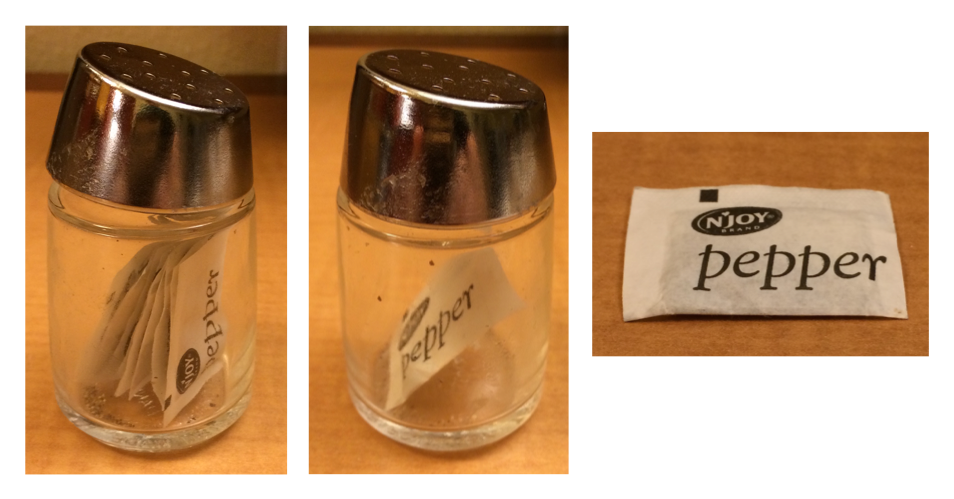

# Base R 실전 가이드 {#sec-base-r}

```{r}
#| echo: false
source("_common.R")
```

## 서론

프로그래밍 섹션을 마무리하며, 이 책의 다른 곳에서는 다루지 않은 가장 중요한 Base R 함수들에 대한 빠른 투어를 제공하고자 합니다.
이 도구들은 프로그래밍을 더 많이 할 때 특히 유용하며 야생에서 만나는 코드를 읽는 데 도움이 될 것입니다.

이쯤에서 tidyverse가 데이터 과학 문제를 해결하는 유일한 방법은 아니라는 점을 상기시켜 드리는 것이 좋겠습니다.
이 책에서 tidyverse를 가르치는 이유는 tidyverse 패키지들이 공통된 설계 철학을 공유하여 함수 간의 일관성을 높이고 새로운 함수나 패키지를 배우고 사용하기 조금 더 쉽게 만들어주기 때문입니다.
Base R을 사용하지 않고 tidyverse를 사용하는 것은 불가능합니다. 그래서 우리는 이미 패키지를 로드하는 `library()`부터 수치 요약을 위한 `sum()`과 `mean()`, factor, date, POSIXct 데이터 타입, 그리고 물론 `+`, `-`, `/`, `*`, `|`, `&`, `!`와 같은 모든 기본 연산자에 이르기까지 **수많은** Base R 함수들을 가르쳤습니다.
지금까지 우리가 초점을 맞추지 않은 것은 Base R 워크플로우이며, 이 장에서는 그 중 몇 가지를 강조하겠습니다.

이 책을 다 읽고 나면, Base R, data.table, 그리고 다른 패키지들을 사용하여 동일한 문제에 접근하는 다른 방법들을 배우게 될 것입니다.
특히 Stack Overflow를 사용할 때, 다른 사람들이 쓴 R 코드를 읽기 시작하면 이러한 다른 접근 방식들을 틀림없이 만나게 될 것입니다.
접근 방식들을 혼합하여 코드를 작성하는 것은 100% 괜찮으며, 다른 사람의 말에 흔들리지 마세요!

이 챕터에서는 네 가지 큰 주제에 집중할 것입니다: `[`를 사용한 서브세팅, `[[`와 `$`를 사용한 서브세팅, apply 계열 함수들, 그리고 `for` 루프입니다.
마지막으로, 두 가지 필수적인 플로팅 함수에 대해 간단히 논의하며 마무리하겠습니다.

### 사전 요구 사항

이 패키지는 Base R에 초점을 맞추고 있으므로 특별한 사전 요구 사항은 없지만, 몇 가지 차이점을 설명하기 위해 tidyverse를 로드할 것입니다.

```{r}
#| label: setup
#| message: false
library(tidyverse)
```

## `[`를 사용하여 여러 요소 선택하기 {#sec-subset-many}

`[`는 벡터와 데이터 프레임에서 하위 구성 요소를 추출하는 데 사용되며, `x[i]` 또는 `x[i, j]`처럼 호출됩니다.
이 섹션에서는 `[`의 강력함을 소개하겠습니다. 먼저 벡터에서 어떻게 사용할 수 있는지 보여준 다음, 동일한 원리가 데이터 프레임과 같은 2차원(2d) 구조로 어떻게 간단하게 확장되는지 살펴보겠습니다.
그런 다음 다양한 dplyr 동사(verbs)들이 어떻게 `[`의 특수한 경우인지 보여줌으로써 그 지식을 공고히 하도록 돕겠습니다.

### 벡터 서브세팅하기

벡터를 서브세팅할 수 있는 주요 5가지 유형(즉, `x[i]`에서 `i`가 될 수 있는 것)이 있습니다:

1.  **양의 정수 벡터**.
    양의 정수로 서브세팅하면 해당 위치의 요소를 유지합니다:

    ```{r}
    x <- c("one", "two", "three", "four", "five")
    x[c(3, 2, 5)]
    ```

    위치를 반복함으로써 실제로 입력보다 긴 출력을 만들 수 있는데, 이 때문에 "서브세팅"이라는 용어는 약간 부적절한 이름이기도 합니다.

    ```{r}
    x[c(1, 1, 5, 5, 5, 2)]
    ```

2.  **음의 정수 벡터**.
    음수 값은 지정된 위치의 요소를 삭제합니다:

    ```{r}
    x[c(-1, -3, -5)]
    ```

3.  **논리형 벡터**.
    논리형 벡터로 서브세팅하면 `TRUE` 값에 해당하는 모든 값을 유지합니다.
    이는 비교 함수들과 함께 사용할 때 가장 유용합니다.

    ```{r}
    x <- c(10, 3, NA, 5, 8, 1, NA)

    # x의 모든 결측되지 않은 값
    x[!is.na(x)]

    # x의 모든 짝수(또는 결측치!) 값
    x[x %% 2 == 0]
    ```

    `filter()`와 달리, `NA` 인덱스는 출력에 `NA`로 포함됩니다.

4.  **문자형 벡터**.
    이름이 있는 벡터(named vector)가 있다면, 문자형 벡터로 서브세팅할 수 있습니다:

    ```{r}
    x <- c(abc = 1, def = 2, xyz = 5)
    x[c("xyz", "def")]
    ```

    양의 정수로 서브세팅할 때와 마찬가지로, 문자형 벡터를 사용하여 개별 항목을 복제할 수 있습니다.

5.  **아무것도 없음**.
    마지막 서브세팅 유형은 아무것도 없는 `x[]`로, 완전한 `x`를 반환합니다.
    이는 벡터를 서브세팅할 때는 유용하지 않지만, 곧 보게 되겠지만 티블과 같은 2차원 구조를 서브세팅할 때는 유용합니다.

### 데이터 프레임 서브세팅하기

데이터 프레임에 `[`를 사용하는 아주 다양한 방법들이 있지만[^base-r-1], 가장 중요한 방법은 `df[rows, cols]`를 통해 행과 열을 독립적으로 선택하는 것입니다. 여기서 `rows`와 `cols`는 위에서 설명한 벡터들입니다.
예를 들어, `df[rows, ]`와 `df[, cols]`는 단지 행이나 단지 열만 선택하며, 빈 서브셋을 사용하여 다른 차원을 보존합니다.

[^base-r-1]: 데이터 프레임을 1차원 객체처럼 서브세팅하는 방법과 행렬(matrix)로 서브세팅하는 방법을 보려면 <https://adv-r.hadley.nz/subsetting.html#subset-multiple>을 읽어보세요.

여기 몇 가지 예제가 있습니다:

```{r}
df <- tibble(
  x = 1:3, 
  y = c("a", "e", "f"), 
  z = runif(3)
)

# 첫 번째 행과 두 번째 열 선택
df[1, 2]

# 모든 행과 x, y 열 선택
df[, c("x" , "y")]

# `x`가 1보다 큰 행들과 모든 열 선택
df[df$x > 1, ]
```

`$`에 대해서는 곧 다시 다루겠지만, 문맥상 `df$x`가 무엇을 하는지 짐작할 수 있을 것입니다: `df`에서 `x` 변수를 추출합니다.
여기서 그것을 사용해야 하는 이유는 `[`가 tidy evaluation(깔끔한 평가)을 사용하지 않기 때문에, `x` 변수의 출처를 명시해야 하기 때문입니다.

`[`에 관해서는 티블(tibble)과 데이터 프레임(data frame) 사이에 중요한 차이가 있습니다.
이 책에서는 주로 티블을 사용해 왔는데, 티블은 데이터 프레임의 일종이면서도 여러분의 삶을 조금 더 편하게 만들기 위해 몇 가지 동작을 조정합니다.
대부분의 경우 "티블"과 "데이터 프레임"을 상호 교환적으로 사용할 수 있으므로, R의 내장 데이터 프레임에 특별히 주의를 환기시키고 싶을 때는 `data.frame`이라고 쓰겠습니다.
만약 `df`가 `data.frame`이라면, `df[, cols]`는 `cols`가 단일 열을 선택할 경우 벡터를 반환하고, 두 개 이상의 열을 선택할 경우 데이터 프레임을 반환합니다.
만약 `df`가 티블이라면, `[`는 항상 티블을 반환합니다.

```{r}
df1 <- data.frame(x = 1:3)
df1[, "x"]

df2 <- tibble(x = 1:3)
df2[, "x"]
```

`data.frame`에서 이런 모호성을 피하는 한 가지 방법은 `drop = FALSE`를 명시적으로 지정하는 것입니다:

```{r}
df1[, "x" , drop = FALSE]
```

### dplyr 상응 기능

여러 dplyr 동사들은 `[`의 특수한 경우입니다:

-   `filter()`는 결측값을 제외하도록 주의하면서 논리형 벡터로 행을 서브세팅하는 것과 같습니다:

    ```{r}
    #| results: false
    df <- tibble(
      x = c(2, 3, 1, 1, NA), 
      y = letters[1:5], 
      z = runif(5)
    )
    df |> filter(x > 1)

    # 동일한 결과
    df[!is.na(df$x) & df$x > 1, ]
    ```

    실무에서 흔히 쓰이는 또 다른 기술은 결측값을 떨어뜨리는 부수 효과를 위해 `which()`를 사용하는 것입니다: `df[which(df$x > 1), ]`.

-   `arrange()`는 대개 `order()`로 생성된 정수형 벡터로 행을 서브세팅하는 것과 같습니다:

    ```{r}
    #| results: false
    df |> arrange(x, y)

    # 동일한 결과
    df[order(df$x, df$y), ]
    ```

    `order(decreasing = TRUE)`를 사용하여 모든 열을 내림차순으로 정렬하거나 `-rank(col)`을 사용하여 각 열을 개별적으로 내림차순으로 정렬할 수 있습니다.

-   `select()`와 `relocate()`는 모두 문자형 벡터로 열을 서브세팅하는 것과 비슷합니다:

    ```{r}
    #| results: false
    df |> select(x, z)

    # 동일한 결과
    df[, c("x", "z")]
    ```

Base R은 또한 `filter()`와 `select()`의 기능을 결합한 `subset()`[^base-r-2]이라는 함수를 제공합니다:

[^base-r-2]: 하지만 이는 그룹화된 데이터 프레임을 다르게 처리하지 않으며 `starts_with()`와 같은 선택 도우미 함수를 지원하지 않습니다.

```{r}
df |> 
  filter(x > 1) |> 
  select(y, z)
```

```{r}
#| results: false
# 동일한 결과
df |> subset(x > 1, c(y, z))
```

이 함수는 dplyr 문법의 많은 부분에 영감을 주었습니다.

### 연습문제

1.  벡터를 입력으로 받아 다음을 반환하는 함수들을 만드세요:

    a.  짝수 번째 위치에 있는 요소들.
    b.  마지막 값을 제외한 모든 요소.
    c.  짝수 값만 (결측값 제외).

2.  왜 `x[-which(x > 0)]`는 `x[x <= 0]`과 같지 않을까요?
    `which()`의 문서를 읽고 약간의 실험을 통해 파악해 보세요.

## `$`와 `[[`를 사용하여 단일 요소 선택하기 {#sec-subset-one}

여러 요소를 선택하는 `[`는 단일 요소를 추출하는 `[[` 및 `$`와 짝을 이룹니다.
이 섹션에서는 `[[`와 `$`를 사용하여 데이터 프레임에서 열을 뽑아내는 방법을 보여주고, `data.frame`과 티블 사이의 몇 가지 차이점을 더 논의하며, 리스트와 함께 사용할 때 `[`와 `[[` 사이의 중요한 차이점을 강조하겠습니다.

### 데이터 프레임

`[[`와 `$`는 데이터 프레임에서 열을 추출하는 데 사용할 수 있습니다.
`[[`는 위치나 이름으로 접근할 수 있으며, `$`는 이름으로 접근하는 데 특화되어 있습니다:

```{r}
tb <- tibble(
  x = 1:4,
  y = c(10, 4, 1, 21)
)

# 위치로 접근
tb[[1]]

# 이름으로 접근
tb[["x"]]
tb$x
```

이들은 새로운 열을 생성하는 데도 사용될 수 있으며, 이는 `mutate()`와 동등한 Base R 방법입니다:

```{r}
tb$z <- tb$x + tb$y
tb
```

`transform()`, `with()`, `within()`을 포함하여 새로운 열을 생성하는 Base R의 다른 접근 방식들이 여러 개 있습니다.
Hadley가 <https://gist.github.com/hadley/1986a273e384fb2d4d752c18ed71bedf>에 몇 가지 예제를 모아두었습니다.

빠른 요약을 수행할 때 `$`를 직접 사용하는 것이 편리합니다.
예를 들어, 단순히 가장 큰 다이아몬드의 크기나 `cut`의 가능한 값들을 찾고 싶다면 `summarize()`를 사용할 필요가 없습니다:

```{r}
max(diamonds$carat)

levels(diamonds$cut)
```

dplyr은 @sec-data-transform에서 언급하지 않았던 `[[`/`$`와 동등한 기능인 `pull()`을 제공합니다.
`pull()`은 변수 이름이나 변수 위치를 받아 해당 열만을 반환합니다.
이는 위의 코드를 파이프를 사용하도록 다시 작성할 수 있음을 의미합니다:

```{r}
diamonds |> pull(carat) |> max()

diamonds |> pull(cut) |> levels()
```

### 티블 (Tibbles)

`$`에 관해 티블과 Base `data.frame` 사이에는 몇 가지 중요한 차이가 있습니다.
데이터 프레임은 변수 이름의 접두사를 매칭(소위 **부분 매칭**)하며, 접근하려는 열이 존재하지 않아도 불평하지 않습니다:

```{r}
df <- data.frame(x1 = 1)
df$x
df$z
```

티블은 더 엄격합니다: 변수 이름을 항상 정확하게 매칭하며, 접근하려는 열이 존재하지 않으면 경고를 발생시킵니다:

```{r}
tb <- tibble(x1 = 1)

tb$x
tb$z
```

이런 이유로 우리는 종종 티블이 게으르고 까칠하다고 농담을 합니다: 일을 덜 하면서 불평은 더 많이 합니다.

### 리스트 (Lists)

`[[`와 `$`는 리스트 작업에도 매우 중요하며, 이들이 `[`와 어떻게 다른지 이해하는 것이 중요합니다.
`l`이라는 이름의 리스트로 그 차이점을 설명해 보겠습니다:

```{r}
l <- list(
  a = 1:3, 
  b = "a string", 
  c = pi, 
  d = list(-1, -5)
)
```

-   `[`는 하위 리스트를 추출합니다.
    몇 개의 요소를 추출하든, 결과는 항상 리스트가 됩니다.

    ```{r}
    str(l[1:2])

    str(l[1])

    str(l[4])
    ```

    벡터와 마찬가지로 논리형, 정수형, 또는 문자형 벡터로 서브세팅할 수 있습니다.

-   `[[`와 `$`는 리스트에서 단일 구성 요소를 추출합니다.
    이들은 리스트에서 한 단계의 계층 구조를 제거합니다.

    ```{r}
    str(l[[1]])

    str(l[[4]])

    str(l$a)
    ```

`[`와 `[[`의 차이는 리스트에서 특히 중요한데, `[[`는 리스트 안으로 깊이 파고드는 반면 `[`는 새롭고 더 작은 리스트를 반환하기 때문입니다.
차이점을 기억하는 데 도움이 되도록 @fig-pepper에 보이는 특이한 후추통을 보세요.
만약 이 후추통이 여러분의 리스트 `pepper`라면, `pepper[1]`은 단일 후추 패킷이 들어있는 후추통입니다.
`pepper[2]`도 똑같이 보이겠지만 두 번째 패킷이 들어있을 것입니다.
`pepper[1:2]`는 두 개의 후추 패킷이 들어있는 후추통이 될 것입니다.
`pepper[[1]]`은 후추 패킷 자체를 추출할 것입니다.

```{r}
#| label: fig-pepper
#| echo: false
#| out-width: "100%"
#| fig-cap: |
#|   (왼쪽) Hadley가 호텔 방에서 찾았던 후추통.
#|   (중간) `pepper[1]`.
#|   (오른쪽) `pepper[[1]]`
#| fig-alt: |
#|   세 장의 사진. 왼쪽은 유리 후추통의 사진입니다. 후추통 안에 후추가 들어있는 
#|   대신 단일 후추 패킷이 들어있습니다.
#|   중간은 단일 후추 패킷의 사진입니다. 오른쪽은 후추 패킷 안의 내용물 사진입니다.

```

이 동일한 원리가 데이터 프레임에 1차원 `[`를 사용할 때도 적용됩니다: `df["x"]`는 한 열짜리 데이터 프레임을 반환하고 `df[["x"]]`는 벡터를 반환합니다.

### 연습문제

1.  벡터의 길이보다 큰 양의 정수와 함께 `[[`를 사용하면 어떻게 되나요?
    존재하지 않는 이름으로 서브세팅하면 어떻게 되나요?

2.  `pepper[[1]][1]`은 무엇이 될까요?
    그렇다면 `pepper[[1]][[1]]`은요?

## Apply 계열 함수

@sec-iteration에서 여러분은 `dplyr::across()` 및 map 계열 함수들과 같은 반복을 위한 tidyverse 기법들을 배웠습니다.
이 섹션에서는 이들의 Base R 동등물인 **apply 계열 함수**들에 대해 배울 것입니다.
이 맥락에서 apply와 map은 동의어입니다. 왜냐하면 "벡터의 각 요소에 대해 함수를 매핑(map)한다"를 말하는 다른 방식이 "벡터의 각 요소에 대해 함수를 적용(apply)한다"이기 때문입니다.
야생에서 이들을 알아볼 수 있도록 이 계열에 대한 빠른 개요를 제공하겠습니다.

이 계열의 가장 중요한 멤버는 `lapply()`로, `purrr::map()`[^base-r-3]과 매우 유사합니다.
사실 우리는 `map()`의 더 고급 기능들을 사용하지 않았기 때문에, @sec-iteration의 모든 `map()` 호출을 `lapply()`로 바꿀 수 있습니다.

[^base-r-3]: 단지 진행률 표시줄이나 에러 발생 시 어떤 요소가 문제를 일으켰는지 보고하는 편리한 기능들이 부족할 뿐입니다.

`across()`에 정확히 대응하는 Base R 기능은 없지만, `[`와 `lapply()`를 함께 사용하면 비슷하게 만들 수 있습니다.
내부적으로 데이터 프레임은 열들의 리스트이기 때문에, 데이터 프레임에 `lapply()`를 호출하면 각 열에 함수가 적용되는 방식이 작동합니다.

```{r}
df <- tibble(a = 1, b = 2, c = "a", d = "b", e = 4)

# 먼저 수치형 열 찾기
num_cols <- sapply(df, is.numeric)
num_cols

# 그런 다음 lapply()로 각 열을 변환한 뒤 원래 값을 대체
df[, num_cols] <- lapply(df[, num_cols, drop = FALSE], \(x) x * 2)
df
```

위의 코드는 새로운 함수인 `sapply()`를 사용합니다.
`lapply()`와 비슷하지만 항상 결과를 단순화하려고 시도합니다. 이름에 `s`가 붙은 이유이며, 여기서는 리스트 대신 논리형 벡터를 생성합니다.
단순화가 실패하여 예상치 못한 타입을 얻을 수 있으므로 프로그래밍 목적으로는 사용하는 것을 권장하지 않지만, 대화형(interactive)으로 사용할 때는 보통 괜찮습니다.
purrr에도 @sec-iteration에서 언급하지 않은 `map_vec()`이라는 비슷한 함수가 있습니다.

Base R은 **v**ector apply의 줄임말인 `vapply()`라는 더 엄격한 버전의 `sapply()`를 제공합니다.
이 함수는 예상되는 타입을 지정하는 추가 인자를 받아, 입력에 관계없이 항상 같은 방식으로 단순화가 일어나도록 보장합니다.
예를 들어, 위의 `sapply()` 호출을 `is.numeric()`이 길이가 1인 논리형 벡터를 반환할 것으로 기대한다고 지정한 이 `vapply()`로 바꿀 수 있습니다:

```{r}
vapply(df, is.numeric, logical(1))
```

`sapply()`와 `vapply()`의 구별은 함수 내부에 있을 때(비정상적인 입력에 대한 함수의 견고성에 큰 차이를 만들기 때문에) 정말 중요하지만, 데이터 분석에서는 보통 문제가 되지 않습니다.

apply 계열의 또 다른 중요한 멤버는 단일 그룹화 요약을 계산하는 `tapply()`입니다:

```{r}
diamonds |> 
  group_by(cut) |> 
  summarize(price = mean(price))

tapply(diamonds$price, diamonds$cut, mean)
```

불행하게도 `tapply()`는 이름이 있는 벡터로 결과를 반환하기 때문에, 여러 요약과 그룹화 변수들을 데이터 프레임으로 수집하려면 약간의 작업이 필요합니다 (물론 이렇게 하지 않고 그냥 떠다니는 벡터들로 작업하는 것도 분명 가능하지만, 우리의 경험상 그것은 단지 일을 미루는 것일 뿐입니다).
만약 `tapply()`나 다른 Base 기법들을 사용하여 다른 그룹화 요약을 수행하는 방법이 궁금하다면, Hadley가 몇 가지 기법들을 [gist에 모아두었습니다](https://gist.github.com/hadley/c430501804349d382ce90754936ab8ec).

apply 계열의 마지막 멤버는 행렬과 배열에서 작동하는 바로 그 `apply()`입니다.
특히 `apply(df, 2, something)`를 주의하세요. 이는 `lapply(df, something)`을 수행하는 느리고 잠재적으로 위험한 방법입니다.
우리는 보통 행렬이 아닌 데이터 프레임으로 작업하기 때문에 데이터 과학에서는 이 함수가 거의 등장하지 않습니다.

## `for` 루프

`for` 루프는 apply 계열과 map 계열 모두 내부적으로 사용하는 반복의 기본 구성 요소입니다.
`for` 루프는 숙련된 R 프로그래머가 되어가면서 배우는 것이 중요한 강력하고 일반적인 도구입니다.
`for` 루프의 기본 구조는 다음과 같습니다:

```{r}
#| eval: false
for (element in vector) {
  # element를 가지고 무언가를 함
}
```

`for` 루프의 가장 직관적인 용도는 `walk()`와 같은 효과를 달성하는 것입니다: 리스트의 각 요소에 대해 부수 효과(side-effect)가 있는 어떤 함수를 호출하는 것입니다.
예를 들어, @sec-save-database에서 `walk()`를 사용하는 대신:

```{r}
#| eval: false
paths |> walk(append_file)
```

`for` 루프를 사용할 수 있었습니다:

```{r}
#| eval: false
for (path in paths) {
  append_file(path)
}
```

만약 `for` 루프의 출력을 저장하고 싶다면 상황이 조금 더 까다로워집니다. 예를 들어 @sec-iteration에서 했던 것처럼 디렉토리 안의 모든 엑셀 파일들을 읽어 들이는 경우입니다:

```{r}
paths <- dir("data/gapminder", pattern = "\\.xlsx$", full.names = TRUE)
files <- map(paths, readxl::read_excel)
```

몇 가지 다른 기법들을 사용할 수 있지만, 우리는 사전에 출력의 모습이 어떨지 명시적으로 지정하는 것을 권장합니다.
이 경우, 우리는 `paths`와 같은 길이의 리스트를 원하며, 이는 `vector()`로 생성할 수 있습니다:

```{r}
files <- vector("list", length(paths))
```

그다음 `paths`의 요소들을 순회하는 대신, `seq_along()`을 사용하여 `paths`의 각 요소에 대해 하나의 인덱스를 생성하고 인덱스들을 순회합니다:

```{r}
seq_along(paths)
```

인덱스를 사용하는 것이 중요한 이유는 입력의 각 위치를 출력의 해당 위치와 연결할 수 있게 해주기 때문입니다:

```{r}
for (i in seq_along(paths)) {
  files[[i]] <- readxl::read_excel(paths[[i]])
}
```

티블들의 리스트를 단일 티블로 결합하려면 `do.call()` + `rbind()`를 사용할 수 있습니다:

```{r}
do.call(rbind, files)
```

리스트를 만들고 결과를 그 과정에 저장하는 대신, 데이터 프레임을 조각조각 조립하는 더 단순한 접근 방식도 있습니다:

```{r}
out <- NULL
for (path in paths) {
  out <- rbind(out, readxl::read_excel(path))
}
```

벡터가 매우 길어질 때 아주 느려질 수 있기 때문에 이 패턴은 피하는 것을 권장합니다.
이것이 `for` 루프가 느리다는 끊임없는 헛소문의 근원입니다: `for` 루프 자체가 느린 것이 아니라 반복적으로 벡터를 키워나가는 방식이 느린 것입니다.

## 플롯

평소에는 tidyverse를 사용하지 않는 많은 R 사용자들도 합리적인 기본값, 자동 범례, 현대적인 외관과 같은 유용한 기능들 때문에 시각화를 할 때는 ggplot2를 선호합니다.
하지만 Base R의 플로팅 함수들은 매우 간결해서 기본적인 탐색용 플롯을 그릴 때 타이핑을 아주 적게 해도 되므로 여전히 유용할 수 있습니다.

야생에서 보게 될 Base R 플롯에는 주로 두 가지 유형이 있습니다: `plot()`으로 생성되는 산점도(scatterplots)와 `hist()`로 생성되는 히스토그램입니다.
여기 diamonds 데이터셋을 이용한 간단한 예제가 있습니다:

```{r}
#| dev: png
#| fig-width: 4
#| fig-asp: 1
#| layout-ncol: 2
#| fig-alt: |
#|   왼쪽은 0~5캐럿 범위의 다이아몬드 캐럿의 히스토그램.
#|   분포는 단봉형이고 오른쪽으로 치우쳐 있음. 오른쪽은 다이아몬드의 가격 대 
#|   캐럿의 산점도로, 가격과 캐럿이 증가함에 따라 퍼지는 양의 상관관계를 보여줌. 
#|   산점도는 0~3캐럿 다이아몬드에 비해 3캐럿보다 큰 다이아몬드가 매우 적음을 보여줌.
# 왼쪽
hist(diamonds$carat)

# 오른쪽
plot(diamonds$carat, diamonds$price)
```

Base R 플로팅 함수들은 벡터와 함께 작동하므로, `$`나 다른 기술을 사용하여 데이터 프레임에서 열을 뽑아내야 한다는 점에 유의하세요.

## 요약

이 챕터에서는 서브세팅과 반복을 위해 유용한 Base R 함수들을 선별하여 보여드렸습니다.
이 책의 다른 곳에서 논의한 접근 방식들과 비교할 때, 이 함수들은 데이터 프레임과 어떤 열 명세(column specification)를 취하기보다는 개별 벡터를 취하는 경향이 있어 "데이터 프레임"의 느낌보다는 "벡터"의 느낌을 더 많이 가집니다.
이것은 종종 프로그래밍을 위한 삶을 더 쉽게 만들어 주며, 더 많은 함수를 작성하고 여러분만의 패키지를 쓰기 시작함에 따라 더 중요해집니다.

이 챕터로 책의 프로그래밍 섹션이 마무리됩니다.
여러분은 단순히 R을 사용하는 데이터 과학자가 아니라, R로 *프로그래밍*할 수 있는 데이터 과학자가 되기 위한 여정에서 탄탄한 출발을 하셨습니다.
이 챕터들이 여러분의 프로그래밍에 대한 흥미를 불러일으켰기를 바라며, 이 책을 넘어서도 계속해서 배워나가기를 기대합니다.
