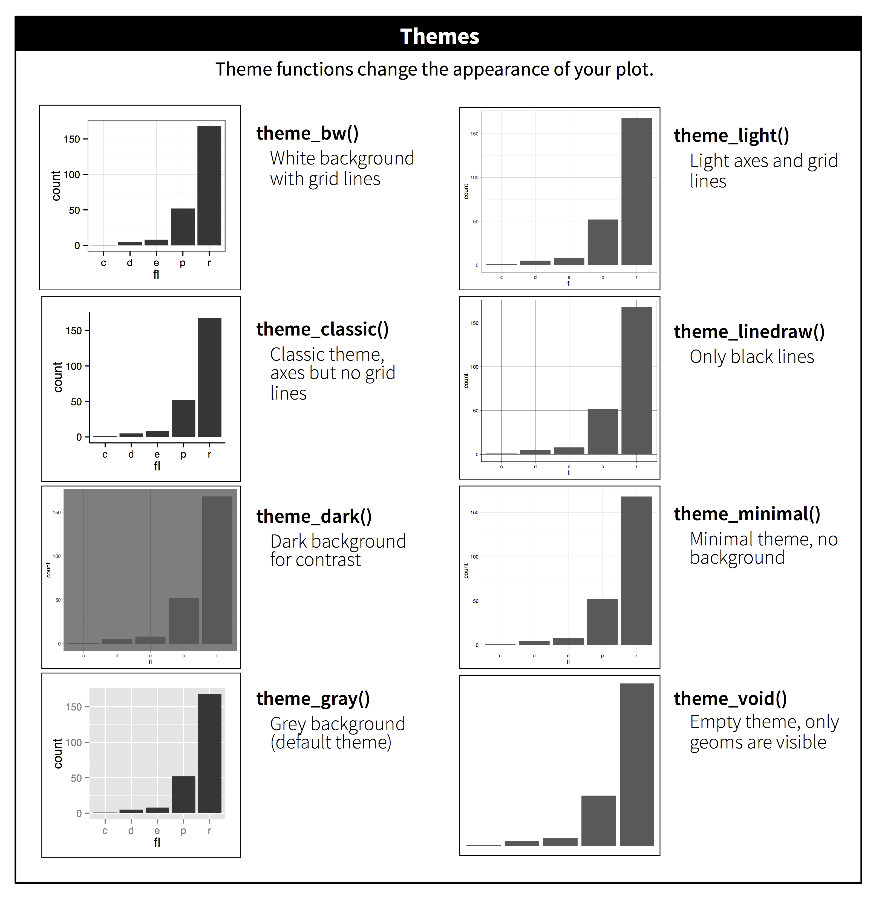

# 소통 {#sec-communication}

```{r}
#| echo: false
source("_common.R")
```

## 서론

@sec-exploratory-data-analysis에서 여러분은 플롯을 *탐색*을 위한 도구로 사용하는 방법을 배웠습니다. 탐색적 플롯을 만들 때는 플롯이 어떤 변수를 표시할지 보기도 전에 이미 알고 있습니다. 여러분은 목적을 가지고 각 플롯을 만들었고, 빠르게 살펴본 다음 다음 플롯으로 넘어갈 수 있었습니다. 대부분의 분석 과정에서 여러분은 수십 개 또는 수백 개의 플롯을 생성하며, 그중 대부분은 즉시 버려집니다.

이제 데이터를 이해했으므로, 여러분의 이해를 다른 사람들에게 *전달(communicate)*해야 합니다. 여러분의 청중은 아마도 여러분과 같은 배경 지식을 공유하지 않을 것이며 데이터에 깊이 몰두하지도 않을 것입니다. 다른 사람들이 데이터에 대한 좋은 정신적 모델(mental model)을 빠르게 구축할 수 있도록 도우려면, 플롯을 가능한 한 자명하게(self-explanatory) 만드는 데 상당한 노력을 기울여야 합니다. 이 챕터에서는 이를 위해 ggplot2가 제공하는 몇 가지 도구들을 배우게 될 것입니다.

이 챕터는 좋은 그래픽을 생성하는 데 필요한 도구들에 집중합니다. 여러분이 무엇을 원하는지 이미 알고 있고, 단지 그것을 어떻게 하는지 알 필요가 있다고 가정합니다. 그런 이유로, 이 챕터를 일반적인 시각화 관련 좋은 책과 함께 보시기를 강력히 추천합니다. 우리는 특히 알버트 카이로(Albert Cairo)의 [The Truthful Art](https://www.amazon.com/gp/product/0321934075/)를 좋아합니다. 이 책은 시각화를 만드는 기술적인 방법이 아니라, 효과적인 그래픽을 만들기 위해 무엇을 생각해야 하는지에 집중합니다.

### 사전 요구 사항

이 챕터에서는 다시 한번 ggplot2에 집중할 것입니다. 또한 데이터 조작을 위해 dplyr을, 기본 브레이크(breaks), 라벨, 변환 및 팔레트를 덮어쓰기 위해 **scales**를, 그리고 Kamil Slowikowski의 **ggrepel**([https://ggrepel.slowkow.com](https://ggrepel.slowkow.com/))과 Thomas Lin Pedersen의 **patchwork**([https://patchwork.data-imaginist.com](https://patchwork.data-imaginist.com/))를 포함한 몇 가지 ggplot2 확장 패키지를 사용할 것입니다. 패키지가 아직 없다면 `install.packages()`로 설치해야 한다는 사실을 잊지 마세요.

```{r}
#| label: setup
#| message: false
library(tidyverse)
library(scales)
library(ggrepel)
library(patchwork)
```

## 라벨

탐색용 그래픽을 고 품질의 그래픽으로 바꿀 때 시작하기 가장 쉬운 곳은 좋은 라벨을 다는 것입니다. `labs()` 함수를 사용하여 라벨을 추가합니다.

```{r}
#| message: false
#| fig-alt: |
#|   자동차의 고속도로 연료 효율 대 엔진 크기 산점도로, 점들은 자동차 
#|   클래스에 따라 색상이 지정됨. 고속도로 연료 효율 대 엔진 크기 사이의 
#|   관계 궤적을 따르는 매끄러운 곡선이 겹쳐져 있음. x축은 "배기량 (L)", 
#|   y축은 "고속도로 연비 (mpg)"로 라벨이 붙어 있음. 범례는 "자동차 유형"으로 
#|   라벨이 붙어 있음. 플롯 제목은 "연비는 일반적으로 엔진 크기가 커짐에 
#|   따라 감소한다"임. 부제목은 "2인승(스포츠카)은 가벼운 무게 때문에 
#|   예외이다"이고 캡션은 "데이터 출처: fueleconomy.gov"임.
ggplot(mpg, aes(x = displ, y = hwy)) +
  geom_point(aes(color = class)) +
  geom_smooth(se = FALSE) +
  labs(
    x = "배기량 (L)",
    y = "고속도로 연비 (mpg)",
    color = "자동차 유형",
    title = "연비는 일반적으로 엔진 크기가 커짐에 따라 감소한다",
    subtitle = "2인승(스포츠카)은 가벼운 무게 때문에 예외이다",
    caption = "데이터 출처: fueleconomy.gov"
  )
```

플롯 제목의 목적은 주요 발견을 요약하는 것입니다. "배기량 대 연비의 산점도"와 같이 단순히 플롯이 무엇인지를 설명하는 제목은 피하세요.

더 많은 텍스트를 추가해야 한다면 다른 두 가지 유용한 라벨이 있습니다. `subtitle`은 제목 아래에 더 작은 글꼴로 세부 정보를 추가하고, `caption`은 플롯의 우측 하단에 텍스트를 추가하며, 종종 데이터 출처를 설명하는 데 사용됩니다. `labs()`를 사용하여 축과 범례 제목을 바꿀 수도 있습니다. 짧은 변수 이름을 더 상세한 설명으로 바꾸고 단위를 포함하는 것이 일반적으로 좋은 아이디어입니다.

텍스트 문자열 대신 수학 공식을 사용할 수도 있습니다. `""` 대신 `quote()`를 사용하고 `?plotmath`에서 사용 가능한 옵션들을 읽어보세요.

```{r}
#| fig-asp: 1
#| out-width: "50%"
#| fig-width: 3
#| fig-alt: |
#|   x축과 y축 라벨에 수학 텍스트가 있는 산점도. x축 라벨은 x_i, 
+   y축 라벨은 i가 1부터 n까지일 때 x_i 제곱의 합이라고 되어 있음.
df <- tibble(
  x = 1:10,
  y = cumsum(x^2)
)

ggplot(df, aes(x, y)) +
  geom_point() +
  labs(
    x = quote(x[i]),
    y = quote(sum(x[i] ^ 2, i == 1, n))
  )
```

### 연습문제

1.  연비 데이터를 사용하여 `title`, `subtitle`, `caption`, `x`, `y`, `color` 라벨이 사용자 정의된 플롯 하나를 만드세요.

2.  연비 데이터를 사용하여 다음 플롯을 재현해 보세요. 점의 색상과 모양이 모두 구동 방식 유형에 따라 다르다는 점에 유의하세요.

    ```{r}
    #| echo: false
    #| fig-alt: |
    #|   고속도로 연비 대 도시 연비의 산점도. 점의 모양과 색상은 구동 방식 
    #|   유형에 의해 결정됨.
    ggplot(mpg, aes(x = cty, y = hwy, color = drv, shape = drv)) +
      geom_point() +
      labs(
        x = "도심 연비 (MPG)",
        y = "고속도로 연비 (MPG)",
        shape = "구동 방식 유형",
        color = "구동 방식 유형"
      )
    ```

3.  지난 한 달 동안 만든 탐색용 그래픽 하나를 골라, 다른 사람들이 더 쉽게 이해할 수 있도록 유익한 제목을 추가해 보세요.

## 주석

플롯의 주요 구성 요소에 라벨을 붙이는 것 외에도 개별 관측값이나 관측값 그룹에 라벨을 붙이는 것이 유용할 때가 많습니다. 가장 먼저 사용할 수 있는 도구는 `geom_text()`입니다. `geom_text()`는 `geom_point()`와 유사하지만 추가적인 심미적 요소인 `label`을 가집니다. 이를 통해 플롯에 텍스트 라벨을 추가할 수 있습니다.

라벨의 출처는 두 가지가 가능합니다. 첫째, 라벨을 제공하는 티블(tibble)이 있을 수 있습니다. 다음 플롯에서는 각 구동 방식에서 엔진 크기가 가장 큰 자동차들을 뽑아 `label_info`라는 새로운 데이터 프레임으로 저장합니다.

```{r}
label_info <- mpg |>
  group_by(drv) |>
  arrange(desc(displ)) |>
  slice_head(n = 1) |>
  mutate(
    drive_type = case_when(
      drv == "f" ~ "전륜 구동",
      drv == "r" ~ "후륜 구동",
      drv == "4" ~ "4륜 구동"
    )
  ) |>
  select(displ, hwy, drv, drive_type)

label_info
```

그런 다음, 이 새로운 데이터 프레임을 사용하여 세 그룹에 직접 라벨을 붙임으로써 범례를 플롯에 직접 배치된 라벨로 대체합니다. `fontface`와 `size` 인자를 사용하여 텍스트 라벨의 모습을 사용자 정의할 수 있습니다. 이들은 플롯의 나머지 텍스트보다 크고 굵게 표시됩니다. (`theme(legend.position = "none"`)은 모든 범례를 끕니다. 이에 대해서는 곧 더 자세히 이야기하겠습니다.)

```{r}
#| fig-alt: |
#|   구동 방식별로 점의 색상이 지정된 고속도로 연비 대 엔진 크기 산점도. 
#|   각 구동 방식 유형에 대한 매끄러운 곡선이 겹쳐져 있음. 텍스트 라벨은 
#|   곡선들을 전륜 구동, 후륜 구동, 4륜 구동으로 식별함.
ggplot(mpg, aes(x = displ, y = hwy, color = drv)) +
  geom_point(alpha = 0.3) +
  geom_smooth(se = FALSE) +
  geom_text(
    data = label_info, 
    aes(x = displ, y = hwy, label = drive_type),
    fontface = "bold", size = 5, hjust = "right", vjust = "bottom"
  ) +
  theme(legend.position = "none")
```

라벨의 정렬을 제어하기 위해 `hjust`(가로 정렬)와 `vjust`(세로 정렬)를 사용한 점에 유의하세요.

그러나 위에서 만든 주석이 달린 플롯은 라벨들이 서로 겹치고 점들과도 겹치기 때문에 읽기 어렵습니다. ggrepel 패키지의 `geom_label_repel()` 함수를 사용하여 이 두 가지 문제를 모두 해결할 수 있습니다. 이 유용한 패키지는 라벨들이 겹치지 않도록 자동으로 조정해 줍니다.

```{r}
#| fig-alt: |
#|   구동 방식별로 점의 색상이 지정된 고속도로 연비 대 엔진 크기 산점도. 
#|   각 구동 방식 유형에 대한 매끄러운 곡선이 겹쳐져 있음. 텍스트 라벨은 
#|   곡선들을 전륜 구동, 후륜 구동, 4륜 구동으로 식별함. 라벨은 흰색 
#|   배경의 상자이며 겹치지 않도록 배치됨.
ggplot(mpg, aes(x = displ, y = hwy, color = drv)) +
  geom_point(alpha = 0.3) +
  geom_smooth(se = FALSE) +
  geom_label_repel(
    data = label_info, 
    aes(x = displ, y = hwy, label = drive_type),
    fontface = "bold", size = 5, nudge_y = 2
  ) +
  theme(legend.position = "none")
```

또한 같은 아이디어를 사용하여 ggrepel 패키지의 `geom_text_repel()`로 플롯의 특정 점들을 강조할 수 있습니다. 여기서 사용된 또 다른 편리한 기술을 보세요. 라벨이 붙은 점들을 더욱 강조하기 위해 크기가 큰 빈 원 점 레이어를 두 번째로 추가했습니다.

```{r}
#| fig-alt: |
#|   자동차의 고속도로 연료 효율 대 엔진 크기 산점도. 고속도로 연비가 
#|   40 이상이거나, 엔진 크기가 5 이상이면서 연비가 20 이상인 점들은 빨간색 
#|   원 포인트와 빨간색 빈 원으로 표시되며 자동차의 모델명으로 라벨이 붙음.
potential_outliers <- mpg |>
  filter(hwy > 40 | (hwy > 20 & displ > 5))
  
ggplot(mpg, aes(x = displ, y = hwy)) +
  geom_point() +
  geom_text_repel(data = potential_outliers, aes(label = model)) +
  geom_point(data = potential_outliers, color = "red") +
  geom_point(
    data = potential_outliers,
    color = "red", size = 3, shape = "circle open"
  )
```

`geom_text()`와 `geom_label()` 외에도 ggplot2에는 플롯에 주석을 다는 데 도움이 되는 많은 다른 기하 객체들이 있음을 기억하세요. 몇 가지 아이디어를 보시죠:

-   `geom_hline()`과 `geom_vline()`을 사용하여 참조선을 추가하세요. 종종 굵게(`linewidth = 2`) 흰색(`color = white`)으로 만들고 기본 데이터 레이어 아래에 그립니다. 그러면 데이터에서 시선을 뺏지 않으면서도 쉽게 볼 수 있습니다.

-   `geom_rect()`를 사용하여 관심 있는 점들 주위에 직사각형을 그리세요. 직사각형의 경계는 `xmin`, `xmax`, `ymin`, `ymax` 심미적 요소에 의해 정의됩니다. 또는 [ggforce 패키지](https://ggforce.data-imaginist.com/index.html), 특히 점들의 하위 집합에 헐(hulls)로 주석을 달 수 있게 해주는 [`geom_mark_hull()`](https://ggforce.data-imaginist.com/reference/geom_mark_hull.html)을 찾아보세요.

-   `arrow` 인자와 함께 `geom_segment()`를 사용하여 화살표로 특정 지점에 주의를 환기하세요. `x`와 `y` 심미적 요소로 시작 위치를 정의하고, `xend`와 `yend`로 끝 위치를 정의하세요.

플롯에 주석을 추가하는 또 다른 편리한 함수는 `annotate()`입니다. 경험상, 기하 객체들은 데이터의 하위 집합을 강조하는 데 일반적으로 유용하고, `annotate()`는 플롯에 하나 또는 몇 개의 주석 요소를 추가하는 데 유용합니다.

`annotate()` 사용을 시연하기 위해, 플롯에 추가할 텍스트를 만들어 봅시다. 텍스트가 조금 길어서 한 줄에 넣고 싶은 문자 수를 지정하여 자동으로 줄 바꿈을 해주는 `stringr::str_wrap()`을 사용하겠습니다.

```{r}
trend_text <- "엔진 크기가 커질수록 연비는 낮아지는 경향이 있습니다." |>
  str_wrap(width = 30)
trend_text
```

그런 다음, 라벨 기하 객체와 세그먼트 기하 객체의 두 가지 주석 레이어를 추가합니다. 두 레이어의 `x`와 `y` 심미적 요소는 주석이 시작될 위치를 정의하며, 세그먼트 주석의 `xend`와 `yend` 심미적 요소는 세그먼트의 끝 위치를 정의합니다. 또한 세그먼트가 화살표 스타일로 되어 있음에 유의하세요.

```{r}
#| fig-alt: |
#|   자동차의 고속도로 연료 효율 대 엔진 크기 산점도. 점들의 경향을 따르는 
#|   빨간색 하향 화살표가 있으며 화살표 옆에 배치된 주석은 "엔진 크기가 
#|   커질수록 연비는 낮아지는 경향이 있습니다"라고 읽힘. 화살표와 주석 
#|   텍스트는 빨간색임.
ggplot(mpg, aes(x = displ, y = hwy)) +
  geom_point() +
  annotate(
    geom = "label", x = 3.5, y = 38,
    label = trend_text,
    hjust = "left", color = "red"
  ) +
  annotate(
    geom = "segment",
    x = 3, y = 35, xend = 5, yend = 25, color = "red",
    arrow = arrow(type = "closed")
  )
```

주석은 여러분의 시각화에서 주요 시사점과 흥미로운 특징들을 전달하는 강력한 도구입니다. 유일한 한계는 여러분의 상상력(과 주석을 미적으로 아름답게 배치하는 여러분의 인내심)뿐입니다!

### 연습문제

1.  무한한(infinite) 위치와 함께 `geom_text()`를 사용하여 플롯의 네 모서리에 텍스트를 배치하세요.

2.  티블을 만들 필요 없이 `annotate()`를 사용하여 지난 플롯의 중앙에 점 기하 객체를 추가해 보세요. 점의 모양, 크기 또는 색상을 사용자 정의해 보세요.

3.  `geom_text()`가 있는 라벨은 파세팅과 어떻게 상호작용하나요? 단일 파세트에 라벨을 추가하려면 어떻게 해야 하나요? 각 파세트에 서로 다른 라벨을 넣으려면 어떻게 해야 하나요? (힌트: `geom_text()`에 전달되는 데이터셋에 대해 생각해 보세요.)

4.  `geom_label()`의 어떤 인자가 배경 상자의 모습을 제어하나요?

5.  `arrow()`의 네 가지 인자는 무엇인가요? 그것들은 어떻게 작동하나요? 가장 중요한 옵션들을 보여주는 일련의 플롯을 만들어 보세요.

## 스케일

소통을 위해 플롯을 개선하는 세 번째 방법은 스케일(scales)을 조정하는 것입니다. 스케일은 심미적 매핑이 시각적으로 어떻게 나타나는지를 제어합니다.

### 기본 스케일

보통 ggplot2는 스케일을 자동으로 추가해 줍니다. 예를 들어, 다음과 같이 입력하면:

```{r}
#| label: default-scales
#| fig-show: hide
ggplot(mpg, aes(x = displ, y = hwy)) +
  geom_point(aes(color = class))
```

ggplot2는 내부적으로 기본 스케일을 자동으로 추가합니다:

```{r}
#| fig-show: hide
ggplot(mpg, aes(x = displ, y = hwy)) +
  geom_point(aes(color = class)) +
  scale_x_continuous() +
  scale_y_continuous() +
  scale_color_discrete()
```

스케일의 명명 규칙을 확인하세요. `scale_` 뒤에 심미적 요소의 이름이 오고, 그다음 `_`, 그리고 스케일의 이름이 옵니다. 기본 스케일은 그것들이 정렬되는 변수의 유형(연속형, 이산형, 날짜-시간, 또는 날짜)에 따라 이름이 붙여집니다. `scale_x_continuous()`는 `displ`의 수치 값을 x축의 연속적인 수직선 위에 놓으며, `scale_color_discrete()`는 각 자동차 `class`에 대한 색상을 선택하는 식입니다. 아래에서 배울 비기본(non-default) 스케일들도 많이 있습니다.

기본 스케일은 광범위한 입력에 대해 잘 작동하도록 신중하게 선택되었습니다. 그럼에도 불구하고 두 가지 이유로 기본값을 덮어쓰고 싶을 수 있습니다.

-   기본 스케일의 일부 매개변수를 조정하고 싶을 수 있습니다. 이를 통해 축의 브레이크(breaks)를 변경하거나 범례의 키 라벨을 변경하는 등의 작업을 수행할 수 있습니다.

-   스케일을 완전히 교체하고 완전히 다른 알고리즘을 사용하고 싶을 수 있습니다. 데이터에 대해 더 많이 알고 있기 때문에 종종 기본값보다 더 나은 결과를 낼 수 있습니다.

### 축 눈금과 범례 키

축(axes)과 범례(legends)를 통칭하여 **가이드(guides)**라고 부릅니다. 축은 x와 y 심미적 요소를 위해 사용되고, 범례는 그 외의 모든 것을 위해 사용됩니다.

축의 눈금(ticks)과 범례의 키(keys)의 모습을 결정하는 두 가지 주요 인자가 있습니다. 바로 `breaks`와 `labels`입니다. `breaks`는 눈금의 위치나 키와 관련된 값을 제어합니다. `labels`는 각 눈금/키와 관련된 텍스트 라벨을 제어합니다. `breaks`의 가장 흔한 용도는 기본 선택을 덮어쓰는 것입니다.

```{r}
#| fig-alt: |
#|   구동 방식별로 색상이 지정된 자동차의 고속도로 연료 효율 대 엔진 크기 
#|   산점도. y축은 15에서 시작하여 40에서 끝나고 5씩 증가하는 
#|   브레이크를 가짐.
ggplot(mpg, aes(x = displ, y = hwy, color = drv)) +
  geom_point() +
  scale_y_continuous(breaks = seq(15, 40, by = 5)) 
```

`labels`도 같은 방식으로 사용할 수 있지만(`breaks`와 같은 길이의 문자 벡터), 라벨을 아예 없애기 위해 `NULL`로 설정할 수도 있습니다. 이는 지도나 절대적인 숫자를 공유할 수 없는 플롯을 출판할 때 유용할 수 있습니다. 또한 `breaks`와 `labels`를 사용하여 범례의 모습을 제어할 수도 있습니다. 범주형 변수를 위한 이산형 스케일의 경우, `labels`는 기존 레벨 이름과 원하는 라벨의 명명된 리스트(named list)가 될 수 있습니다.

```{r}
#| fig-alt: |
#|   구동 방식별로 색상이 지정된 자동차의 고속도로 연료 효율 대 엔진 크기 
#|   산점도. x축과 y축의 눈금에는 라벨이 없음. 범례에는 사용자 정의 
#|   라벨(4-wheel, front, rear)이 있음.
ggplot(mpg, aes(x = displ, y = hwy, color = drv)) +
  geom_point() +
  scale_x_continuous(labels = NULL) +
  scale_y_continuous(labels = NULL) +
  scale_color_discrete(labels = c("4" = "4-wheel", "f" = "front", "r" = "rear"))
```

`labels` 인자를 scales 패키지의 라벨링 함수들과 결합하는 것은 숫자를 통화, 퍼센트 등으로 형식화하는 데에도 유용합니다. 왼쪽 플롯은 `label_dollar()`를 사용한 기본 라벨링을 보여주며, 이는 달러 기호와 천 단위 구분 쉼표를 추가합니다. 오른쪽 플롯은 달러 값을 1,000으로 나누고 접미사 "K"를 추가하며 사용자 정의 브레이크를 추가하여 더욱 사용자 정의했습니다. `breaks`는 데이터의 원래 스케일에 있음에 유의하세요.

```{r}
#| layout-ncol: 2
#| fig-width: 4
#| fig-alt: |
#|   다이아몬드 품질(cut) 대 가격의 나란히 놓인 두 개의 박스 플롯. 
#|   이상값은 투명함. 두 플롯 모두 x축 라벨은 달러 형식임. 왼쪽 플롯의 
#|   x축 라벨은 $0에서 시작하여 $15,000까지 $5,000씩 증가함. 오른쪽 
#|   플롯의 x축 라벨은 $1K에서 시작하여 $19K까지 $6K씩 증가함.
# 왼쪽
ggplot(diamonds, aes(x = price, y = cut)) +
  geom_boxplot(alpha = 0.05) +
  scale_x_continuous(labels = label_dollar())

# 오른쪽
ggplot(diamonds, aes(x = price, y = cut)) +
  geom_boxplot(alpha = 0.05) +
  scale_x_continuous(
    labels = label_dollar(scale = 1/1000, suffix = "K"), 
    breaks = seq(1000, 19000, by = 6000)
  )
```

또 다른 편리한 라벨 함수는 `label_percent()`입니다.

```{r}
#| fig-alt: |
#|   투명도(clarity) 레벨로 채워진 품질(cut)의 분할 막대 차트. y축 라벨은 
#|   0%에서 시작하여 100%까지 25%씩 증가함. y축 라벨 이름은 "Percentage"임.
ggplot(diamonds, aes(x = cut, fill = clarity)) +
  geom_bar(position = "fill") +
  scale_y_continuous(name = "Percentage", labels = label_percent())
```

`breaks`의 또 다른 용도는 데이터 포인트가 상대적으로 적을 때 정확히 어디에서 관측값이 발생하는지 강조하고 싶을 때입니다. 예를 들어, 각 미국 대통령이 임기를 시작하고 종료한 시기를 보여주는 이 플롯을 봅시다.

```{r}
#| fig-alt: |
#|   미국 대통령들의 ID 번호 대 그들이 집권을 시작한 연도의 선 그래프. 
#|   집권 시작 연도는 점으로 표시되고, 거기서 시작하여 임기 종료 시점에서 
#|   끝나는 세그먼트가 있음. x축 라벨은 어포스트로피로 시작하는 두 자리 
#|   연도(예: '53) 형식임.
presidential |>
  mutate(id = 33 + row_number()) |>
  ggplot(aes(x = start, y = id)) +
  geom_point() +
  geom_segment(aes(xend = end, yend = id)) +
  scale_x_date(name = NULL, breaks = presidential$start, date_labels = "'%y")
```

`breaks` 인자의 경우 심미적 매핑을 할 수 없기 때문에 `presidential$start`를 사용하여 `start` 변수를 벡터로 추출했다는 점에 유의하세요. 또한 날짜 및 날짜-시간 스케일의 브레이크와 라벨 지정은 약간 다릅니다.

-   `date_labels`는 `parse_datetime()`과 동일한 형식의 형식 지정 문자열을 받습니다.

-   `date_breaks`(여기에는 표시되지 않음)는 "2 days" 또는 "1 month"와 같은 문자열을 받습니다.

### 범례 레이아웃

대부분의 경우 축을 조정하기 위해 `breaks`와 `labels`를 사용하게 될 것입니다. 이 두 인자 모두 범례에서도 작동하지만, 범례를 위해 더 자주 사용하게 될 다른 기술들이 몇 가지 있습니다.

범례의 전체적인 위치를 제어하려면 `theme()` 설정을 사용해야 합니다. 챕터 마지막 부분에서 테마에 대해 다시 다루겠지만, 요약하자면 테마는 플롯의 데이터 이외의 부분들을 제어합니다. 테마 설정인 `legend.position`은 범례가 그려지는 위치를 제어합니다.

```{r}
#| layout-ncol: 2
#| fig-width: 4
#| fig-alt: |
#|   자동차 클래스에 따라 점들의 색상이 지정된 고속도로 연료 효율 대 엔진 
#|   크기 산점도 4개. 시계 방향으로 범례가 플롯의 오른쪽, 왼쪽, 아래쪽, 
+   위쪽에 배치됨.
base <- ggplot(mpg, aes(x = displ, y = hwy)) +
  geom_point(aes(color = class))

base + theme(legend.position = "right") # 기본값
base + theme(legend.position = "left")
base + 
  theme(legend.position = "top") +
  guides(color = guide_legend(nrow = 3))
base + 
  theme(legend.position = "bottom") +
  guides(color = guide_legend(nrow = 3))
```

플롯이 가로로 길다면 범례를 위나 아래에 배치하고, 세로로 길다면 범례를 왼쪽이나 오른쪽에 배치하는 것이 좋습니다. 또한 범례 표시를 완전히 없애기 위해 `legend.position = "none"`을 사용할 수도 있습니다.

개별 범례의 표시를 제어하려면 `guides()`를 `guide_legend()` 또는 `guide_colorbar()`와 함께 사용하세요. 다음 예에서는 두 가지 중요한 설정을 보여줍니다. `nrow`를 사용하여 범례가 사용하는 행의 수를 제어하는 것과, 점을 더 크게 만들기 위해 심미적 요소 중 하나를 덮어쓰는 것입니다. 이는 플롯에 많은 점을 표시하기 위해 낮은 `alpha`를 사용했을 때 특히 유용합니다.

```{r}
#| fig-alt: |
#|   자동차 클래스에 따라 점들의 색상이 지정된 고속도로 연료 효율 대 엔진 
#|   크기 산점도. 플롯 위에는 매끄러운 곡선이 겹쳐져 있음. 범례는 
#|   아래쪽에 있으며 클래스들이 두 줄로 가로로 나열됨. 범례의 점들은 
#|   플롯의 점들보다 더 큼.
ggplot(mpg, aes(x = displ, y = hwy)) +
  geom_point(aes(color = class)) +
  geom_smooth(se = FALSE) +
  theme(legend.position = "bottom") +
  guides(color = guide_legend(nrow = 2, override.aes = list(size = 4)))
```

`guides()`의 인자 이름은 `labs()`에서와 마찬가지로 심미적 요소의 이름과 일치함에 유의하세요.

### 스케일 교체

세부 사항을 조금씩 조정하는 대신 스케일을 아예 통째로 바꿀 수도 있습니다. 가장 바꾸고 싶을 법한 두 가지 유형의 스케일은 연속형 위치 스케일과 색상 스케일입니다. 다행히도 같은 원리가 다른 모든 심미적 요소에도 적용되므로, 위치와 색상을 마스터하고 나면 다른 스케일 교체도 빠르게 익힐 수 있습니다.

변수의 변환(transformations)을 플롯에 그리는 것은 매우 유용합니다. 예를 들어, `carat`과 `price`를 로그 변환하면 그들 사이의 정밀한 관계를 더 쉽게 볼 수 있습니다.

```{r}
#| fig-align: default
#| layout-ncol: 2
#| fig-width: 3
#| fig-alt: |
#|   다이아몬드 가격 대 캐럿의 두 플롯. 데이터가 빈으로 나뉘고 각 빈을 
#|   나타내는 직사각형의 색상은 해당 빈에 들어가는 점의 수에 따라 
#|   결정됨. 오른쪽 플롯에서는 가격과 캐럿 값이 로그로 변환되었고 축 
#|   라벨은 로그 변환된 값을 보여줌.
# 왼쪽
ggplot(diamonds, aes(x = carat, y = price)) +
  geom_bin2d()

# 오른쪽
ggplot(diamonds, aes(x = log10(carat), y = log10(price))) +
  geom_bin2d()
```

그러나 이 변환의 단점은 축에 변환된 값이 라벨로 붙어 있어 플롯을 해석하기 어렵다는 점입니다. 심미적 매핑에서 변환을 수행하는 대신 스케일에서 변환을 수행할 수 있습니다. 이는 시각적으로 동일하지만, 축에 원래 데이터 스케일로 라벨이 붙는다는 점이 다릅니다.

```{r}
#| fig-alt: |
#|   다이아몬드 가격 대 캐럿의 플롯. 데이터가 빈으로 나뉘고 각 빈을 
#|   나타내는 직사각형의 색상은 해당 빈에 들어가는 점의 수에 따라 
#|   결정됨. 축 라벨은 원래 데이터 스케일임.
ggplot(diamonds, aes(x = carat, y = price)) +
  geom_bin2d() + 
  scale_x_log10() + 
  scale_y_log10()
```

자주 사용자 정의되는 또 다른 스케일은 색상입니다. 기본 범주형 스케일은 색상 휠(color wheel) 주변에서 균등한 간격을 가진 색상을 선택합니다. 유용한 대안은 일반적인 유형의 색맹을 가진 사람들에게 더 잘 작동하도록 수동으로 조정된 ColorBrewer 스케일입니다. 아래의 두 플롯은 비슷해 보이지만, 빨간색과 초록색의 농도 차이가 충분하여 오른쪽의 점들은 적록 색맹을 가진 사람들도 구분할 수 있습니다.

[^communication-1]: 이러한 이미지들을 테스트하기 위해 [SimDaltonism](https://michelf.ca/projects/sim-daltonism/)과 같은 도구를 사용하여 색맹 시뮬레이션을 해볼 수 있습니다.

```{r}
#| fig-align: default
#| layout-ncol: 2
#| fig-width: 3
#| fig-alt: |
#|   구동 방식별로 점의 색상이 지정된 고속도로 연비 대 엔진 크기 산점도. 
#|   왼쪽 플롯은 기본 ggplot2 색상 팔레트를 사용하고 오른쪽 플롯은 다른 
#|   색상 팔레트를 사용함.
ggplot(mpg, aes(x = displ, y = hwy)) +
  geom_point(aes(color = drv))

ggplot(mpg, aes(x = displ, y = hwy)) +
  geom_point(aes(color = drv)) +
  scale_color_brewer(palette = "Set1")
```

접근성을 개선하기 위한 더 간단한 기술들도 잊지 마세요. 색상이 몇 개 되지 않는다면 중복된 모양(shape) 매핑을 추가할 수 있습니다. 이는 여러분의 플롯이 흑백으로 출력되어도 해석 가능하도록 보장하는 데 도움이 될 것입니다.

```{r}
#| fig-alt: |
#|   점의 색상과 모양이 모두 구동 방식에 기반한 고속도로 연비 대 엔진 
#|   크기 산점도. 색상 팔레트는 기본 ggplot2 팔레트가 아님.
ggplot(mpg, aes(x = displ, y = hwy)) +
  geom_point(aes(color = drv, shape = drv)) +
  scale_color_brewer(palette = "Set1")
```

ColorBrewer 스케일은 온라인 <https://colorbrewer2.org/>에 문서화되어 있으며 Erich Neuwirth의 **RColorBrewer** 패키지를 통해 R에서 사용할 수 있습니다. @fig-brewer는 모든 팔레트의 전체 리스트를 보여줍니다. 연속형(위쪽) 및 발산형(아래쪽) 팔레트는 범주형 값이 순서가 있거나 "중간" 값이 있는 경우 특히 유용합니다. 이는 연속형 변수를 범주형 변수로 만들기 위해 `cut()`을 사용했을 때 종종 발생합니다.

```{r}
#| label: fig-brewer
#| echo: false
#| fig-cap: 모든 colorBrewer 스케일.
#| fig-asp: 2.5
#| fig-alt: |
#|   모든 colorBrewer 스케일. 한 그룹은 밝은 색에서 어두운 색으로 변함. 
#|   다른 그룹은 순서가 없는 색상 세트임. 그리고 마지막 그룹은 발산형 
#|   스케일(어두운 색에서 밝은 색으로, 다시 어두운 색으로)임. 각 세트 
#|   내에는 여러 팔레트가 있음.
par(mar = c(0, 3, 0, 0))
RColorBrewer::display.brewer.all()
```

값과 색상 사이에 미리 정의된 매핑이 있는 경우 `scale_color_manual()`을 사용하세요. 예를 들어, 대통령의 정당을 색상에 매핑한다면 공화당에는 빨간색, 민주당에는 파란색이라는 표준 매핑을 사용하고 싶을 것입니다. 이러한 색상을 할당하는 한 가지 방법은 16진수 색상 코드를 사용하는 것입니다.

```{r}
#| fig-alt: |
#|   대통령들의 ID 번호 대 그들이 집권을 시작한 연도의 선 그래프. 
#|   시작 연도는 점으로 표시되고 거기서 시작하여 임기 종료 시점에서 
#|   끝나는 세그먼트가 있음. 민주당 대통령은 파란색으로, 공화당은 
#|   빨간색으로 표시됨.
presidential |>
  mutate(id = 33 + row_number()) |>
  ggplot(aes(x = start, y = id, color = party)) +
  geom_point() +
  geom_segment(aes(xend = end, yend = id)) +
  scale_color_manual(values = c(Republican = "#E81B23", Democratic = "#00AEF3"))
```

연속형 색상의 경우 내장된 `scale_color_gradient()` 또는 `scale_fill_gradient()`를 사용할 수 있습니다. 발산형 스케일이 있는 경우 `scale_color_gradient2()`를 사용할 수 있습니다. 이를 통해 예를 들어 양수와 음수에 서로 다른 색상을 줄 수 있습니다. 이는 평균보다 높거나 낮은 점들을 구분하고 싶을 때도 유용합니다.

또 다른 옵션은 viridis 색상 스케일을 사용하는 것입니다. 디자이너인 Nathaniel Smith와 Stéfan van der Walt는 다양한 형태의 색맹을 가진 사람들도 인지할 수 있을 뿐만 아니라 색상과 흑백 모두에서 지각적으로 균일한 연속 색상 체계를 신중하게 조정했습니다. 이러한 스케일은 ggplot2에서 연속형(`c`), 이산형(`d`), 그리고 빈으로 나뉜(`b`) 팔레트로 제공됩니다.

```{r}
#| fig-align: default
#| layout-ncol: 2
#| fig-width: 3
#| fig-asp: 0.75
#| fig-alt: |
#|   3개의 육각형 빈 플롯으로, 육각형의 색상은 해당 육각형 빈에 들어가는 
#|   관측값의 수를 나타냄. 첫 번째 플롯은 기본 연속형 ggplot2 스케일을 
#|   사용함. 두 번째 플롯은 viridis 연속형 스케일을 사용하고, 세 번째 
#|   플롯은 viridis binned 스케일을 사용함.
df <- tibble(
  x = rnorm(10000),
  y = rnorm(10000)
)

ggplot(df, aes(x, y)) +
  geom_hex() +
  coord_fixed() +
  labs(title = "기본값, 연속형", x = NULL, y = NULL)

ggplot(df, aes(x, y)) +
  geom_hex() +
  coord_fixed() +
  scale_fill_viridis_c() +
  labs(title = "Viridis, 연속형", x = NULL, y = NULL)

ggplot(df, aes(x, y)) +
  geom_hex() +
  coord_fixed() +
  scale_fill_viridis_b() +
  labs(title = "Viridis, binned", x = NULL, y = NULL)
```

모든 색상 스케일은 각각 `color`와 `fill` 심미적 요소를 위해 `scale_color_*()`와 `scale_fill_*()`의 두 가지 종류로 제공된다는 점에 유의하세요.

### 줌(Zooming)

플롯의 범위를 제어하는 데는 세 가지 방법이 있습니다.

1.  어떤 데이터가 플롯에 그려질지 조정합니다.
2.  각 스케일에서 한계(limits)를 설정합니다.
3.  `coord_cartesian()`에서 `xlim`과 `ylim`을 설정합니다.

일련의 플롯을 통해 이러한 옵션들을 시연하겠습니다. 왼쪽 플롯은 구동 방식 유형별로 색상이 지정된 엔진 크기와 연비 사이의 관계를 보여줍니다. 오른쪽 플롯은 동일한 변수들을 보여주지만, 플롯에 그려지는 데이터의 하위 집합만 사용합니다. 데이터의 하위 집합을 사용함으로써 x축과 y축 스케일뿐만 아니라 매끄러운 곡선에도 영향을 주었습니다.

```{r}
#| layout-ncol: 2
#| fig-width: 4
#| message: false
#| fig-alt: |
#|   왼쪽은 구동 방식별로 점의 색상이 지정된 고속도로 연비 대 배기량의 
#|   산점도. 겹쳐진 매끄러운 곡선은 하키 스틱처럼 감소하다가 증가하는 
#|   패턴을 보임. 오른쪽은 배기량이 5에서 6 사이, 고속도로 연비가 
#|   10에서 25 사이로 제한된 동일한 변수들을 보여줌. 겹쳐진 매끄러운 
#|   곡선은 처음에는 약간 증가하다가 감소하는 패턴을 보임.
# 왼쪽
ggplot(mpg, aes(x = displ, y = hwy)) +
  geom_point(aes(color = drv)) +
  geom_smooth()

# 오른쪽
mpg |>
  filter(displ >= 5 & displ <= 6 & hwy >= 10 & hwy <= 25) |>
  ggplot(aes(x = displ, y = hwy)) +
  geom_point(aes(color = drv)) +
  geom_smooth()
```

이것들을 아래의 두 플롯과 비교해 봅시다. 왼쪽 플롯은 개별 스케일에서 `limits`를 설정하고, 오른쪽 플롯은 `coord_cartesian()`에서 설정합니다. 한계를 줄이는 것은 데이터를 필터링하는 것과 같음을 알 수 있습니다. 따라서 플롯의 특정 영역을 줌하려면 일반적으로 `coord_cartesian()`을 사용하는 것이 가장 좋습니다.

```{r}
#| layout-ncol: 2
#| fig-width: 4
#| message: false
#| warning: false
#| fig-alt: |
#|   왼쪽은 배기량이 5에서 6 사이, 고속도로 연비가 10에서 25 사이로 
#|   제한된 고속도로 연비 대 배기량 산점도. 겹쳐진 매끄러운 곡선은 처음에는 
#|   약간 증가하다가 감소하는 패턴을 보임. 오른쪽은 동일한 한계로 설정되어 
#|   있으나 겹쳐진 매끄러운 곡선은 상대적으로 완만하며 끝에서 약간 
#|   증가하는 패턴을 보임.
# 왼쪽
ggplot(mpg, aes(x = displ, y = hwy)) +
  geom_point(aes(color = drv)) +
  geom_smooth() +
  scale_x_continuous(limits = c(5, 6)) +
  scale_y_continuous(limits = c(10, 25))

# 오른쪽
ggplot(mpg, aes(x = displ, y = hwy)) +
  geom_point(aes(color = drv)) +
  geom_smooth() +
  coord_cartesian(xlim = c(5, 6), ylim = c(10, 25))
```

반면에 개별 스케일에서 `limits`를 설정하는 것은 예를 들어 서로 다른 플롯 간에 스케일을 맞추기 위해 한계를 *확장*하고 싶을 때 일반적으로 더 유용합니다. 예를 들어, 두 가지 클래스의 자동차를 추출하여 따로 그리면 세 가지 스케일(x축, y축, 색상)이 모두 서로 다른 범위를 갖기 때문에 플롯을 비교하기 어렵습니다.

```{r}
#| layout-ncol: 2
#| fig-width: 4
#| fig-alt: |
#|   왼쪽은 SUV의 고속도로 연비 대 배기량 산점도. 오른쪽은 컴팩트카의 
#|   동일 변수에 대한 산점도. 두 플롯 모두 점의 색상은 구동 방식에 
#|   의해 결정됨. SUV 중에는 4륜 구동과 후륜 구동이 많고, 컴팩트카 
#|   중에는 전륜 구동과 4륜 구동이 많음. SUV 플롯은 고속도로 연비와 
#|   배기량 사이의 명확한 음의 관계를 보여주는 반면, 컴팩트카 플롯은 
#|   관계가 훨씬 더 완만함.
suv <- mpg |> filter(class == "suv")
compact <- mpg |> filter(class == "compact")

# 왼쪽
ggplot(suv, aes(x = displ, y = hwy, color = drv)) +
  geom_point()

# 오른쪽
ggplot(compact, aes(x = displ, y = hwy, color = drv)) +
  geom_point()
```

이 문제를 극복하는 한 가지 방법은 여러 플롯에 걸쳐 스케일을 공유하고, 전체 데이터의 `limits`로 스케일을 학습시키는 것입니다.

```{r}
#| layout-ncol: 2
#| fig-width: 4
#| fig-alt: |
#|   왼쪽은 SUV의 고속도로 연비 대 배기량 산점도. 오른쪽은 컴팩트카의 
#|   동일 변수에 대한 산점도. 두 플롯 모두 점의 색상은 구동 방식에 
#|   의해 결정됨. 두 플롯 모두 고속도로 연비, 배기량, 구동 방식 유형에 
#|   대해 동일한 스케일로 그려졌으며 이로 인해 전륜 구동 SUV가 없고 
#|   후륜 구동 컴팩트카가 없음에도 불구하고 두 플롯 모두 범례에 전륜, 
#|   후륜, 4륜 구동의 세 가지 유형이 모두 표시됨. x축과 y축 스케일이 
#|   공유되므로 점들이 전체 플롯 영역을 채우지 않음.
x_scale <- scale_x_continuous(limits = range(mpg$displ))
y_scale <- scale_y_continuous(limits = range(mpg$hwy))
col_scale <- scale_color_discrete(limits = unique(mpg$drv))

# 왼쪽
ggplot(suv, aes(x = displ, y = hwy, color = drv)) +
  geom_point() +
  x_scale +
  y_scale +
  col_scale

# 오른쪽
ggplot(compact, aes(x = displ, y = hwy, color = drv)) +
  geom_point() +
  x_scale +
  y_scale +
  col_scale
```

이 특정 사례에서는 단순히 파세팅을 사용할 수도 있었겠지만, 이 기술은 예를 들어 플롯을 보고서의 여러 페이지에 걸쳐 뿌리고 싶을 때 더 일반적으로 유용합니다.

### 연습문제

1.  왜 다음 코드는 기본 스케일을 덮어쓰지 않을까요?

    ```{r}
    #| fig-show: hide
    df <- tibble(
      x = rnorm(10000),
      y = rnorm(10000)
    )

    ggplot(df, aes(x, y)) +
      geom_hex() +
      scale_color_gradient(low = "white", high = "red") +
      coord_fixed()
    ```

2.  모든 스케일의 첫 번째 인자는 무엇인가요? 그것은 `labs()`와 어떻게 비교되나요?

3.  대통령 임기 표시를 다음과 같이 변경해 보세요.

    a. 색상과 x축 브레이크를 사용자 정의한 두 가지 버전 결합하기.
    b. y축의 표시 개선하기.
    c. 각 임기에 대통령의 이름을 라벨로 붙이기.
    d. 유익한 플롯 라벨 추가하기.
    e. 4년마다 브레이크 배치하기(생각보다 까다로울 수 있습니다!).

4.  먼저 다음 플롯을 만드세요. 그런 다음 `override.aes`를 사용하여 코드를 수정하여 범례를 더 쉽게 볼 수 있도록 만드세요.

    ```{r}
    #| fig-show: hide
    ggplot(diamonds, aes(x = carat, y = price)) +
      geom_point(aes(color = cut), alpha = 1/20)
    ```

## 테마 {#sec-themes}

마지막으로, 테마(theme)를 사용하여 플롯의 데이터 이외의 요소들을 사용자 정의할 수 있습니다.

```{r}
#| message: false
#| fig-alt: |
#|   자동차의 고속도로 연비 대 배기량 산점도로, 자동차 클래스별로 색상이 
#|   지정됨. 플롯 배경은 흰색이며 회색 그리드 선이 있음.
ggplot(mpg, aes(x = displ, y = hwy)) +
  geom_point(aes(color = class)) +
  geom_smooth(se = FALSE) +
  theme_bw()
```

ggplot2에는 @fig-themes에 표시된 8개의 테마가 포함되어 있으며, `theme_gray()`가 기본값입니다. Jeffrey Arnold의 **ggthemes**(<https://jrnold.github.io/ggthemes>)와 같은 추가 기능 패키지에는 훨씬 더 많은 테마가 포함되어 있습니다. 또한 특정 기업이나 저널 스타일을 맞추고자 한다면 자신만의 테마를 만들 수도 있습니다.

[^communication-2]: 많은 사람들이 왜 기본 테마가 회색 배경을 가지고 있는지 궁금해합니다. 이는 그리드 선을 보이게 하면서도 데이터를 돋보이게 하기 위한 의도적인 선택이었습니다. 흰색 그리드 선은 잘 보이며(위치 판단을 크게 돕기 때문에 중요합니다), 시각적 충격이 적어 우리가 쉽게 무시할 수 있습니다. 회색 배경은 플롯에 텍스트와 유사한 타이포그래피 색상을 부여하여, 그래픽이 밝은 흰색 배경으로 튀어 나가지 않고 문서의 흐름에 잘 어울리도록 보장합니다. 마지막으로, 회색 배경은 플롯이 단일 시각적 개체로 인식되도록 하는 연속적인 색상 영역을 생성합니다.

```{r}
#| label: fig-themes
#| echo: false
#| fig-cap: ggplot2에 내장된 8개의 테마.
#| fig-alt: |
#|   ggplot2로 만든 8개의 막대 그래프로, 각 그래프는 8개의 내장 테마 중 
#|   하나를 사용함: 
#|   theme_bw() - 그리드 선이 있는 흰색 배경,
#|   theme_light() - 밝은 축과 그리드 선,
#|   theme_classic() - 고전적 테마, 축은 있지만 그리드 선은 없음, 
#|   theme_linedraw() - 검은색 선만 있음, 
#|   theme_dark() - 대비를 위한 어두운 배경, 
#|   theme_minimal() - 최소한의 테마, 배경 없음,
#|   theme_gray() - 회색 배경 (기본 테마),
#|   theme_void() - 빈 테마, 기하 객체만 보임.

```

또한 y축에 사용되는 글꼴의 크기나 색상과 같이 각 테마의 개별 구성 요소를 제어할 수도 있습니다. 우리는 이미 `legend.position`이 범례가 그려지는 위치를 제어한다는 것을 보았습니다. `theme()`을 사용하여 사용자 정의할 수 있는 범례의 다른 측면들이 많이 있습니다. 예를 들어, 아래 플롯에서는 범례의 방향을 바꾸고 검은색 테두리를 둘렀습니다. 테마의 범례 상자와 플롯 제목 요소를 사용자 정의할 때는 `element_*()` 함수를 사용함에 유의하세요. 이러한 함수들은 데이터 이외의 구성 요소의 스타일링을 지정합니다. 예를 들어 제목 텍스트는 `element_text()`의 `face` 인자에서 굵게 지정되고, 범례 테두리 색상은 `element_rect()`의 `color` 인자에서 정의됩니다. 제목과 캡션의 위치를 제어하는 테마 요소는 각각 `plot.title.position`과 `plot.caption.position`입니다. 다음 플롯에서는 이들을 `"plot"`으로 설정하여 이러한 요소들이 플롯 패널(기본값) 대신 전체 플롯 영역에 정렬되도록 지정했습니다. 제목과 캡션 텍스트의 형식이나 위치를 변경하는 데 다른 유용한 `theme()` 구성 요소들도 사용되었습니다.

```{r}
#| fig-alt: |
#|   구동 방식별로 색상이 지정된 자동차ের 고속도로 연료 효율 대 엔진 크기 
#|   산점도. 플롯 제목은 "엔진 크기가 커질수록 연비는 낮아지는 경향이 
#|   있습니다"이며 캡션은 데이터 출처인 fueleconomy.gov를 가리킴. 캡션과 
#|   제목은 왼쪽 정렬되어 있고 범례는 검은색 테두리와 함께 플롯 안에 있음.
ggplot(mpg, aes(x = displ, y = hwy, color = drv)) +
  geom_point() +
  labs(
    title = "엔진 크기가 커질수록 연비는 낮아지는 경향이 있습니다",
    caption = "출처: https://fueleconomy.gov."
  ) +
  theme(
    legend.position = c(0.6, 0.7),
    legend.direction = "horizontal",
    legend.box.background = element_rect(color = "black"),
    plot.title = element_text(face = "bold"),
    plot.title.position = "plot",
    plot.caption.position = "plot",
    plot.caption = element_text(hjust = 0)
  )
```

모든 `theme()` 구성 요소에 대한 개요는 `?theme` 도움말을 참조하세요. [ggplot2 책](https://ggplot2-book.org/)도 테마 설정에 대한 자세한 내용을 확인하기에 훌륭한 곳입니다.

### 연습문제

1.  ggthemes 패키지에서 제공하는 테마 하나를 골라 마지막으로 만든 플롯에 적용해 보세요.
2.  여러분의 플롯의 축 라벨을 파란색이고 굵게 만들어 보세요.

## 레이아웃

지금까지 단일 플롯을 생성하고 수정하는 방법에 대해 이야기했습니다. 만약 특정 방식으로 배치하고 싶은 여러 개의 플롯이 있다면 어떻게 해야 할까요? **patchwork** 패키지를 사용하면 별개의 플롯들을 하나의 그래픽으로 결합할 수 있습니다. 우리는 이 챕터 앞부분에서 이 패키지를 로드했습니다.

두 개의 플롯을 나란히 놓으려면 단순히 서로를 더하면 됩니다. 먼저 플롯을 만들고 이를 객체로 저장해야 함에 유의하세요(다음 예에서는 `p1`과 `p2`라고 명명함). 그런 다음 `+`를 사용하여 나란히 배치합니다.

```{r}
#| fig-width: 6
#| fig-asp: 0.5
#| fig-alt: |
#|   고속도로 연비 대 엔진 크기 산점도와 구동 방식 대 고속도로 연비의 
#|   나란히 놓인 박스 플롯이 나란히 배치됨.
p1 <- ggplot(mpg, aes(x = displ, y = hwy)) + 
  geom_point() + 
  labs(title = "Plot 1")
p2 <- ggplot(mpg, aes(x = drv, y = hwy)) + 
  geom_boxplot() + 
  labs(title = "Plot 2")
p1 + p2
```

위의 코드 청크에서 patchwork 패키지의 새로운 함수를 사용하지 않았다는 점에 유의하는 것이 중요합니다. 대신 패키지가 `+` 연산자에 새로운 기능을 추가한 것입니다.

patchwork를 사용하여 복잡한 플롯 레이아웃을 만들 수도 있습니다. 아래에서 `|`는 `p1`과 `p3`을 나란히 배치하고, `/`는 `p2`를 다음 줄로 이동시킵니다.

```{r}
#| fig-width: 6
#| fig-asp: 0.8
#| fig-alt: |
#|   첫 번째와 세 번째 플롯이 나란히 배치되고 두 번째 플롯이 그 아래에 
#|   길게 늘어선 세 개의 플롯. 첫 번째 플롯은 고속도로 연비 대 엔진 
#|   크기 산점도, 세 번째 플롯은 고속도로 연비 대 도시 연비 산점도, 
#|   두 번째 플롯은 구동 방식별 고속도로 연비 박스 플롯임.
p3 <- ggplot(mpg, aes(x = cty, y = hwy)) + 
  geom_point() + 
  labs(title = "Plot 3")
(p1 | p3) / p2
```

또한 patchwork를 사용하여 여러 플롯의 범례를 하나의 공통 범례로 모으고, 범례의 배치와 플롯의 치수를 사용자 정의하며, 플롯에 공통 제목, 부제목, 캡션 등을 추가할 수 있습니다. 아래에서 우리는 5개의 플롯을 만듭니다. 박스 플롯과 산점도의 범례는 끄고 밀도 플롯의 범례를 `& theme(legend.position = "top")`을 사용하여 플롯 상단으로 모았습니다. 여기서 평소의 `+` 대신 `&` 연산자를 사용했음에 유의하세요. 이는 개별 ggplot이 아니라 patchwork 플롯의 테마를 수정하고 있기 때문입니다. 범례는 `guide_area()` 안의 상단에 배치됩니다. 마지막으로 패치워크의 다양한 구성 요소의 높이도 사용자 정의했습니다. 가이드는 높이 1, 박스 플롯 3, 밀도 플롯 2, 파세팅된 산점도 4의 비율을 가집니다. Patchwork는 이 스케일을 사용하여 플롯에 할당된 영역을 나누고 구성 요소를 적절하게 배치합니다.

```{r}
#| fig-width: 8
#| fig-asp: 1
#| fig-alt: |
#|   처음 두 플롯이 나란히 배치되고, 세 번째와 네 번째 플롯이 그 아래에 
#|   나란히 배치되며, 다섯 번째 플롯이 그 아래에 길게 늘어선 5개의 플롯. 
#|   패치워크 플롯의 제목은 "서로 다른 구동 방식을 가진 자동차의 도심 및 
#|   고속도로 연비"이며 출처는 fueleconomy.gov임. 처음 두 플롯은 나란히 
#|   놓인 박스 플롯임. 플롯 3과 4는 밀도 플롯임. 다섯 번째 플롯은 
#|   파세팅된 산점도임. 각 플롯은 구동 방식별로 색상이 지정된 기하 객체를 
#|   보여주지만, 패치워크 플롯에는 제목 아래와 플롯 위에 하나인 공통 
#|   범례가 있음.
p1 <- ggplot(mpg, aes(x = drv, y = cty, color = drv)) + 
  geom_boxplot(show.legend = FALSE) + 
  labs(title = "Plot 1")

p2 <- ggplot(mpg, aes(x = drv, y = hwy, color = drv)) + 
  geom_boxplot(show.legend = FALSE) + 
  labs(title = "Plot 2")

p3 <- ggplot(mpg, aes(x = cty, color = drv, fill = drv)) + 
  geom_density(alpha = 0.5) + 
  labs(title = "Plot 3")

p4 <- ggplot(mpg, aes(x = hwy, color = drv, fill = drv)) + 
  geom_density(alpha = 0.5) + 
  labs(title = "Plot 4")

p5 <- ggplot(mpg, aes(x = cty, y = hwy, color = drv)) + 
  geom_point(show.legend = FALSE) + 
  facet_wrap(~drv) +
  labs(title = "Plot 5")

(guide_area() / (p1 + p2) / (p3 + p4) / p5) +
  plot_annotation(
    title = "서로 다른 구동 방식을 가진 자동차의 도심 및 고속도로 연비",
    caption = "출처: https://fueleconomy.gov."
  ) +
  plot_layout(
    guides = "collect",
    heights = c(1, 3, 2, 4)
    ) &
  theme(legend.position = "top")
```

patchwork를 사용하여 여러 플롯을 결합하고 배치하는 방법에 대해 더 자세히 배우고 싶다면 패키지 웹사이트의 가이드를 살펴보는 것을 추천합니다: <https://patchwork.data-imaginist.com>.

### 연습문제

1.  다음 플롯 레이아웃에서 괄호를 생략하면 어떻게 되나요? 왜 그런 일이 일어나는지 설명할 수 있나요?

    ```{r}
    #| fig-show: hide
    p1 <- ggplot(mpg, aes(x = displ, y = hwy)) + 
      geom_point() + 
      labs(title = "Plot 1")
    p2 <- ggplot(mpg, aes(x = drv, y = hwy)) + 
      geom_boxplot() + 
      labs(title = "Plot 2")
    p3 <- ggplot(mpg, aes(x = cty, y = hwy)) + 
      geom_point() + 
      labs(title = "Plot 3")

    (p1 | p2) / p3
    ```

2.  이전 연습문제의 세 플롯을 사용하여 다음 패치워크를 재현해 보세요.

    ```{r}
    #| fig-width: 7
    #| fig-asp: 0.8
    #| echo: false
    #| fig-alt: |
    #|   3개의 플롯: 플롯 1은 고속도로 연비 대 엔진 크기 산점도. 
    #|   플롯 2는 구동 방식별 고속도로 연비 박스 플롯. 플롯 3은 구동 
    #|   방식별 도심 연비 박스 플롯. 플롯 1은 첫 번째 줄에 있고 플롯 2와 
    #|   3은 다음 줄에 있으며 각각 플롯 1 너비의 절반을 차지함. 플롯 1은 
    #|   "Fig. A", 플롯 2는 "Fig. B", 플롯 3은 "Fig. C"로 이름 붙여짐.
    p1 / (p2 + p3) +
      plot_annotation(
        tag_levels = c("A"), 
        tag_prefix = "Fig. ",
        tag_suffix = ":"
      )
    ```

## 요약

이 챕터에서 여러분은 제목, 부제목, 캡션과 같은 플롯 라벨을 추가하는 방법뿐만 아니라 기본 축 라벨 수정, 주석을 사용하여 플롯에 정보 텍스트를 추가하거나 특정 데이터 포인트를 강조하는 방법, 축 스케일 사용자 정의, 플롯의 테마 변경 등에 대해 배웠습니다. 또한 단순하거나 복잡한 플롯 레이아웃을 사용하여 하나의 그래프에 여러 플롯을 결합하는 방법에 대해서도 배웠습니다.

지금까지 많은 다양한 유형의 플롯을 만드는 방법과 다양한 기술을 사용하여 사용자 정의하는 방법에 대해 배웠지만, ggplot2로 만들 수 있는 것들의 겉면만 겨우 훑었을 뿐입니다. ggplot2를 포괄적으로 이해하고 싶다면 [*ggplot2: Elegant Graphics for Data Analysis*](https://ggplot2-book.org) 책을 읽어보시는 것을 추천합니다. 다른 유용한 리소스로는 Winston Chang의 [*R Graphics Cookbook*](https://r-graphics.org)과 Claus Wilke의 [*Fundamentals of Data Visualization*](https://clauswilke.com/dataviz/)이 있습니다.
