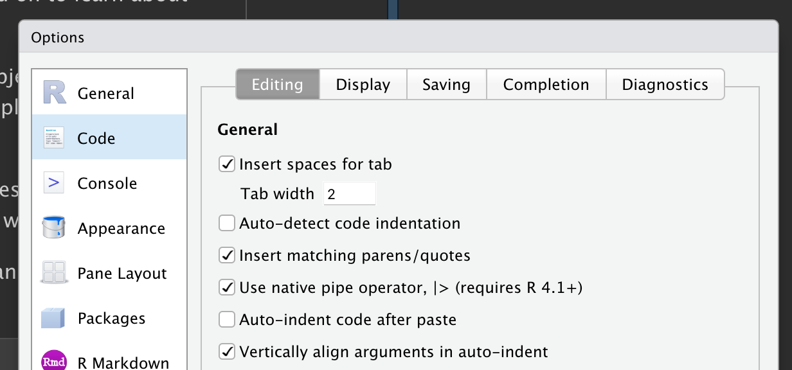

# 데이터 변형 {#sec-data-transform}

```{r}
#| echo: false
source("_common.R")
```

## 서론

시각화는 통찰력을 생성하는 중요한 도구이지만, 데이터를 원하는 그래프를 만드는 데 딱 맞는 형태로 얻는 경우는 드뭅니다.
데이터로부터 질문에 답하기 위해 새로운 변수나 요약치를 만들어야 할 때가 많고, 때로는 데이터를 다루기 조금 더 쉽게 만들기 위해 변수 이름을 바꾸거나 관측값의 순서를 바꾸고 싶을 수도 있습니다.
이 챕터에서는 **dplyr** 패키지와 2013년 뉴욕시에서 출발한 항공편에 관한 새로운 데이터셋을 사용하여 이러한 모든 데이터 변형 방법(그리고 그 이상!)을 배우게 됩니다.

이 챕터의 목표는 데이터 프레임을 변형하기 위한 모든 핵심 도구에 대한 개요를 제공하는 것입니다.
먼저 데이터 프레임의 행(rows)과 열(columns)을 조작하는 함수부터 시작한 다음, 동사(함수)들을 결합하는 데 사용하는 중요한 도구인 파이프(pipe)에 대해 다시 자세히 다룰 것입니다.
그다음에는 그룹(groups) 단위로 작업하는 기능을 소개하겠습니다.
마지막으로 이러한 함수들이 실제로 작동하는 모습을 보여주는 사례 연구로 챕터를 마무리하겠습니다.
이후 챕터에서는 특정 유형의 데이터(예: 숫자, 문자열, 날짜)를 깊이 있게 다루면서 이 함수들을 더 상세히 살펴볼 것입니다.

### 사전 요구 사항

이 챕터에서는 tidyverse의 또 다른 핵심 멤버인 dplyr 패키지에 집중합니다.
주요 개념을 설명하기 위해 nycflights13 패키지의 데이터를 사용할 것이며, 데이터 이해를 돕기 위해 ggplot2를 활용할 것입니다.

```{r}
#| label: setup
library(nycflights13)
library(tidyverse)
```

tidyverse를 로드할 때 출력되는 충돌(conflicts) 메시지에 주의를 기울이세요.
이 메시지는 dplyr이 base R의 일부 함수를 덮어쓴다는 것을 알려줍니다.
dplyr을 로드한 후에도 이러한 함수의 기본(base) 버전을 사용하고 싶다면, `stats::filter()` 및 `stats::lag()`와 같이 전체 이름을 사용해야 합니다.
지금까지는 대개 함수가 어느 패키지에서 왔는지 무시해 왔는데, 보통은 크게 중요하지 않기 때문입니다.
하지만 패키지를 알면 도움말이나 관련 함수를 찾는 데 도움이 되므로, 어느 패키지에서 온 함수인지 명확히 할 필요가 있을 때는 R의 구문과 동일하게 `패키지이름::함수이름()` 형식을 사용하겠습니다.

### nycflights13

기본적인 dplyr 동사들을 탐색하기 위해 `nycflights13::flights`를 사용할 것입니다.
이 데이터셋에는 2013년 뉴욕시에서 출발한 모든 `r format(nrow(nycflights13::flights), big.mark = ",")`건의 항공편 정보가 포함되어 있습니다.
이 데이터는 미국 [교통통계국(Bureau of Transportation Statistics)](https://www.transtats.bts.gov/DL_SelectFields.aspx?gnoyr_VQ=FGJ&QO_fu146_anzr=b0-gvzr)에서 제공하며, `?flights`를 통해 문서화되어 있습니다.

```{r}
flights
```

`flights`는 티블(tibble)로, tidyverse에서 일반적인 실수들을 방지하기 위해 사용하는 특별한 형태의 데이터 프레임입니다.
티블과 일반 데이터 프레임의 가장 중요한 차이점은 출력 방식입니다. 티블은 대용량 데이터셋을 위해 설계되었으므로 처음 몇 개의 행과 한 화면에 들어오는 열만 보여줍니다.
모든 내용을 확인하는 방법은 몇 가지가 있습니다.
RStudio를 사용 중이라면, 스크롤과 필터링이 가능한 대화형 뷰를 여는 `View(flights)`가 가장 편리할 것입니다.
그렇지 않다면 `print(flights, width = Inf)`를 사용하여 모든 열을 보여주거나, `glimpse()`를 사용할 수 있습니다:

```{r}
glimpse(flights)
```

두 가지 뷰 모두에서 변수 이름 뒤에는 각 변수의 유형을 알려주는 약어가 붙습니다: `<int>`는 정수(integer)의 줄임말이고, `<dbl>`은 더블(double, 즉 실수)의 줄임말이며, `<chr>`은 문자(character, 즉 문자열)의 줄임말, `<dttm>`은 날짜-시간(date-time)의 줄임말입니다.
열에 수행할 수 있는 작업은 해당 열의 "유형"에 크게 의존하기 때문에 이들은 매우 중요합니다.

### dplyr 기초

이제 데이터 조작 과제의 대다수를 해결할 수 있게 해주는 주요 dplyr 동사(함수)들을 배우게 될 것입니다.
하지만 각 함수의 차이점을 논의하기 전에, 이들의 공통점을 언급할 가치가 있습니다:

1.  첫 번째 인자는 항상 데이터 프레임입니다.

2.  그 뒤의 인자들은 일반적으로 (따옴표 없이) 변수 이름을 사용하여 어느 열에 대해 작업할지를 기술합니다.

3.  출력 결과는 항상 새로운 데이터 프레임입니다.

각 동사는 한 가지 일을 잘 수행하도록 설계되었기 때문에, 복잡한 문제를 해결하려면 보통 여러 동사를 결합해야 하며, 우리는 이를 파이프 `|>`를 사용하여 수행할 것입니다.
파이프에 대해서는 @sec-the-pipe에서 더 자세히 다루겠지만, 간단히 말해 파이프는 왼쪽에 있는 것을 오른쪽 함수의 인자로 전달합니다. 즉, `x |> f(y)`는 `f(x, y)`와 같고, `x |> f(y) |> g(z)`는 `g(f(x, y), z)`와 같습니다.
파이프를 읽는 가장 쉬운 방법은 "~한 다음(then)"입니다.
이를 통해 세부 내용을 아직 배우지 않았더라도 다음 코드의 흐름을 파악할 수 있습니다.

```{r}
#| eval: false
flights |>
  filter(dest == "IAH") |> 
  group_by(year, month, day) |> 
  summarize(
    arr_delay = mean(arr_delay, na.rm = TRUE)
  )
```

dplyr의 동사들은 무엇에 작용하는지에 따라 네 그룹으로 나뉩니다: **행(rows)** , **열(columns)** , **그룹(groups)** , 또는 **테이블(tables)** .
다음 섹션에서는 행, 열, 그룹에 대한 가장 중요한 동사들을 배우게 됩니다.
그다음, @sec-joins에서 테이블을 대상으로 작동하는 조인(join) 동사들을 살펴볼 것입니다.
그럼 시작해 봅시다!

## 행

데이터셋의 행에 작용하는 가장 중요한 동사는 `filter()`와 `arrange()`입니다. `filter()`는 행의 순서를 바꾸지 않고 어떤 행을 남길지 결정하며, `arrange()`는 어떤 행이 있는지는 바꾸지 않고 행의 순서를 변경합니다.
두 함수 모두 행에만 영향을 미치며, 열은 그대로 유지됩니다.
또한 고유한 값을 가진 행을 찾는 `distinct()`에 대해서도 논의할 것입니다.
`arrange()`나 `filter()`와 달리 `distinct()`는 선택적으로 열을 수정할 수도 있습니다.

### `filter()`

`filter()`를 사용하면 열의 값을 기준으로 행을 남길 수 있습니다[^data-transform-1].
첫 번째 인자는 데이터 프레임입니다.
두 번째와 그 이후의 인자들은 행을 남기기 위해 참(true)이어야 하는 조건들입니다.
예를 들어, 120분(2시간) 이상 늦게 출발한 모든 항공편을 찾을 수 있습니다.

[^data-transform-1]: 나중에 위치(position)를 기준으로 행을 선택할 수 있게 해주는 `slice_*()` 함수군에 대해서도 배울 것입니다.

```{r}
flights |> 
  filter(dep_delay > 120)
```

`>`(보다 큰)뿐만 아니라 `>=`(보다 크거나 같은), `<`(보다 작은), `<=`(보다 작거나 같은), `==`(같은), `!=`(같지 않은)를 사용할 수 있습니다.
또한 `&`나 `,`를 사용하여 "그리고(and)"(조건 둘 다 체크)를 나타내거나, `|`를 사용하여 "또는(or)"(둘 중 하나라도 체크)을 나타내는 조건들을 결합할 수도 있습니다.

```{r}
# 1월 1일에 출발한 항공편
flights |> 
  filter(month == 1 & day == 1)

# 1월 또는 2월에 출발한 항공편
flights |> 
  filter(month == 1 | month == 2)
```

`|`와 `==`를 결합할 때 유용하게 쓸 수 있는 `%in%`이라는 단축 방식이 있습니다.
변수 값이 오른쪽의 값 중 하나인 행들을 남겨줍니다.

```{r}
# 1월 또는 2월에 출발한 항공편을 선택하는 더 짧은 방법
flights |> 
  filter(month %in% c(1, 2))
```

이러한 비교 및 논리 연산자들에 대해서는 @sec-logicals에서 더 자세히 다룰 것입니다.

`filter()`를 실행하면 dplyr은 필터링 작업을 수행하여 새로운 데이터 프레임을 생성하고 이를 출력합니다.
dplyr 함수는 입력을 절대 수정하지 않기 때문에 기존의 `flights` 데이터셋을 수정하지는 않습니다.
결과를 저장하려면 할당 연산자 `<-`를 사용해야 합니다.

```{r}
jan1 <- flights |> 
  filter(month == 1 & day == 1)
```

### 흔한 실수

R을 시작할 때 범하기 가장 쉬운 실수는 같음을 테스트할 때 `==` 대신 `=`를 사용하는 것입니다. `filter()`는 이런 상황이 발생하면 친절하게 알려줄 것입니다.

```{r}
#| error: true
flights |> 
  filter(month = 1)
```

또 다른 실수는 영어 문장처럼 "또는(or)" 문을 작성하는 것입니다.

```{r}
#| eval: false
flights |> 
  filter(month == 1 | 2)
```

이 코드는 에러를 던지지 않는다는 점에서는 "작동"하지만, 여러분이 원하는 대로 작동하지는 않습니다. `|` 연산자가 먼저 `month == 1` 조건을 확인한 다음 `2`라는 숫자를 확인하는데, `2`는 체크하기에 논리적으로 적절한 조건이 아니기 때문입니다.
여기서 어떤 일이 일어나고 왜 그런지에 대해서는 @sec-order-operations-boolean에서 더 자세히 배울 것입니다.

### `arrange()`

`arrange()`는 열의 값을 기준으로 행의 순서를 바꿉니다.
데이터 프레임과 정렬 기준이 될 일련의 열 이름(또는 더 복잡한 식)을 인자로 받습니다.
둘 이상의 열 이름을 제공하면, 앞선 열의 값이 같을 때 뒤에 오는 열을 기준으로 순위를 정하게 됩니다.
예를 들어, 다음 코드는 네 개의 열에 걸쳐 있는 출발 시간을 기준으로 정렬합니다.
가장 빠른 연도가 먼저 오고, 같은 연도 내에서는 가장 빠른 달이 먼저 오게 됩니다.

```{r}
flights |> 
  arrange(year, month, day, dep_time)
```

`arrange()` 안에서 열 이름 주위에 `desc()`를 사용하면 해당 열을 기준으로 내림차순(큰 값에서 작은 값 순서)으로 정렬할 수 있습니다.
예를 들어, 이 코드는 항공편을 지연 시간이 가장 긴 순서대로 정렬합니다.

```{r}
flights |> 
  arrange(desc(dep_delay))
```

행의 개수는 바뀌지 않았다는 점에 유의하세요. 우리는 데이터를 정렬할 뿐 필터링하는 것은 아닙니다.

### `distinct()`

`distinct()`는 데이터셋에서 고유한 모든 행을 찾아줍니다. 따라서 엄밀히 말하면 주로 행에 작용하는 기능입니다.
하지만 대부분의 경우 특정 변수들의 고유한 조합을 원할 것이므로, 선택적으로 열 이름을 제공할 수도 있습니다.

```{r}
# 중복된 행이 있다면 제거
flights |> 
  distinct()

# 모든 고유한 출발지(origin)와 목적지(dest) 쌍 찾기
flights |> 
  distinct(origin, dest)
```

대안으로, 고유한 행을 필터링하면서 다른 열들도 유지하고 싶다면 `.keep_all = TRUE` 옵션을 사용할 수 있습니다.

```{r}
flights |> 
  distinct(origin, dest, .keep_all = TRUE)
```

이러한 고유한 항공편들이 모두 1월 1일인 것은 우연이 아닙니다. `distinct()`는 데이터셋에서 고유한 행의 첫 번째 출현을 찾고 나머지는 버리기 때문입니다.

대신 출현 횟수를 찾고 싶다면 `distinct()`를 `count()`로 바꾸는 것이 더 좋습니다. `sort = TRUE` 인자를 사용하면 출현 횟수가 많은 순서대로 정렬할 수 있습니다. 카운트에 대해서는 @sec-counts에서 더 배우게 됩니다.

```{r}
flights |>
  count(origin, dest, sort = TRUE)
```

### 연습문제

1.  각 조건에 대해 단일 파이프라인을 작성하여 해당 조건을 충족하는 모든 항공편을 찾으세요:

    -   도착 지연 시간이 2시간 이상인 항공편
    -   휴스턴(`IAH` 또는 `HOU`)으로 비행한 항공편
    -   유나이티드(United), 아메리칸(American) 또는 델타(Delta) 항공사에서 운항한 항공편
    -   여름(7월, 8월, 9월)에 출발한 항공편
    -   2시간 이상 늦게 도착했지만 늦게 출발하지는 않은 항공편
    -   최소 1시간 이상 연착되었으나 비행 중에 30분 이상 시간을 만회한 항공편

2.  `flights`를 정렬하여 출발 지연 시간이 가장 긴 항공편을 찾으세요. 아침에 가장 일찍 출발한 항공편을 찾으세요.

3.  `flights`를 정렬하여 가장 빠른 항공편을 찾으세요. (힌트: 함수 내부에서 수학 계산식을 포함해 보세요.)

4.  2013년의 모든 날에 비행이 있었나요?

5.  어느 항공편이 가장 먼 거리를 이동했나요? 어느 항공편이 가장 짧은 거리를 이동했나요?

6.  `filter()`와 `arrange()`를 둘 다 사용하는 경우 순서가 중요할까요? 왜 그럴까요/왜 아닐까요? 결과물과 함수가 수행해야 할 작업량에 대해 생각해 보세요.

## 열

행을 바꾸지 않고 열에 영향을 미치는 네 가지 중요한 동사가 있습니다: `mutate()`는 기존 열에서 파생된 새로운 열을 만들고, `select()`는 어떤 열을 남길지 결정하며, `rename()`은 열의 이름을 바꾸고, `relocate()`는 열의 위치를 변경합니다.

### `mutate()` {#sec-mutate}

`mutate()`의 역할은 기존 열로부터 계산된 새로운 열을 추가하는 것입니다.
변형 챕터에서는 다양한 유형의 변수를 조작하는 데 사용할 수 있는 방대한 함수 구성을 배우게 될 것입니다.
지금은 기본적인 대수 연산을 사용하여 연착된 항공편이 공중에서 시간을 얼마나 만회했는지를 나타내는 `gain`과 시간당 마일 단위의 `speed`를 계산해 보겠습니다.

```{r}
flights |> 
  mutate(
    gain = dep_delay - arr_delay,
    speed = distance / air_time * 60
  )
```

기본적으로 `mutate()`는 새로운 열을 데이터셋의 오른쪽에 추가하는데, 이 때문에 여기서 어떤 일이 일어나는지 확인하기 어렵습니다.
대신 `.before` 인자를 사용하여 왼쪽 편에 변수를 추가할 수 있습니다[^data-transform-2].

[^data-transform-2]: RStudio에서 많은 열이 있는 데이터셋을 보는 가장 쉬운 방법은 `View()`임을 기억하세요.

```{r}
flights |> 
  mutate(
    gain = dep_delay - arr_delay,
    speed = distance / air_time * 60,
    .before = 1
  )
```

`.before` 앞에 붙은 마침표(`.`)는 이것이 우리가 만드는 세 번째 변수의 이름이 아니라 함수의 인자임을 나타냅니다.
특정 변수 뒤에 추가하고 싶다면 `.after`를 사용할 수도 있으며, `.before`와 `.after` 모두에서 위치 숫자 대신 변수 이름을 직접 사용할 수 있습니다.
예를 들어, `day` 뒤에 새로운 변수들을 추가할 수도 있습니다.

```{r}
#| results: false
flights |> 
  mutate(
    gain = dep_delay - arr_delay,
    speed = distance / air_time * 60,
    .after = day
  )
```

또는 `.keep` 인자를 사용하여 어떤 변수들을 유지할지 제어할 수 있습니다.
특히 유용한 값인 `"used"`는 `mutate()` 단계에서 사용되었거나 생성된 열들만 유지하도록 지정합니다.
예를 들어, 다음 출력 결과는 `dep_delay`, `arr_delay`, `air_time`, `gain`, `hours`, `gain_per_hour` 변수만을 포함하게 됩니다.

```{r}
#| results: false
flights |> 
  mutate(
    gain = dep_delay - arr_delay,
    hours = air_time / 60,
    gain_per_hour = gain / hours,
    .keep = "used"
  )
```

위 계산 결과를 다시 `flights`에 할당하지 않았기 때문에, `gain`, `hours`, `gain_per_hour`라는 새로운 변수들은 단지 출력만 될 뿐 데이터 프레임에 저장되지는 않는다는 점에 유의하세요.
나중에 이러한 변수들을 계속 사용하고 싶다면, 결과를 다시 `flights`에 할당하여 기존 데이터 프레임을 더 많은 변수로 덮어쓸지, 아니면 새로운 객체에 할당할지 신중히 생각해야 합니다.
종종 정답은 내용을 더 잘 나타내는 이름(예: `delay_gain`)을 가진 새로운 객체에 할당하는 것이지만, `flights`를 덮어쓰는 것이 타당한 이유가 있을 때도 있습니다.

### `select()` {#sec-select}

수백 개 또는 수천 개의 변수를 가진 데이터셋을 받는 일은 드물지 않습니다.
이런 상황에서 첫 번째 과제는 보통 관심 있는 변수들에만 집중하는 것입니다.
`select()`를 사용하면 변수 이름을 기반으로 한 작업들을 통해 유용한 하위 집합으로 빠르게 좁힐 수 있습니다.

-   이름으로 열 선택:

    ```{r}
    #| results: false
    flights |> 
      select(year, month, day)
    ```

-   year부터 day 사이의 모든 열 선택 (양 끝단 포함):

    ```{r}
    #| results: false
    flights |> 
      select(year:day)
    ```

-   year부터 day까지를 제외한 모든 열 선택 (양 끝단 포함):

    ```{r}
    #| results: false
    flights |> 
      select(!year:day)
    ```

    과거에는 이 작업에 `!` 대신 `-`를 사용했기 때문에 실무 코드에서도 자주 볼 수 있을 것입니다.
    이 두 연산자는 같은 목적으로 사용되지만 동작에 미묘한 차이가 있습니다.
    저희는 "아님(not)"이라고 읽히고 `&`나 `|`와 잘 결합되는 `!`를 사용하는 것을 권장합니다.

-   문자형 변수인 모든 열 선택:

    ```{r}
    #| results: false
    flights |> 
      select(where(is.character))
    ```

`select()` 내에서 사용할 수 있는 여러 헬퍼(helper) 함수들이 있습니다.

-   `starts_with("abc")`: "abc"로 시작하는 매칭 이름.
-   `ends_with("xyz")`: "xyz"로 끝나는 매칭 이름.
-   `contains("ijk")`: "ijk"를 포함하는 매칭 이름.
-   `num_range("x", 1:3)`: `x1`, `x2`, `x3` 매칭 이름.

자세한 내용은 `?select`를 참조하세요.
이제 정규 표현식(@sec-regular-expressions의 주제)을 알게 되면, 특정 패턴과 일치하는 변수를 선택하기 위해 `matches()`를 사용할 수도 있게 됩니다.

`select()`를 하면서 `=`를 사용하여 변수 이름을 바꿀 수 있습니다.
새 이름은 `=`의 왼쪽에 오고, 기존 변수 이름은 오른쪽에 옵니다.

```{r}
flights |> 
  select(tail_num = tailnum)
```

### `rename()`

기존의 모든 변수를 유지하면서 몇 개만 이름을 바꾸고 싶다면 `select()` 대신 `rename()`을 사용할 수 있습니다.

```{r}
flights |> 
  rename(tail_num = tailnum)
```

이름이 일관되지 않은 열이 매우 많아서 일일이 손으로 고치기 고통스럽다면, 유용한 자동 정제 기능을 제공하는 `janitor::clean_names()`를 확인해 보세요.

### `relocate()`

변수들의 위치를 옮기려면 `relocate()`를 사용하세요.
관련된 변수들을 모아두거나 중요한 변수를 앞으로 옮기고 싶을 수 있습니다.
기본적으로 `relocate()`는 변수들을 맨 앞으로 이동시킵니다.

```{r}
flights |> 
  relocate(time_hour, air_time)
```

`mutate()`에서와 마찬가지로 `.before` 및 `.after` 인자를 사용하여 위치를 지정할 수도 있습니다.

```{r}
#| results: false
flights |> 
  relocate(year:dep_time, .after = time_hour)
flights |> 
  relocate(starts_with("arr"), .before = dep_time)
```

### 연습문제

1.  `dep_time`, `sched_dep_time`, `dep_delay`를 비교해 보세요. 이 세 수치 사이에 어떤 관계가 있을 것으로 예상하나요?

2.  `flights`에서 `dep_time`, `dep_delay`, `arr_time`, `arr_delay`를 선택하는 가능한 모든 방법을 브레인스토밍해 보세요.

3.  `select()` 호출에서 동일한 변수 이름을 여러 번 지정하면 어떻게 됩니까?

4.  `any_of()` 함수는 무엇을 합니까? 이 벡터와 함께 사용할 때 왜 유용할까요?

    ```{r}
    variables <- c("year", "month", "day", "dep_delay", "arr_delay")
    ```

5.  다음 코드를 실행한 결과가 놀라운가요? select 헬퍼들은 기본적으로 대소문자를 어떻게 처리하나요? 기본값을 어떻게 바꿀 수 있나요?

    ```{r}
    #| eval: false
    flights |> select(contains("TIME"))
    ```

6.  측정 단위를 나타내기 위해 `air_time`의 이름을 `air_time_min`으로 바꾸고 데이터 프레임의 맨 앞으로 이동시키세요.

7.  다음 코드가 작동하지 않는 이유는 무엇이며, 이 에러는 무엇을 의미하나요?

    ```{r}
    #| error: true
    flights |> 
      select(tailnum) |> 
      arrange(arr_delay)
    ```

## 파이프 {#sec-the-pipe}

앞서 파이프의 간단한 예제들을 보여드렸으나, 파이프의 진정한 위력은 여러 동사를 결합하기 시작할 때 나타납니다.
예를 들어, 휴스턴 IAH 공항으로 가는 가장 빠른 항공편을 찾고 싶다고 상상해 봅시다. `filter()`, `mutate()`, `select()`, `arrange()`를 결합해야 합니다.

```{r}
flights |> 
  filter(dest == "IAH") |> 
  mutate(speed = distance / air_time * 60) |> 
  select(year:day, dep_time, carrier, flight, speed) |> 
  arrange(desc(speed))
```

비록 이 파이프라인은 네 단계로 이루어져 있지만, 각 줄의 시작 부분에 동사가 오기 때문에 훑어보기가 쉽습니다. `flights` 데이터로 시작하여, 그다음 필터링하고(filter), 변형하고(mutate), 선택하고(select), 정렬(arrange)합니다.

파이프가 없었다면 어떤 일이 일어났을까요?
가장 먼저 떠올릴 수 있는 방법은 각 함수 호출을 이전 호출 안에 중첩시키는 것입니다.

```{r}
#| results: false
arrange(
  select(
    mutate(
      filter(
        flights, 
        dest == "IAH"
      ),
      speed = distance / air_time * 60
    ),
    year:day, dep_time, carrier, flight, speed
  ),
  desc(speed)
)
```

아니면 수많은 중간 객체(intermediate objects)를 사용할 수도 있습니다.

```{r}
#| results: false
flights1 <- filter(flights, dest == "IAH")
flights2 <- mutate(flights1, speed = distance / air_time * 60)
flights3 <- select(flights2, year:day, dep_time, carrier, flight, speed)
arrange(flights3, desc(speed))
```

두 방식 모두 나름의 쓰임새와 시기가 있지만, 일반적으로 파이프는 작성하기 쉽고 읽기 편한 데이터 분석 코드를 생성합니다.

코드에 파이프를 추가하려면 키보드 단축키인 Ctrl/Cmd + Shift + M을 사용하는 것을 권장합니다.
@fig-pipe-options에 표시된 것처럼 `%>%` 대신 `|>`를 사용하려면 RStudio 옵션을 하나 변경해야 합니다. `%>%`에 대해서는 곧 설명하겠습니다.

```{r}
#| label: fig-pipe-options
#| echo: false
#| fig-cap: |
#|   `|>`를 삽입하려면 "Use native pipe operator" 옵션이 체크되어 있는지 확인하세요.
#| fig-alt: | 
#|   "Code" 옵션의 "Editing" 패널에 있는 "Use native pipe operator" 옵션 스크린샷.

```

::: callout-note
## magrittr

한동안 tidyverse를 사용해 오셨다면, **magrittr** 패키지에서 제공하는 `%>%` 파이프에 익숙하실 것입니다.
magrittr 패키지는 핵심 tidyverse에 포함되어 있으므로 tidyverse를 로드할 때마다 `%>%`를 사용할 수 있습니다.

```{r}
#| eval: false
library(tidyverse)

mtcars %>% 
  group_by(cyl) %>%
  summarize(n = n())
```

단순한 경우라면 `|>`와 `%>%`는 동일하게 작동합니다.
그렇다면 왜 기본(base) 파이프를 권장할까요?
첫째, 기본 R의 일부이므로 tidyverse를 사용하지 않을 때도 항상 사용할 수 있기 때문입니다.
둘째, `|>`는 `%>%`보다 꽤나 더 단순합니다. 2014년 `%>%`가 발명된 이후 2021년 R 4.1.0에 `|>`가 포함되기까지의 기간 동안 우리는 파이프에 대해 더 잘 이해하게 되었습니다.
이를 통해 자주 쓰이지 않고 덜 중요한 기능들을 덜어낸 기본 구현이 가능해졌습니다.
:::

## 그룹

지금까지는 행과 열에 대해 작업하는 함수들을 배웠습니다.
그룹 단위로 작업하는 기능을 추가하면 dplyr은 훨씬 더 강력해집니다.
이 섹션에서는 가장 중요한 함수들인 `group_by()`, `summarize()`, 그리고 slice 계열 함수들에 집중할 것입니다.

### `group_by()`

분석에 의미 있는 그룹으로 데이터셋을 나누려면 `group_by()`를 사용하세요.

```{r}
flights |> 
  group_by(month)
```

`group_by()`는 데이터를 실제로 바꾸지는 않지만, 출력을 자세히 보면 월별로 "그룹화됨"(`Groups: month [12]`)이라고 표시된 것을 알 수 있습니다.
이는 이후의 작업들이 이제 "월별로" 작동할 것임을 의미합니다. `group_by()`는 데이터 프레임에 이러한 그룹화된 기능(클래스라고 지칭함)을 추가하여 이후 데이터에 적용되는 동사들의 동작 방식을 바꿉니다.

### `summarize()` {#sec-summarize}

가장 중요한 그룹 작업은 요약(summary)으로, 단일 요약 통계량을 계산하는 데 사용될 경우 데이터 프레임을 각 그룹당 하나의 행으로 축소합니다.
dplyr에서 이 작업은 `summarize()`[^data-transform-3]가 수행하며, 다음 예제는 월별 평균 출발 지연 시간을 계산합니다.

[^data-transform-3]: 영국식 영어를 선호하신다면 `summarise()`로 써도 됩니다.

```{r}
flights |> 
  group_by(month) |> 
  summarize(
    avg_delay = mean(dep_delay)
  )
```

아차! 결과가 모두 `NA`로 나왔습니다. `NA`는 R에서 결측값(missing value)을 나타내는 기호입니다.
이런 일이 발생한 이유는 실제 비행 중 일부가 지연 시간 열에 결측 데이터를 가지고 있었고, 그 값들을 포함하여 평균을 계산했을 때 `NA` 결과가 나왔기 때문입니다.
결측값에 대해서는 @sec-missing-values에서 자세히 다루겠지만, 지금은 `mean()` 함수에 `na.rm = TRUE` 인자를 설정하여 모든 결측값을 무시하라고 알려주겠습니다.

```{r}
flights |> 
  group_by(month) |> 
  summarize(
    avg_delay = mean(dep_delay, na.rm = TRUE)
  )
```

한 번의 `summarize()` 호출 내에서 얼마든지 요약치를 생성할 수 있습니다.
다음 챕터들에서 유용한 다양한 요약치들을 배우게 되겠지만, 매우 유용한 요약치 중 하나는 각 그룹의 행 개수를 반환하는 `n()`입니다.

```{r}
flights |> 
  group_by(month) |> 
  summarize(
    avg_delay = mean(dep_delay, na.rm = TRUE), 
    n = n()
  )
```

평균과 개수만으로도 데이터 과학에서 놀라울 정도로 많은 일을 할 수 있습니다!

### `slice_` 함수들

각 그룹 내에서 특정 행을 추출할 수 있게 해주는 다섯 가지 유용한 함수가 있습니다:

-   `df |> slice_head(n = 1)`: 각 그룹의 첫 번째 행을 가져옵니다.
-   `df |> slice_tail(n = 1)`: 각 그룹의 마지막 행을 가져옵니다.
-   `df |> slice_min(x, n = 1)`: `x` 열의 값이 가장 작은 행을 가져옵니다.
-   `df |> slice_max(x, n = 1)`: `x` 열의 값이 가장 큰 행을 가져옵니다.
-   `df |> slice_sample(n = 1)`: 무작위 행 하나를 가져옵니다.

둘 이상의 행을 선택하려면 `n`을 바꿀 수도 있고, `n =` 대신 `prop = 0.1`을 사용하여 각 그룹 행의 10%를 선택할 수도 있습니다.
예를 들어, 다음 코드는 각 목적지별로 도착이 가장 많이 지연된 항공편을 찾습니다.

```{r}
flights |> 
  group_by(dest) |> 
  slice_max(arr_delay, n = 1) |>
  relocate(dest)
```

목적지는 105개인데 108개의 행이 결과로 나왔습니다. 왜 그럴까요?
`slice_min()`과 `slice_max()`는 공동 순위(tied values)를 유지하므로 `n = 1`은 가장 높은 값을 가진 모든 행을 가져다주기 때문입니다.
그룹당 정확히 한 행만 원한다면 `with_ties = FALSE`로 설정하면 됩니다.

이는 `summarize()`로 최대 지연 시간을 계산하는 것과 비슷하지만, 단일 요약 통계량 대신 해당 행 전체(동점자가 있다면 여러 행)를 얻게 된다는 차이가 있습니다.

### 여러 변수로 그룹화하기

둘 이상의 변수를 사용하여 그룹을 생성할 수 있습니다. 예를 들어, 날짜마다 그룹을 만들 수 있습니다.

```{r}
daily <- flights |>  
  group_by(year, month, day)
daily
```

둘 이상의 변수로 그룹화된 티블을 요약할 때, 각 요약은 마지막 그룹을 한 겹씩 벗겨냅니다(peels off).
뒤돌아보면 이 기능이 작동하는 그리 훌륭한 방식은 아니었지만, 기존 코드를 깨트리지 않고 바꾸기는 어렵습니다.
어떤 일이 일어나고 있는지 명확히 하기 위해 dplyr은 이 동작을 바꿀 수 있는 방법을 알려주는 메시지를 표시합니다.

```{r}
daily_flights <- daily |> 
  summarize(n = n())
```

만약 이 동작에 만족한다면, 메시지를 끄기 위해 명시적으로 이를 요청할 수 있습니다.

```{r}
#| results: false
daily_flights <- daily |> 
  summarize(
    n = n(), 
    .groups = "drop_last"
  )
```

또는 다른 값을 설정하여 기본 동작을 바꿀 수도 있습니다. 예를 들어, 모든 그룹화를 해제하려면 `"drop"`, 동일한 그룹을 보존하려면 `"keep"`을 설정합니다.

### 그룹 해제하기

`summarize()`를 사용하지 않고도 데이터 프레임에서 그룹화를 제거하고 싶을 수 있습니다. 이때 `ungroup()`을 사용할 수 있습니다.

```{r}
daily |> 
  ungroup()
```

이제 그룹화가 해제된 데이터 프레임을 요약하면 어떻게 되는지 봅시다.

```{r}
daily |> 
  ungroup() |>
  summarize(
    avg_delay = mean(dep_delay, na.rm = TRUE), 
    flights = n()
  )
```

dplyr은 그룹화되지 않은 데이터 프레임의 모든 행을 하나의 그룹으로 취급하기 때문에 단일 행을 결과로 얻게 됩니다.

### `.by`

dplyr 1.1.0에는 연산별 그룹화를 위한 새로운 실험적인 구문인 `.by` 인자가 포함되었습니다. `group_by()`와 `ungroup()`이 없어지는 것은 아니지만, 이제 단일 연산 내에서 그룹화하기 위해 `.by` 인자를 사용할 수도 있습니다.

```{r}
#| results: false
flights |> 
  summarize(
    delay = mean(dep_delay, na.rm = TRUE), 
    n = n(),
    .by = month
  )
```

또는 여러 변수로 그룹화하고 싶은 경우:

```{r}
#| results: false
flights |> 
  summarize(
    delay = mean(dep_delay, na.rm = TRUE), 
    n = n(),
    .by = c(origin, dest)
  )
```

`.by`는 모든 동사에서 작동하며, 작업을 마쳤을 때 그룹화 메시지를 끄기 위한 `.groups` 인자나 `ungroup()`을 사용할 필요가 없다는 장점이 있습니다.

이 챕터에서 이 구문에 집중하지 않은 이유는 이 책을 집필할 당시 매우 새로운 기능이었기 때문입니다.
많은 가능성을 가지고 있고 꽤 인기를 얻을 것으로 보이기 때문에 언급하고 싶었습니다.
자세한 내용은 [dplyr 1.1.0 블로그 포스트](https://www.tidyverse.org/blog/2023/02/dplyr-1-1-0-per-operation-grouping/)에서 더 배우실 수 있습니다.

### 연습문제

1.  어떤 항공사가 가장 나쁜 평균 지연 시간을 가졌을까요? 도전 과제: 나쁜 공항의 영향과 나쁜 항공사의 영향을 분리해 낼 수 있을까요? 왜 그럴까요/왜 아닐까요? (힌트: `flights |> group_by(carrier, dest) |> summarize(n())`을 생각해 보세요.)

2.  각 목적지별로 출발 지연 시간이 가장 길었던 항공편들을 찾으세요.

3.  하루 동안 지연 시간이 어떻게 변하나요? 그래프를 그려서 답을 설명해 보세요.

4.  `slice_min()`과 그 친구들에게 음의 숫자 `n`을 제공하면 어떤 일이 일어납니까?

5.  방금 배운 dplyr 동사들을 사용하여 `count()`가 하는 일을 설명해 보세요. `count()`의 `sort` 인자는 무엇을 합니까?
