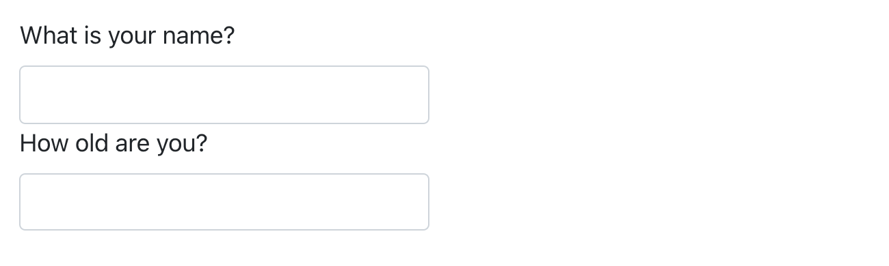

# Quarto 형식 {#sec-quarto-formats}

```{r}
#| echo: false
source("_common.R")
```

## 서론

지금까지 여러분은 HTML 문서를 생성하는 데 Quarto가 사용되는 것을 보았습니다.
이 챕터에서는 Quarto로 생성할 수 있는 다른 많은 종류의 출력물에 대한 간략한 개요를 제공합니다.

문서의 출력물을 설정하는 방법에는 두 가지가 있습니다:

1.  영구적으로, YAML 헤더를 수정하여 설정:

    ``` yaml
    title: "다이아몬드 크기"
    format: html
    ```

2.  일시적으로, `quarto::quarto_render()`를 직접 호출하여 설정:

    ```{r}
    #| eval: false
    quarto::quarto_render("diamond-sizes.qmd", output_format = "docx")
    ```

    `output_format` 인자는 리스트 값도 받을 수 있기 때문에, 프로그래밍 방식으로 여러 유형의 출력물을 생성하고자 할 때 유용합니다.

    ```{r}
    #| eval: false
    quarto::quarto_render("diamond-sizes.qmd", output_format = c("docx", "pdf"))
    ```

## 출력 옵션

Quarto는 광범위한 출력 형식을 제공합니다.
전체 목록은 <https://quarto.org/docs/output-formats/all-formats.html>에서 찾을 수 있습니다.
많은 형식이 일부 출력 옵션(예: 목차를 포함하기 위한 `toc: true`)을 공유하지만, 어떤 옵션들은 형식에 특화되어 있습니다(예: `code-fold: true`는 HTML 출력의 경우 코드 청크를 `<details>` 태그로 접어서 사용자가 필요할 때 표시할 수 있게 하지만, PDF나 Word 문서에는 적용되지 않습니다).

기본 옵션을 덮어쓰려면 확장된 `format` 필드를 사용해야 합니다.
예를 들어 떠다니는(floating) 목차가 있는 `html`을 렌더링하고 싶다면 다음과 같이 사용합니다:

``` yaml
format:
  html:
    toc: true
    toc_float: true
```

형식 목록을 제공하여 여러 출력물로 렌더링할 수도 있습니다:

``` yaml
format:
  html:
    toc: true
    toc_float: true
  pdf: default
  docx: default
```

기본 옵션을 덮어쓰고 싶지 않을 때의 특수 문법(`pdf: default`)에 유의하세요.

문서의 YAML에 명시된 모든 형식으로 렌더링하려면 `output_format = "all"`을 사용할 수 있습니다.

```{r}
#| eval: false
quarto::quarto_render("diamond-sizes.qmd", output_format = "all")
```

## 문서

이전 챕터에서는 기본 `html` 출력에 중점을 두었습니다.
그 테마를 바탕으로 서로 다른 종류의 문서를 생성하는 여러 기본적인 변형이 있습니다.
예를 들어:

-   `pdf`는 LaTeX(오픈소스 문서 레이아웃 시스템)를 사용하여 PDF를 만듭니다. 이를 위해서는 LaTeX를 설치해야 합니다.
    설치되어 있지 않다면 RStudio가 설치를 안내할 것입니다.

-   `docx`는 Microsoft Word (`.docx`) 문서용입니다.

-   `odt`는 OpenDocument Text (`.odt`) 문서용입니다.

-   `rtf`는 Rich Text Format (`.rtf`) 문서용입니다.

-   `gfm`은 GitHub Flavored Markdown (`.md`) 문서용입니다.

-   `ipynb`는 Jupyter Notebooks (`.ipynb`)용입니다.

의사 결정권자와 공유할 문서를 생성할 때, 문서 YAML에서 전역 옵션을 설정하여 기본적으로 표시되는 코드를 끌 수 있다는 것을 기억하세요:

``` yaml
execute:
  echo: false
```

`html` 문서의 경우, 코드 청크를 기본적으로 숨기되 클릭 한 번으로 볼 수 있도록 만드는 또 다른 옵션이 있습니다:

``` yaml
format:
  html:
    code: true
```

## 프레젠테이션

Quarto를 사용하여 프레젠테이션을 만들 수도 있습니다.
Keynote나 PowerPoint와 같은 도구에 비하면 시각적인 제어 능력은 떨어지지만, R 코드의 결과를 프레젠테이션에 자동으로 삽입하는 것은 엄청난 시간을 절약해 줍니다.
프레젠테이션은 콘텐츠를 슬라이드로 나누는 방식으로 작동하며, 각각의 2단계(`##`) 헤더에서 새로운 슬라이드가 시작됩니다.
추가로 1단계(`#`) 헤더는 새로운 섹션의 시작을 나타내며, 기본적으로 가운데 정렬된 섹션 제목 슬라이드를 생성합니다.

Quarto는 다음과 같은 다양한 프레젠테이션 형식을 지원합니다:

1.  `revealjs` - revealjs를 사용한 HTML 프레젠테이션

2.  `pptx` - PowerPoint 프레젠테이션

3.  `beamer` - LaTeX Beamer를 사용한 PDF 프레젠테이션.

Quarto로 프레젠테이션을 만드는 방법에 대해 더 자세히 읽어보시려면 [https://quarto.org/docs/presentations](https://quarto.org/docs/presentations/)를 참조하세요.

## 상호작용 (Interactivity)

어떤 HTML 문서와 마찬가지로 Quarto로 만든 HTML 문서에도 대화형(interactive) 컴포넌트를 포함할 수 있습니다.
여기서는 Quarto 문서에 상호작용을 포함하는 두 가지 옵션인 htmlwidgets와 Shiny를 소개합니다.

### htmlwidgets

HTML은 대화형 형식이므로, 대화형 HTML 시각화를 생성하는 R 함수인 **htmlwidgets**를 사용하여 그 상호작용을 활용할 수 있습니다.
아래의 **leaflet** 지도를 예로 들어보겠습니다.
이 페이지를 웹에서 보고 있다면 지도를 이리저리 끌거나 확대/축소 등을 할 수 있습니다.
물론 책에서는 그렇게 할 수 없으므로, Quarto가 자동으로 정적 스크린샷을 삽입해 줍니다.

```{r}
#| fig-alt: 마웅가화우 / 에덴 산의 Leaflet 지도.
library(leaflet)
leaflet() |>
  setView(174.764, -36.877, zoom = 16) |> 
  addTiles() |>
  addMarkers(174.764, -36.877, popup = "Maungawhau") 
```

htmlwidgets의 가장 큰 장점은 이를 사용하기 위해 HTML이나 JavaScript에 대해 아무것도 알 필요가 없다는 것입니다.
모든 세부 사항이 패키지 내부에 감춰져 있으므로 여러분은 그것에 대해 걱정할 필요가 없습니다.

다음과 같이 htmlwidgets를 제공하는 많은 패키지가 있습니다:

-   대화형 시계열 시각화를 위한 [**dygraphs**](https://rstudio.github.io/dygraphs).

-   대화형 표를 위한 [**DT**](https://rstudio.github.io/DT/).

-   대화형 3D 플롯을 위한 [**threejs**](https://bwlewis.github.io/rthreejs).

-   다이어그램(흐름도 및 단순 노드-링크 다이어그램 등)을 위한 [**DiagrammeR**](https://rich-iannone.github.io/DiagrammeR).

htmlwidgets에 대해 더 자세히 알아보고 이를 제공하는 패키지의 전체 목록을 보려면 <https://www.htmlwidgets.org>를 방문하세요.

### Shiny

htmlwidgets는 **클라이언트 사이드(client-side)** 상호작용을 제공합니다. 즉, 모든 상호작용이 R과 독립적으로 브라우저에서 일어납니다.
한편으로는 HTML 파일을 R 연결 없이 배포할 수 있어서 아주 좋습니다.
하지만 이는 HTML과 JavaScript로 구현된 것으로만 할 수 있는 일을 근본적으로 제한합니다.
대안적인 접근 방식은 JavaScript가 아닌 R 코드를 사용하여 상호작용을 만들 수 있게 해주는 패키지인 **shiny**를 사용하는 것입니다.

Quarto 문서에서 Shiny 코드를 호출하려면 YAML 헤더에 `server: shiny`를 추가하세요:

``` yaml
title: "Shiny Web App"
format: html
server: shiny
```

그런 다음 "input" 함수를 사용하여 문서에 대화형 컴포넌트를 추가할 수 있습니다:

```{r}
#| eval: false
library(shiny)

textInput("name", "이름이 무엇입니까?")
numericInput("age", "몇 살입니까?", NA, min = 0, max = 150)
```

```{r}
#| echo: false
#| out-width: null
#| fig-alt: |
#|   위아래로 두 개의 입력 상자. 위쪽 상자는 "이름이 무엇입니까?"이고 
#|   아래쪽은 "몇 살입니까?"입니다.

```

또한 Shiny 서버에서 실행되어야 하는 코드를 포함하는 청크 옵션 `context: server`를 가진 코드 청크도 필요합니다.

그런 다음 `input$name`과 `input$age`로 값을 참조할 수 있으며, 이 값들이 변경될 때마다 이를 사용하는 코드가 자동으로 다시 실행됩니다.

shiny 상호작용은 **서버 사이드(server-side)**에서 발생하기 때문에 여기서는 라이브 shiny 앱을 보여드릴 수 없습니다.
이는 JavaScript를 몰라도 대화형 앱을 작성할 수 있지만 앱을 실행할 서버가 필요하다는 것을 의미합니다.
이것은 실행과 관련된 문제(logistical issue)를 일으킵니다: Shiny 앱을 온라인에서 실행하려면 Shiny 서버가 필요합니다.
자신의 컴퓨터에서 Shiny 앱을 실행할 때는 Shiny가 자동으로 Shiny 서버를 설정해주지만, 이런 종류의 상호작용을 온라인에 게시하고 싶다면 공개된 Shiny 서버가 필요합니다.
이것이 shiny의 근본적인 트레이드오프입니다. R에서 할 수 있는 모든 것을 shiny 문서에서 할 수 있지만 누군가 R을 실행하고 있어야 합니다.

Shiny에 대해 더 자세히 배우려면 Hadley Wickham이 쓴 Mastering Shiny(<https://mastering-shiny.org/>)를 읽어보시길 권장합니다.

## 웹사이트와 책

약간의 추가 인프라만 있으면 Quarto를 사용하여 완전한 웹사이트나 책을 생성할 수 있습니다:

-   `.qmd` 파일들을 단일 디렉토리에 넣으세요.
    `index.qmd`가 홈페이지가 될 것입니다.

-   사이트의 내비게이션을 제공하는 `_quarto.yml`이라는 YAML 파일을 추가하세요.
    이 파일에서 `project` 유형을 `book` 또는 `website`로 설정하세요. 예:

    ``` yaml
    project:
      type: book
    ```

예를 들어, 다음 `_quarto.yml` 파일은 세 개의 소스 파일(`index.qmd` (홈페이지), `viridis-colors.qmd`, `terrain-colors.qmd`)로 웹사이트를 생성합니다.

```{r}
#| echo: false
#| comment: ""
cat(readr::read_file("quarto/example-site.yml"))
```

책을 위해 필요한 `_quarto.yml` 파일도 매우 유사하게 구조화되어 있습니다.
다음 예제는 네 개의 챕터로 구성되어 세 가지 다른 출력 형식(`html`, `pdf`, `epub`)으로 렌더링되는 책을 만드는 방법을 보여줍니다.
다시 한번 말하지만, 소스 파일은 `.qmd` 파일들입니다.

```{r}
#| echo: false
#| comment: ""
cat(readr::read_file("quarto/example-book.yml"))
```

웹사이트와 책을 위해 RStudio 프로젝트를 사용하는 것을 추천합니다.
`_quarto.yml` 파일을 기반으로 RStudio는 작업 중인 프로젝트 유형을 인식하고, 웹사이트와 책을 렌더링하고 미리 볼 수 있는 Build 탭을 IDE에 추가합니다.
웹사이트와 책 모두 `quarto::quarto_render()`를 사용하여 렌더링할 수도 있습니다.

Quarto 웹사이트에 대해서는 <https://quarto.org/docs/websites>에서, 책에 대해서는 <https://quarto.org/docs/books>에서 더 자세히 읽어보세요.

## 기타 형식

Quarto는 더욱 다양한 출력 형식을 제공합니다:

-   Quarto 저널 템플릿(<https://quarto.org/docs/journals/templates.html>)을 사용하여 학술지 논문을 작성할 수 있습니다.

-   `format: ipynb`를 통해 Quarto 문서를 Jupyter Notebook으로 출력할 수 있습니다: <https://quarto.org/docs/reference/formats/ipynb.html>.

더 많은 형식의 목록은 <https://quarto.org/docs/output-formats/all-formats.html>를 참조하세요.

## 요약

이 챕터에서는 Quarto를 사용하여 결과를 소통할 수 있는 정적/대화형 문서, 프레젠테이션, 웹사이트, 책 등 다양한 옵션을 소개했습니다.

이러한 다양한 형식에서 효과적으로 의사소통하는 방법에 대해 더 배우고 싶다면 다음 리소스들을 추천합니다:

-   프레젠테이션 기술을 향상시키려면 Neal Ford, Matthew McCollough, Nathaniel Schutta가 쓴 [*Presentation Patterns*](https://presentationpatterns.com/)를 읽어보세요.
    이 책은 프레젠테이션을 개선하기 위해 적용할 수 있는 (저수준 및 고수준의) 효과적인 패턴 모음을 제공합니다.

-   학술 발표를 한다면 [*Leek group guide to giving talks*](https://github.com/jtleek/talkguide)가 마음에 드실 겁니다.

-   직접 수강해 보지는 않았지만, 대중 연설에 관한 Matt McGarrity의 온라인 코스가 좋다는 이야기를 들었습니다: <https://www.coursera.org/learn/public-speaking>.

-   대시보드를 많이 만들고 있다면 Stephen Few의 [*Information Dashboard Design: The Effective Visual Communication of Data*](https://www.amazon.com/Information-Dashboard-Design-Effective-Communication/dp/0596100167)를 꼭 읽어보세요.
    단순히 보기에만 좋은 것이 아니라 진정으로 유용한 대시보드를 만드는 데 도움이 될 것입니다.

-   아이디어를 효과적으로 전달하는 것은 종종 그래픽 디자인에 대한 지식이 있을 때 이점이 있습니다.
    Robin Williams의 [*The Non-Designer's Design Book*](https://www.amazon.com/Non-Designers-Design-Book-4th/dp/0133966151)은 시작하기에 좋은 책입니다.
