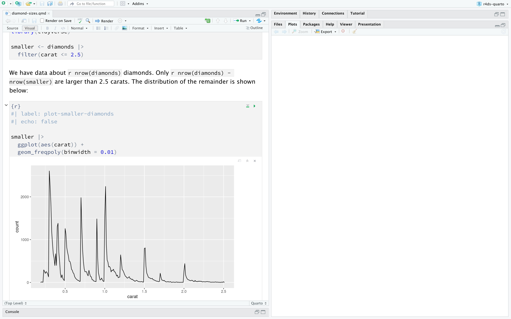
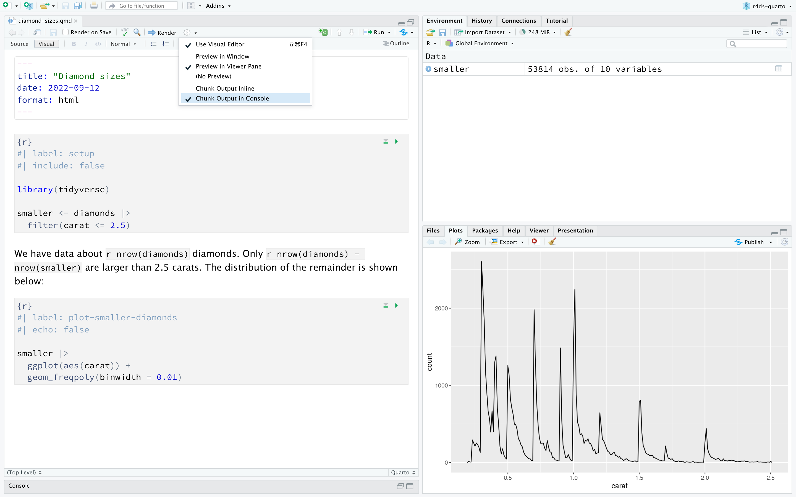
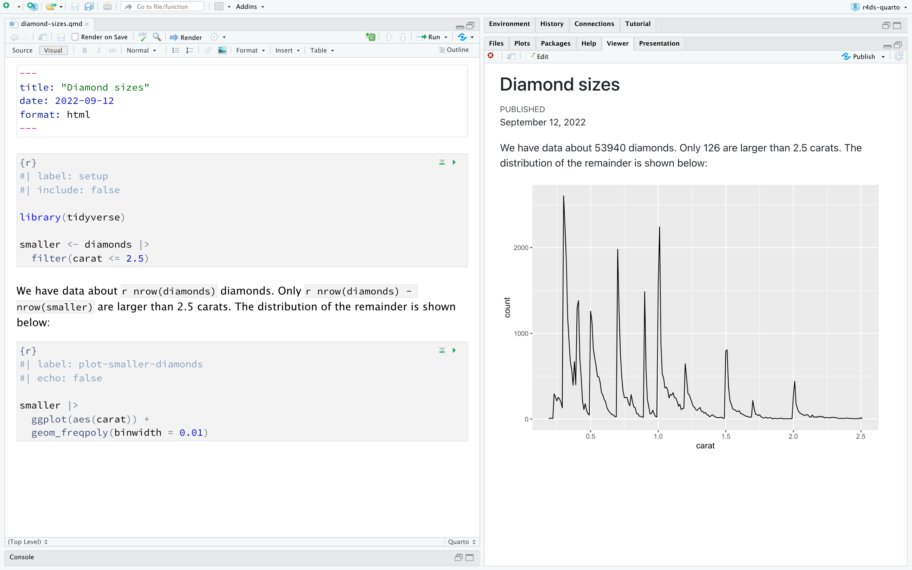
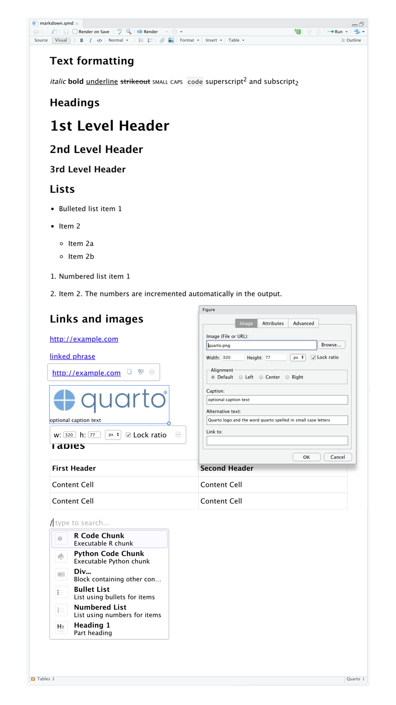
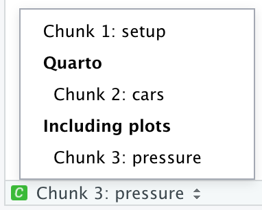

# Quarto {#sec-quarto}

```{r}
#| echo: false
source("_common.R")
```

## 서론

Quarto는 코드, 결과물, 산문(글)을 결합하여 데이터 과학을 위한 통합된 저작 프레임워크를 제공합니다.
Quarto 문서는 완전히 재현 가능하며 PDF, Word 파일, 발표 자료 등 수십 가지 출력 형식을 지원합니다.

Quarto 파일은 세 가지 방식으로 사용되도록 설계되었습니다:

1.  분석 뒤에 숨겨진 코드가 아닌 결론에 집중하고 싶어 하는 의사 결정권자에게 전달하기 위해.

2.  여러분의 결론뿐만 아니라 어떻게 그 결론에 도달했는지(즉, 코드)에도 관심이 있는 다른 데이터 과학자(미래의 여러분 포함!)와 협업하기 위해.

3.  수행한 작업뿐만 아니라 생각했던 내용까지 기록할 수 있는 현대적인 연구 노트로서 데이터 과학을 *수행*하기 위한 환경으로.

Quarto는 R 패키지가 아니라 명령줄 인터페이스(CLI) 도구입니다.
이는 대개 `?`를 통해 도움말을 볼 수 없음을 의미합니다.
대신 이 챕터를 공부하고 앞으로 Quarto를 사용할 때는 [Quarto 공식 문서](https://quarto.org)를 참조해야 합니다.

R Markdown 사용자라면 "Quarto가 R Markdown과 매우 비슷해 보인다"고 생각할 수도 있습니다.
틀린 생각이 아닙니다!
Quarto는 R Markdown 생태계의 여러 패키지(rmarkdown, bookdown, distill, xaringan 등)의 기능을 하나의 일관된 시스템으로 통합할 뿐만 아니라, R 외에도 Python, Julia와 같은 여러 프로그래밍 언어에 대한 기본 지원을 확장합니다.
어떤 면에서 Quarto는 10년 넘게 R Markdown 생태계를 확장하고 지원하며 배운 모든 것을 반영하고 있습니다.

### 사전 요구 사항

명령줄 인터페이스(Quarto CLI)가 필요하지만, RStudio에서 필요할 때 자동으로 설치하고 로드하므로 여러분이 직접 명시적으로 설치하거나 로드할 필요는 없습니다.

```{r}
#| label: setup
#| include: false
chunk <- "```"
inline <- function(x = "") paste0("`` `r ", x, "` ``")
library(tidyverse)
```

## Quarto 기초

이것은 Quarto 파일로, 확장자가 `.qmd`인 평문 텍스트 파일입니다:

```{r echo = FALSE, comment = ""}
cat(readr::read_file("quarto/diamond-sizes.qmd"))
```

여기에는 세 가지 중요한 유형의 콘텐츠가 포함되어 있습니다:

1.  `---`로 둘러싸인 (선택 사항인) **YAML 헤더**.
2.  ```` ``` ````로 둘러싸인 R 코드 **청크(Chunks)**.
3.  `# 제목` 및 `_기울임꼴_`과 같은 단순한 텍스트 서식이 섞인 텍스트.

그림 @fig-diamond-sizes-notebook 은 코드와 결과가 섞여 있는 노트북 인터페이스를 가진 RStudio의 `.qmd` 문서를 보여줍니다.
각 코드 청크는 실행 아이콘(청크 상단의 재생 버튼처럼 생긴 모양)을 클릭하거나 Cmd/Ctrl + Shift + Enter를 눌러 실행할 수 있습니다.
RStudio는 코드를 실행하고 그 결과를 코드와 나란히 인라인으로 표시합니다.

```{r}
#| label: fig-diamond-sizes-notebook
#| echo: false
#| out-width: "90%"
#| fig-cap: |
#|   RStudio에서의 Quarto 문서. 문서 내에 코드와 결과가 섞여 있으며, 
#|   그림 출력은 코드 바로 아래에 나타납니다.
#| fig-alt: |
#|   왼쪽에는 "diamond-sizes.qmd"라는 제목의 Quarto 문서가 있고 오른쪽에는 
#|   비어 있는 Viewer 창이 있는 RStudio 창. Quarto 문서에는 2.5캐럿 미만의 
#|   다이아몬드 무게 빈도 그래프를 생성하는 코드 청크가 있습니다. 
#|   그래프는 무게가 증가함에 따라 빈도가 감소함을 보여줍니다.

```

문서 내에서 그림과 결과를 보는 것이 싫고 대신 RStudio의 Console 및 Plot 창을 사용하고 싶다면, "Render" 옆의 톱니바퀴 아이콘을 클릭하고 그림 @fig-diamond-sizes-console-output 과 같이 "Chunk Output in Console"로 전환할 수 있습니다.

```{r}
#| label: fig-diamond-sizes-console-output
#| echo: false
#| out-width: "90%"
#| fig-cap: |
#|   Plot 창에 그림 출력이 있는 RStudio의 Quarto 문서.
#| fig-alt: |
#|   왼쪽에는 "diamond-sizes.qmd"라는 제목의 Quarto 문서가 있고 오른쪽 
#|   하단에는 Plot 창이 있는 RStudio 창. Quarto 문서에는 2.5캐럿 미만의 
#|   다이아몬드 무게 빈도 그래프를 생성하는 코드 청크가 있습니다. 그래프는 
#|   Plot 창에 표시되며 무게가 증가함에 따라 빈도가 감소함을 보여줍니다. 
#|   Console에서 청크 출력을 표시하도록 하는 RStudio 설정도 강조되어 있습니다.

```

모든 텍스트, 코드, 결과를 포함하는 전체 보고서를 생성하려면 "Render"를 클릭하거나 Cmd/Ctrl + Shift + K를 누르세요.
`quarto::quarto_render("diamond-sizes.qmd")`를 사용하여 프로그래밍 방식으로 이를 수행할 수도 있습니다.
이것은 그림 @fig-diamond-sizes-report 와 같이 뷰어 창에 보고서를 표시하고 HTML 파일을 생성합니다.

```{r}
#| label: fig-diamond-sizes-report
#| echo: false
#| out-width: "90%"
#| fig-cap: |
#|   RStudio 내에서 렌더링된 보고서.
#| fig-alt: |
#|   왼쪽에는 "diamond-sizes.qmd"라는 제목의 Quarto 문서가 있고 오른쪽 
#|   뷰어 패널에는 보고서의 HTML 렌더링이 표시된 RStudio 창. 보고서에는 
#|   제목, 텍스트, 코드 청크, 그리고 청크 뒤에 생성된 그림이 포함되어 있습니다.

```

`.qmd`를 렌더링할 때 Quarto는 파일을 **knitr**(<https://yihui.org/knitr/>)로 전달하며, knitr는 모든 코드 청크를 실행하고 코드와 그 결과를 포함하는 새로운 마크다운(`.md`) 문서를 만듭니다.
이렇게 생성된 마크다운 파일은 **pandoc**([https://pandoc.org](https://pandoc.org/){.uri})에 의해 최종 결과물 파일로 처리됩니다.
이 과정은 @fig-quarto-flow 에 나와 있습니다.
이러한 2단계 워크플로의 장점은 @sec-quarto-formats 에서 배우게 될 것처럼 매우 다양한 출력 형식을 생성할 수 있다는 것입니다.

```{r}
#| label: fig-quarto-flow
#| echo: false
#| out-width: "75%"
#| fig-alt: |
#|   qmd 파일로 시작하여 knitr, md, pandoc을 거쳐 PDF, MS Word 또는 
#|   HTML로 이어지는 워크플로 다이어그램.
#| fig-cap: |
#|   qmd에서 knitr, md, pandoc을 거쳐 PDF, MS Word 또는 HTML 형식의 
#|   출력물로 이어지는 Quarto 워크플로 다이어그램.
knitr::include_graphics("images/quarto-flow.png")
```

자신만의 `.qmd` 파일을 시작하려면 메뉴 바에서 *File \> New File \> Quarto Document...*를 선택하세요.
RStudio는 Quarto의 주요 기능이 어떻게 작동하는지 상기시켜 주는 유용한 콘텐츠로 파일을 미리 채울 수 있는 마법사를 실행할 것입니다.

다음 섹션에서는 Quarto 문서의 세 가지 구성 요소인 마크다운 텍스트, 코드 청크, YAML 헤더에 대해 자세히 다룹니다.

### 연습문제

1.  *File \> New File \> Quarto Document*를 사용하여 새로운 Quarto 문서를 만드세요.
    지침을 읽어보세요.
    청크를 개별적으로 실행하는 연습을 해보세요.
    그런 다음 해당 버튼을 클릭하거나 해당 키보드 단축키를 사용하여 문서를 렌더링하세요.
    코드를 수정하고 다시 실행하여 수정된 결과가 나오는지 확인하세요.

2.  기본 제공되는 세 가지 형식인 HTML, PDF, Word 각각에 대해 하나씩 새로운 Quarto 문서를 만드세요.
    Render each of the three documents.
    How do the outputs differ?
    입력물은 어떻게 다른가요?
    (PDF 출력을 생성하려면 LaTeX를 설치해야 할 수도 있습니다. 필요할 경우 RStudio가 안내해 줄 것입니다.)

## 시각적 편집기

RStudio의 시각적(Visual) 편집기는 Quarto 문서를 작성하기 위한 [WYSIWYM](https://en.wikipedia.org/wiki/WYSIWYM) ("보이는 것이 뜻하는 것이다") 인터페이스를 제공합니다.
내부적으로 Quarto 문서(`.qmd` 파일)의 산문(prose)은 평문 텍스트 파일의 서식을 지정하기 위한 가벼운 규칙 세트인 마크다운(Markdown)으로 작성됩니다.
사실 Quarto는 테이블, 인용, 상호 참조, 각주, div/span, 정의 목록, 속성, 원시 HTML/TeX 등을 포함하고 코드 셀 실행 및 출력을 인라인으로 볼 수 있도록 지원하는 Pandoc 마크다운(Quarto가 이해할 수 있도록 마크다운을 약간 확장한 버전)을 사용합니다.
마크다운은 @sec-source-editor 에서 보게 될 것처럼 읽고 쓰기 쉽게 설계되었지만, 여전히 새로운 구문을 배워야 합니다.
따라서 `.qmd` 파일과 같은 컴퓨팅 문서가 처음이지만 Google Docs나 MS Word와 같은 도구를 사용해 본 경험이 있다면, RStudio에서 Quarto를 시작하는 가장 쉬운 방법은 시각적 편집기입니다.

시각적 편집기에서는 메뉴 바의 버튼을 사용하여 이미지, 테이블, 상호 참조 등을 삽입하거나, 모든 것을 삽입할 수 있는 단축키인 <kbd>⌘</kbd> + <kbd>/</kbd> 또는 <kbd>Ctrl</kbd> + <kbd>/</kbd>를 사용할 수 있습니다.
행의 시작 부분에 있다면(@fig-visual-editor 에 표시된 것처럼), <kbd>/</kbd>만 입력하여 단축키를 호출할 수도 있습니다.

```{r}
#| label: fig-visual-editor
#| echo: false
#| out-width: "75%"
#| fig-cap: |
#|   Quarto 시각적 편집기.
#| fig-alt: |
#|   텍스트 서식(기울임꼴, 굵게, 밑줄, 작은 대문자, 코드, 위첨자, 아래첨자), 
#|   1~3단계 제목, 글머리 기호 및 번호 매기기 목록, 링크, 연결된 문구, 
#|   이미지(이미지 크기 사용자 정의, 캡션 및 대체 텍스트 추가 등을 위한 
#|   팝업 창 포함), 머리글 행이 있는 테이블, 그리고 R 코드 청크, 
#|   Python 코드 청크, div, 글머리 기호 목록, 번호 매기기 목록 또는 
#|   1단계 제목을 삽입할 수 있는 옵션이 있는 삽입 도구 등 시각적 편집기의 
#|   다양한 기능을 보여주는 Quarto 문서.

```

이미지를 삽입하고 표시 방식을 사용자 정의하는 것도 시각적 편집기를 통해 쉽게 할 수 있습니다.
클립보드의 이미지를 시각적 편집기에 직접 붙여넣거나(RStudio가 해당 이미지의 복사본을 프로젝트 디렉터리에 넣고 링크를 연결함), 시각적 편집기의 Insert \> Figure / Image 메뉴를 사용하여 삽입하려는 이미지를 찾아보거나 URL을 붙여넣을 수 있습니다.
또한 동일한 메뉴를 사용하여 이미지 크기를 조정하고 캡션, 대체 텍스트 및 링크를 추가할 수 있습니다.

시각적 편집기에는 여기에서 다 나열하지 않은 더 많은 기능이 있으며, 작성 경험이 쌓이면서 유용하게 사용하게 될 것입니다.

가장 중요한 점은, 시각적 편집기가 서식이 지정된 형태로 콘텐츠를 보여주지만 내부적으로는 평문 마크다운으로 저장된다는 것입니다. 따라서 시각적 편집기와 소스 편집기 사이를 자유롭게 오가며 작업할 수 있습니다.

### 연습문제

1.  시각적 편집기를 사용하여 @fig-visual-editor 의 문서를 재현해 보세요.
2.  시각적 편집기에서 Insert 메뉴와 삽입 도구를 사용하여 각각 코드 청크를 삽입해 보세요.
3.  시각적 편집기를 사용하여 다음을 수행하는 방법을 찾아보세요:
    a.  각주(footnote) 추가.
    b.  수평선(horizontal rule) 추가.
    c.  인용 블록(block quote) 추가.
4.  시각적 편집기에서 Insert \> Citation으로 이동하여 [Welcome to the Tidyverse](https://joss.theoj.org/papers/10.21105/joss.01686)라는 논문의 DOI(digital object identifier)인 [10.21105/joss.01686](https://doi.org/10.21105/joss.01686)을 사용하여 인용을 삽입해 보세요. 문서를 렌더링하고 문서에 참고 문헌이 어떻게 나타나는지 관찰하세요. 문서의 YAML에서 어떤 변화를 발견했나요?

## 소스 편집기 {#sec-source-editor}

시각적 편집기의 도움 없이 RStudio의 소스(Source) 편집기만을 사용하여 Quarto 문서를 편집할 수도 있습니다.
시각적 편집기가 Google Docs와 같은 도구에서 글을 쓰는 경험과 비슷하다면, 소스 편집기는 R 스크립트나 R Markdown 문서를 작성하는 경험과 비슷할 것입니다.
소스 편집기는 평문 텍스트에서 오류를 찾는 것이 더 쉬울 때가 많으므로 Quarto 구문 오류를 디버깅하는 데 유용할 수 있습니다.

소스 편집기에서 Quarto 문서를 작성할 때 Pandoc 마크다운을 사용하는 방법은 아래 가이드와 같습니다.

```{r}
#| echo: false
#| comment: ""
cat(readr::read_file("quarto/markdown.qmd"))
```

이것들을 배우는 가장 좋은 방법은 직접 시도해 보는 것입니다.
며칠 정도 걸리겠지만 곧 제2의 천성처럼 익숙해져서 더 이상 신경 쓰지 않아도 될 것입니다.
만약 잊어버렸다면 *Help \> Markdown Quick Reference*를 통해 유용한 참고 시트를 볼 수 있습니다.

### 연습문제

1.  간단한 CV를 작성하여 배운 내용을 연습해 보세요.
    제목은 여러분의 이름으로 하고, (최소한) 학력이나 경력을 위한 제목을 포함해야 합니다.
    각 섹션에는 직업/학위의 글머리 기호 목록이 포함되어야 합니다.
    연도를 **굵게** 표시하세요.

2.  소스 편집기와 Markdown 빠른 참조를 사용하여 다음을 수행하는 방법을 찾아보세요:

    a.  각주 추가.
    b.  수평선 추가.
    c.  인용 블록 추가.

3.  <https://github.com/hadley/r4ds/tree/main/quarto>에서 `diamond-sizes.qmd`의 내용을 복사하여 로컬 R Quarto 문서에 붙여넣으세요.
    실행할 수 있는지 확인한 다음, 도수 다각형 다음에 가장 눈에 띄는 특징을 설명하는 텍스트를 추가하세요.

4.  Google Docs나 MS Word에서 제목, 하이퍼링크, 서식이 지정된 텍스트 등의 콘텐츠가 포함된 문서를 만들거나(또는 이전에 만든 문서를 찾으세요),
    이 문서의 내용을 복사하여 시각적 편집기의 Quarto 문서에 붙여넣으세요.
    그런 다음 소스 편집기로 전환하여 소스 코드를 살펴보세요.

## 코드 청크

Quarto 문서 내에서 코드를 실행하려면 청크를 삽입해야 합니다.
청크를 삽입하는 방법은 세 가지가 있습니다:

1.  키보드 단축키 Cmd + Option + I / Ctrl + Alt + I.

2.  편집기 도구 모음의 "Insert" 버튼 아이콘.

3.  청크 구분 기호인 ```` ```{r} ````과 ```` ``` ````을 직접 입력.

키보드 단축키를 배우는 것을 권장합니다.
장기적으로 시간을 많이 절약해 줄 것입니다!

이미 알고 계시고 즐겨 쓰시는(그렇기를 바랍니다!) 키보드 단축키인 Cmd/Ctrl + Enter를 사용하여 코드를 계속 실행할 수 있습니다.
하지만 청크에는 새로운 키보드 단축키가 있습니다: Cmd/Ctrl + Shift + Enter로, 청크 내의 모든 코드를 실행합니다.
청크를 함수처럼 생각하세요.
청크는 상대적으로 독립적이어야 하며, 하나의 작업에 집중해야 합니다.

다음 섹션에서는 ```` ```{r} ````로 시작하고, 선택 사항인 청크 레이블과 `#|`로 표시된 여러 청크 옵션이 각각 별도의 줄에 오는 청크 헤더에 대해 설명합니다.

### 청크 레이블

청크에는 선택적으로 레이블을 붙일 수 있습니다. 예:

```{r}
#| echo: fenced
#| label: simple-addition
1 + 1
```

이에는 세 가지 장점이 있습니다:

1.  스크립트 편집기 왼쪽 하단의 드롭다운 코드 내비게이터를 사용하여 특정 청크로 더 쉽게 이동할 수 있습니다:

    ```{r}
    #| echo: false
    #| out-width: "30%"
    #| fig-alt: |
    #|   3개의 청크를 보여주는 드롭다운 코드 내비게이터를 보여주는 RStudio IDE 
    #|   일부. 청크 1은 setup이고 청크 2는 cars이며...
    #|   Quarto라는 섹션에 있습니다. 청크 3은 pressure이고 Including plots라는 
    #|   섹션에 있습니다.
    
    ```

2.  청크에서 생성된 그래픽은 유용한 이름을 갖게 되어 다른 곳에서 사용하기가 더 쉬워집니다.
    이에 대한 자세한 내용은 @sec-figures 를 참조하세요.

3.  캐시된 청크 네트워크를 설정하여 매번 실행할 때마다 비용이 많이 드는 계산을 다시 수행하는 것을 피할 수 있습니다.
    이에 대한 자세한 내용은 @sec-caching 을 참조하세요.

청크 레이블은 짧으면서도 연상하기 쉬워야 하며 공백을 포함해서는 안 됩니다.
단어를 구분할 때 밑줄(`_`) 대신 대시(`-`)를 사용하고, 청크 레이블에서 다른 특수 문자를 피하는 것을 권장합니다.

일반적으로 원하는 대로 청크 레이블을 지정할 수 있지만, 특별한 동작을 부여하는 청크 이름이 하나 있습니다: 바로 `setup`입니다.
대화식 노트북 모드에 있을 때, `setup`이라는 이름의 청크는 다른 코드가 실행되기 전에 자동으로 한 번 실행됩니다.

또한, 청크 레이블은 중복될 수 없습니다.
각 청크 레이블은 고유해야 합니다.

### 청크 옵션

청크 출력은 청크 헤더에 제공되는 필드인 **옵션(options)**을 통해 사용자 정의할 수 있습니다.
Knitr는 코드 청크를 사용자 정의하는 데 사용할 수 있는 약 60개의 옵션을 제공합니다.
여기서는 자주 사용하게 될 가장 중요한 청크 옵션들을 다루겠습니다.
전체 목록은 [https://yihui.org/knitr/options](https://yihui.org/knitr/options/){.uri}에서 확인할 수 있습니다.

가장 중요한 옵션 세트는 코드 블록이 실행되는지 여부와 완성된 보고서에 어떤 결과가 삽입되는지를 제어합니다:

-   `eval: false`는 코드가 실행(평가)되지 않도록 합니다.
    (당연히 코드가 실행되지 않으면 결과도 생성되지 않습니다).
    이 옵션은 예제 코드를 표시하거나, 각 줄을 주석 처리하지 않고 큰 코드 블록을 비활성화할 때 유용합니다.

-   `include: false`는 코드를 실행하지만, 최종 문서에 코드나 결과를 표시하지 않습니다.
    보고서를 어수선하게 만들고 싶지 않은 설정(setup) 코드에 이 옵션을 사용하세요.

-   `echo: false`는 완성된 파일에 코드가 나타나지 않게 하지만 결과는 나타나게 합니다.
    기본 R 코드를 보고 싶어 하지 않는 사람들을 위한 보고서를 작성할 때 사용하세요.

-   `message: false` 또는 `warning: false`는 완성된 파일에 메시지나 경고가 나타나지 않도록 합니다.

-   `results: hide`는 출력된 결과를 숨깁니다. `fig-show: hide`는 그래프를 숨깁니다.

-   `error: true`는 코드에서 오류가 발생하더라도 렌더링을 계속하도록 합니다.
    보고서의 최종 버전에는 거의 포함하지 않겠지만, `.qmd` 내부에서 정확히 무슨 일이 일어나고 있는지 디버깅해야 할 때 매우 유용할 수 있습니다.
    또한 R을 가르치면서 의도적으로 오류를 포함하고 싶을 때도 유용합니다.
    기본값인 `error: false`는 문서에 단 하나의 오류라도 있으면 렌더링이 실패하게 합니다.

이러한 각 청크 옵션은 `#|` 뒤에 청크 헤더에 추가됩니다. 예를 들어, 다음 청크에서는 `eval`이 false로 설정되어 있으므로 결과가 출력되지 않습니다.

```{r}
#| echo: fenced
#| label: simple-multiplication
#| eval: false
2 * 2
```

다음 표는 각 옵션이 어떤 유형의 출력을 억제하는지 요약합니다:

| 옵션             | 코드 실행 | 코드 표시 | 출력물 | 그림 | 메시지 | 경고 |
|------------------|:--------:|:---------:|:------:|:-----:|:--------:|:--------:|
| `eval: false`    |    X     |           |   X    |   X   |    X     |    X     |
| `include: false` |          |     X     |   X    |   X   |    X     |    X     |
| `echo: false`    |          |     X     |        |       |          |          |
| `results: hide`  |          |           |   X    |       |          |          |
| `fig-show: hide` |          |           |        |   X   |          |          |
| `message: false` |          |           |        |       |    X     |          |
| `warning: false` |          |           |        |       |          |    X     |

### 전역 옵션
knitr를 더 많이 사용하다 보면, 일부 기본 청크 옵션이 요구 사항에 맞지 않아 변경하고 싶을 때가 있을 것입니다.

문서 YAML의 `execute` 아래에 원하는 옵션을 추가하여 이를 수행할 수 있습니다.
예를 들어, 코드를 볼 필요가 없고 결과와 설명만 필요한 독자를 위해 보고서를 준비하는 경우, 문서 레벨에서 `echo: false`를 설정할 수 있습니다.
이렇게 하면 기본적으로 코드가 숨겨지며, 의도적으로 보여주고 싶은 청크에만 `echo: true`를 설정하면 됩니다.
`message: false`와 `warning: false`를 설정할 수도 있겠지만, 그렇게 하면 최종 문서에서 메시지를 볼 수 없기 때문에 문제 디버깅이 더 어려워질 수 있습니다.

``` yaml
title: "나의 보고서"
execute:
  echo: false
```

Quarto는 다국어(R뿐만 아니라 Python, Julia 등 다른 언어와도 작동)를 지원하도록 설계되었기 때문에, 모든 knitr 옵션을 `execute` 레벨에서 사용할 수 있는 것은 아닙니다. 일부 옵션은 다른 엔진(예: Jupyter)에서는 작동하지 않고 knitr에서만 작동하기 때문입니다.
하지만 `knitr` 필드의 `opts_chunk` 아래에 문서의 전역 옵션으로 설정할 수 있습니다.
예를 들어, 책이나 튜토리얼을 작성할 때 다음과 같이 설정합니다:

``` yaml
title: "튜토리얼"
knitr:
  opts_chunk:
    comment: "#>"
    collapse: true
```

이것은 우리가 선호하는 주석 형식을 사용하고 코드와 결과가 밀접하게 연결되도록 합니다.

### 인라인 코드

Quarto 문서에 R 코드를 삽입하는 또 다른 방법이 있습니다: `r inline()`을 사용하여 텍스트 내에 직접 삽입하는 것입니다.
데이터의 속성을 텍스트 안에서 언급할 때 매우 유용할 수 있습니다.
예를 들어, 이 챕터 시작 부분에서 사용한 예제 문서에는 다음과 같은 내용이 있었습니다:

> 우리는 `r inline('nrow(diamonds)')`개의 다이아몬드 데이터를 가지고 있습니다.
> 그중 `r inline('nrow(diamonds) - nrow(smaller)')`개만이 2.5캐럿보다 큽니다.
> 나머지의 분포는 아래와 같습니다:

보고서가 렌더링되면 이러한 계산 결과가 텍스트에 삽입됩니다:

> 우리는 53940개의 다이아몬드 데이터를 가지고 있습니다.
> 그중 126개만이 2.5캐럿보다 큽니다.
> 나머지의 분포는 아래와 같습니다:

텍스트에 숫자를 삽입할 때는 `format()` 함수가 유용합니다.
터무니없는 정밀도까지 출력하지 않도록 `digits`를 설정할 수 있고, 숫자를 읽기 쉽게 만들기 위해 `big.mark`를 설정할 수 있습니다.
이것들을 헬퍼 함수로 묶을 수도 있습니다:

```{r}
comma <- function(x) format(x, digits = 2, big.mark = ",")
comma(3452345)
comma(.12358124331)
```

### 연습문제

1.  컷(cut), 색상(color), 선명도(clarity)에 따라 다이아몬드 크기가 어떻게 변하는지 탐구하는 섹션을 추가하세요.
    R을 모르는 사람을 위해 보고서를 작성한다고 가정하고, 각 청크에 `echo: false`를 설정하는 대신 전역 옵션을 설정하세요.

2.  <https://github.com/hadley/r4ds/tree/main/quarto>에서 `diamond-sizes.qmd`를 다운로드하세요.
    가장 큰 20개의 다이아몬드를 설명하는 섹션을 추가하고, 가장 중요한 속성을 보여주는 표를 포함하세요.

3.  `diamonds-sizes.qmd`를 수정하여 `label_comma()`를 사용해 형식이 잘 갖춰진 출력을 생성하세요.
    또한 2.5캐럿보다 큰 다이아몬드의 비율도 포함하세요.

## 그림 {#sec-figures}

Quarto 문서의 그림은 (PNG나 JPEG 파일처럼) 외부 파일을 삽입하거나 코드 청크의 결과로 생성될 수 있습니다.

외부 파일의 이미지를 삽입하려면 RStudio의 시각적 편집기에서 Insert 메뉴를 사용하고 Figure / Image를 선택할 수 있습니다.
This will pop open a menu where you can browse to the image you want to insert as well as add alternative text or caption to it and adjust its size.
시각적 편집기에서는 클립보드의 이미지를 문서에 직접 붙여넣을 수도 있으며, RStudio는 해당 이미지의 복사본을 프로젝트 폴더에 저장합니다.

그림을 생성하는 코드 청크(예: `ggplot()` 호출 포함)를 포함하면 결과 그림이 Quarto 문서에 자동으로 포함됩니다.

### 그림 크기 조정

Quarto에서 그래픽의 가장 큰 과제는 그림을 적절한 크기와 모양으로 만드는 것입니다.
그림 크기를 제어하는 다섯 가지 주요 옵션이 있습니다: `fig-width`, `fig-height`, `fig-asp`, `out-width` 및 `out-height`.
그림 크기 조정이 까다로운 이유는 두 가지 크기(R에 의해 생성된 그림의 크기와 출력 문서에 삽입되는 크기)가 있고, 크기를 지정하는 방법이 여러 가지(높이, 너비, 가로세로비 중 두 가지 선택)이기 때문입니다.

우리는 다섯 가지 옵션 중 세 가지를 추천합니다:

-   그림은 일관된 너비를 가질 때 미적으로 더 보기 좋습니다.
    이를 강제하려면 전역 설정(defaults)에서 `fig-width: 6` (6인치) 및 `fig-asp: 0.618` (황금비)을 설정하세요.
    그런 다음 개별 청크에서는 `fig-asp`만 조정하면 됩니다.

-   `out-width`를 사용하여 출력 크기를 제어하고, 출력 문서 본문 너비의 백분율로 설정하세요.
    우리는 `out-width: "70%"` 및 `fig-align: center`를 권장합니다.
    이렇게 하면 그림이 너무 많은 공간을 차지하지 않으면서도 숨 쉴 틈을 줍니다.

-   한 줄에 여러 그림을 넣으려면 그림 두 개의 경우 `layout-ncol`을 2로, 세 개의 경우 3으로 설정하세요.
    이렇게 하면 `layout-ncol`이 2일 때 각 그림의 `out-width`가 "50%"로, 3일 때 "33%" 등으로 효과적으로 설정됩니다.
    설명하려는 내용(예: 데이터 보여주기 또는 그림 변형 보여주기)에 따라 아래에서 논의하는 것처럼 `fig-width`를 조정할 수도 있습니다.

그림의 텍스트를 읽기 위해 눈을 찡그려야 한다면 `fig-width`를 수정해야 합니다.
`fig-width`가 최종 문서에서 그림이 렌더링되는 크기보다 크면 텍스트가 너무 작게 보이고, `fig-width`가 작으면 텍스트가 너무 크게 보입니다.
`fig-width`와 문서에서의 최종 너비 사이의 적절한 비율을 찾으려면 약간의 실험이 필요한 경우가 많습니다.
원리를 설명하기 위해 다음 세 가지 그림은 각각 `fig-width`가 4, 6, 8입니다:

```{r}
#| include: false
plot <- ggplot(mpg, aes(x = displ, y = hwy)) + geom_point()
```

```{r}
#| echo: false
#| fig-width: 4
#| out-width: "50%"
#| fig-alt: |
#|   자동차의 주행 거리 대 배기량의 산점도. 점들이 정상 크기이며 축 텍스트와 
#|   레이블의 글꼴 크기가 주변 텍스트와 비슷합니다.
plot
```

```{r}
#| echo: false
#| fig-width: 6
#| out-width: "50%"
#| fig-alt: |
#|   자동차의 주행 거리 대 배기량의 산점도. 이전 그림보다 점들이 작고 
#|   축 텍스트와 레이블이 주변 텍스트보다 작습니다.
plot
```

```{r}
#| echo: false
#| fig-width: 8
#| out-width: "50%"
#| fig-alt: |
#|   자동차의 주행 거리 대 배기량의 산점도. 이전 그림보다 점들이 더 작고 
#|   축 텍스트와 레이블이 주변 텍스트보다 훨씬 작습니다.
plot
```

모든 그림에서 글꼴 크기를 일관되게 유지하려면 `out-width`를 설정할 때마다 기본 `out-width`와의 동일한 비율을 유지하도록 `fig-width`를 조정해야 합니다.
예를 들어, 기본 `fig-width`가 6이고 `out-width`가 "70%"일 때, `out-width: "50%"`를 설정하려면 `fig-width`를 4.3 (6 \* 0.5 / 0.7)으로 설정해야 합니다.

Figure sizing and scaling is an art and science and getting things right can require an iterative trial-and-error approach.
You can learn more about figure sizing in the [taking control of plot scaling blog post](https://www.tidyverse.org/blog/2020/08/taking-control-of-plot-scaling/).

### 기타 중요한 옵션

이 책처럼 코드와 텍스트가 섞여 있는 경우, `fig-show: hold`를 설정하여 코드가 끝난 후에 그림이 표시되도록 할 수 있습니다.
이는 큰 코드 블록을 설명과 함께 나누도록 강제하는 즐거운 부수 효과가 있습니다.

그림에 캡션을 추가하려면 `fig-cap`을 사용하세요.
Quarto에서는 문서 내 인라인에서 "떠다니는(floating)" 상태로 그림이 변경됩니다.

PDF 출력을 생성하는 경우 기본 그래픽 형식은 PDF입니다.
PDF는 고품질 벡터 그래픽이므로 좋은 기본값입니다.
하지만 수천 개의 점을 표시하는 경우에는 매우 크고 느린 그림이 생성될 수 있습니다.
그런 경우에는 `fig-format: "png"`를 설정하여 PNG 사용을 강제하세요.
품질은 약간 낮아지지만 훨씬 더 간결해집니다.

Routine하게 다른 청크에 레이블을 붙이지 않더라도, 그림을 생성하는 코드 청크에는 이름을 붙이는 것이 좋습니다.
청크 레이블은 디스크에 저장되는 그래픽 파일 이름을 생성하는 데 사용되므로, 청크 이름을 지정하면 그림을 골라내어 다른 상황(예: 이메일에 그림 하나를 빠르게 넣고 싶을 때)에서 재사용하기가 훨씬 쉬워집니다.

### 연습문제

1.  시각적 편집기에서 `diamond-sizes.qmd`를 열고, 다이아몬드 이미지를 찾아 복사하여 문서에 붙여넣으세요. 이미지를 더블 클릭하고 캡션을 추가하세요. 이미지 크기를 조정하고 문서를 렌더링하세요. 이미지가 현재 작업 디렉터리에 어떻게 저장되는지 관찰하세요.
2.  그림을 생성하는 `diamond-sizes.qmd`의 코드 청크 레이블을 `fig-` 접두사로 시작하도록 수정하고, 청크 옵션 `fig-cap`으로 그림에 캡션을 추가하세요. 그런 다음 코드 청크 위의 텍스트를 수정하여 Insert \> Cross Reference로 그림에 대한 상호 참조를 추가하세요.
3.  다음 청크 옵션을 하나씩 적용하여 그림의 크기를 변경하고 문서를 렌더링한 후, 그림이 어떻게 변하는지 설명하세요.
    a.  `fig-width: 10`

    b.  `fig-height: 3`

    c.  `out-width: "100%"`

    d.  `out-width: "20%"`

## 표

그림과 마찬가지로 Quarto 문서에는 두 가지 유형의 표를 포함할 수 있습니다.
(Insert Table 메뉴를 사용하여) Quarto 문서에 직접 만드는 마크다운 표일 수도 있고, 코드 청크의 결과로 생성되는 표일 수도 있습니다.
이 섹션에서는 후자인 계산을 통해 생성된 표에 집중하겠습니다.

기본적으로 Quarto는 데이터 프레임과 행렬을 콘솔에서 보는 것과 같이 출력합니다:

```{r}
mtcars[1:5, ]
```

데이터가 추가 서식과 함께 표시되기를 원한다면 `knitr::kable()` 함수를 사용할 수 있습니다.
아래 코드는 @tbl-kable 을 생성합니다.

```{r}
#| label: tbl-kable
#| tbl-cap: knitr kable 예시.
knitr::kable(mtcars[1:5, ], )
```

표를 사용자 정의할 수 있는 다른 방법들을 보려면 `?knitr::kable` 도움말을 읽어보세요.
더 깊은 사용자 정의를 원한다면 **gt**, **huxtable**, **reactable**, **kableExtra**, **xtable**, **stargazer**, **pander**, **tables**, **ascii** 패키지를 고려해 보세요.
각 패키지는 R 코드에서 서식이 지정된 표를 반환하기 위한 다양한 도구를 제공합니다.

### 연습문제

1.  시각적 편집기에서 `diamond-sizes.qmd`를 열고, 코드 청크를 삽입한 후 `knitr::kable()`을 사용하여 `diamonds` 데이터 프레임의 처음 5행을 보여주는 표를 추가하세요.
2.  동일한 표를 `gt::gt()`를 사용하여 표시해 보세요.
3.  `tbl-` 접두사로 시작하는 청크 레이블을 추가하고, 청크 옵션 `tbl-cap`으로 표에 캡션을 추가하세요. 그런 다음 코드 청크 위의 텍스트를 수정하여 Insert \> Cross Reference로 표에 대한 상호 참조를 추가하세요.

## 캐싱 {#sec-caching}

보통 문서를 렌더링할 때마다 완전히 깨끗한 상태에서 시작합니다.
이는 코드에 중요한 모든 계산을 담았음을 보장하므로 재현성에 매우 좋습니다.
하지만 계산 시간이 오래 걸리는 작업이 있는 경우에는 고통스러울 수 있습니다.
해결책은 `cache: true`입니다.

표준 YAML 옵션을 사용하여 문서 내의 모든 계산 결과를 캐싱하도록 문서 레벨에서 Knitr 캐시를 활성화할 수 있습니다:

``` yaml
---
title: "나의 문서"
execute: 
  cache: true
---
```

특정 청크에서 계산 결과를 캐싱하도록 청크 레벨에서 캐싱을 활성화할 수도 있습니다:

```{r}
#| echo: fenced
#| cache: true
# 시간이 오래 걸리는 계산 코드...
```

이 옵션을 설정하면 청크의 출력을 디스크의 특별한 이름의 파일로 저장합니다.
이후 실행 시 Knitr는 코드가 변경되었는지 확인하고, 변경되지 않았다면 캐시된 결과를 재사용합니다.

캐싱 시스템은 주의해서 사용해야 합니다. 기본적으로 종속성이 아닌 코드 자체만을 기반으로 하기 때문입니다.
예를 들어, 여기서 `processed_data` 청크는 `raw-data` 청크에 종속됩니다:

````         
``` {{r}}
#| label: raw-data
#| cache: true
rawdata <- readr::read_csv("a_very_large_file.csv")
```
````

````         
``` {{r}}
#| label: processed_data
#| cache: true
processed_data <- rawdata |> 
  filter(!is.na(import_var)) |> 
  mutate(new_variable = complicated_transformation(x, y, z))
```
````

`processed_data` 청크를 캐싱한다는 것은 dplyr 파이프라인이 변경되면 다시 실행되지만, `read_csv()` 호출이 변경되어도 다시 실행되지 않는다는 것을 의미합니다.
이 문제는 `dependson` 청크 옵션으로 해결할 수 있습니다:

````         
``` {{r}}
#| label: processed-data
#| cache: true
#| dependson: "raw-data"
processed_data <- rawdata |> 
  filter(!is.na(import_var)) |> 
  mutate(new_variable = complicated_transformation(x, y, z))
```
````

`dependson`에는 캐시된 청크가 종속된 *모든* 청크의 문자형 벡터가 포함되어야 합니다.
Knitr는 종속성 중 하나가 변경된 것을 감지할 때마다 캐시된 청크의 결과를 업데이트합니다.

`a_very_large_file.csv`가 변경되어도 청크는 업데이트되지 않는다는 점에 유의하세요. Knitr 캐싱은 `.qmd` 파일 내의 변경 사항만 추적하기 때문입니다.
해당 파일의 변경 사항도 추적하려면 `cache.extra` 옵션을 사용할 수 있습니다.
이는 변경될 때마다 캐시를 무효화하는 임의의 R 표현식입니다.
사용하기 좋은 함수는 `file.mtime()`입니다. 이 함수는 파일이 마지막으로 수정된 시간을 반환합니다.
그런 다음 다음과 같이 작성할 수 있습니다:

````         
``` {{r}}
#| label: raw-data
#| cache: true
#| cache.extra: !expr file.mtime("a_very_large_file.csv")
rawdata <- readr::read_csv("a_very_large_file.csv")
```
````

우리는 [David Robinson](https://twitter.com/drob/status/738786604731490304)의 조언을 따라 이러한 청크의 이름을 지정했습니다. 각 청크는 그것이 생성하는 기본 객체의 이름을 따서 명명됩니다.
이렇게 하면 `dependson` 명세를 이해하기가 더 쉬워집니다.

캐싱 전략이 점점 더 복잡해짐에 따라, `knitr::clean_cache()`를 사용하여 정기적으로 모든 캐시를 정리하는 것이 좋습니다.

### 연습문제

1.  `d`가 `c`와 `b`에 종속되고, `b`와 `c`가 모두 `a`에 종속되는 청크 네트워크를 설정하세요. 각 청크가 `lubridate::now()`를 출력하게 하고, `cache: true`를 설정한 후 캐싱에 대한 이해를 확인하세요.

## 문제 해결(Troubleshooting)

Quarto 문서는 더 이상 대화식 R 환경이 아니기 때문에 문제 해결이 어려울 수 있으며, 몇 가지 새로운 기술을 배워야 합니다.
또한 오류는 Quarto 문서 자체의 문제일 수도 있고 Quarto 문서 내의 R 코드 때문일 수도 있습니다.

코드 청크가 있는 문서에서 흔히 발생하는 오류 중 하나는 중복된 청크 레이블로, 특히 코드 청크를 복사하여 붙여넣는 워크플로를 사용하는 경우에 자주 발생합니다.
이 문제를 해결하려면 중복된 레이블 중 하나를 변경하기만 하면 됩니다.

오류가 문서의 R 코드 때문에 발생한 것이라면, 항상 가장 먼저 시도해야 할 일은 대화식 세션에서 문제를 재현하는 것입니다.
R을 재시작한 다음, Code 메뉴의 Run region 아래에 있는 "Run all chunks"를 선택하거나 키보드 단축키 Ctrl + Alt + R을 사용하여 모든 청크를 실행하세요.
운이 좋으면 문제가 재현될 것이고, 대화식으로 무슨 일이 일어나고 있는지 파악할 수 있습니다.

그것으로 해결되지 않는다면, 대화식 환경과 Quarto 환경 사이에 무언가 차이가 있는 것입니다.
옵션들을 체계적으로 탐색해야 합니다.
가장 흔한 차이점은 작업 디렉터리입니다. Quarto의 작업 디렉터리는 해당 파일이 위치한 디렉터리입니다.
청크에 `getwd()`를 포함하여 작업 디렉터리가 예상과 일치하는지 확인하세요.

다음으로, 버그를 일으킬 수 있는 모든 원인을 브레인스토밍해 보세요.
R 세션과 Quarto 세션에서 그것들이 동일한지 체계적으로 확인해야 합니다.
가장 쉬운 방법은 문제가 발생하는 청크에 `error: true`를 설정한 다음, `print()`와 `str()`을 사용하여 설정이 예상대로인지 확인하는 것입니다.

## YAML 헤더

YAML 헤더의 파라미터를 수정하여 "문서 전체"에 대한 많은 설정을 제어할 수 있습니다.
YAML이 무엇의 약자인지 궁금할 수 있습니다. "YAML Ain't Markup Language"(YAML은 마크다운 언어가 아니다)의 약자로, 계층적 데이터를 인간이 읽고 쓰기 쉬운 방식으로 표현하기 위해 설계되었습니다.
Quarto는 이를 사용하여 출력의 많은 세부 사항을 제어합니다.
여기서는 자체 포함 문서(self-contained documents), 문서 파라미터(document parameters), 참고 문헌(bibliographies) 세 가지를 다루겠습니다.

### 자체 포함(Self-contained)

HTML 문서는 일반적으로 여러 외부 종속성(예: 이미지, CSS 스타일 시트, JavaScript 등)을 가집니다. 기본적으로 Quarto는 이러한 종속성들을 `.qmd` 파일과 같은 디렉터리에 있는 `_files` 폴더에 넣습니다.
HTML 파일을 호스팅 플랫폼(예: QuartoPub, <https://quartopub.com/>)에 게시하면 이 디렉터리의 종속성들도 문서와 함께 게시되므로 게시된 보고서에서 사용할 수 있습니다.
하지만 동료에게 보고서를 이메일로 보내고 싶다면, 모든 종속성을 포함하는 단일한 자체 포함 HTML 문서를 선호할 수 있습니다.
`embed-resources` 옵션을 지정하여 이를 수행할 수 있습니다:

``` yaml
format:
  html:
    embed-resources: true
```

생성된 파일은 자체 포함되어 있으므로, 브라우저에서 제대로 표시하기 위해 외부 파일이나 인터넷 연결이 필요하지 않습니다.

### 파라미터(Parameters)

Quarto 문서는 보고서를 렌더링할 때 값을 설정할 수 있는 하나 이상의 파라미터를 포함할 수 있습니다.
다양한 주요 입력값에 대해 동일한 보고서를 다른 값으로 다시 렌더링하려는 경우 파라미터가 유용합니다.
예를 들어, 지점별 판매 보고서, 학생별 시험 결과 또는 국가별 인구 통계 요약을 생성할 때 사용할 수 있습니다.
하나 이상의 파라미터를 선언하려면 `params` 필드를 사용하세요.

이 예제는 `my_class` 파라미터를 사용하여 어떤 등급의 자동차를 표시할지 결정합니다:

```{r}
#| echo: false
#| out-width: "100%"
#| comment: ""
cat(readr::read_file("quarto/fuel-economy.qmd"))
```

보시다시피, 파라미터는 코드 청크 내에서 `params`라는 이름의 읽기 전용 리스트로 사용할 수 있습니다.

YAML 헤더에 원자 벡터를 직접 작성할 수 있습니다.
또한 파라미터 값 앞에 `!expr`을 붙여 임의의 R 표현식을 실행할 수도 있습니다.
이는 날짜/시간 파라미터를 지정하는 좋은 방법입니다.

``` yaml
params:
  start: !expr lubridate::ymd("2015-01-01")
  snapshot: !expr lubridate::ymd_hms("2015-01-01 12:30:00")
```

### 참고 문헌 및 인용

Quarto는 다양한 스타일의 인용과 참고 문헌 목록을 자동으로 생성할 수 있습니다.
Quarto 문서에 인용과 참고 문헌을 추가하는 가장 간단한 방법은 RStudio의 시각적 편집기를 사용하는 것입니다.

시각적 편집기를 사용하여 인용을 추가하려면 Insert \> Citation으로 이동하세요.
다양한 소스에서 인용을 삽입할 수 있습니다:

1.  [DOI](https://quarto.org/docs/visual-editor/technical.html#citations-from-dois) (Document Object Identifier) 참조.

2.  [Zotero](https://quarto.org/docs/visual-editor/technical.html#citations-from-zotero) 개인 또는 그룹 라이브러리.

3.  [Crossref](https://www.crossref.org/), [DataCite](https://datacite.org/) 또는 [PubMed](https://pubmed.ncbi.nlm.nih.gov/) 검색.

4.  문서의 참고 문헌 파일(문서 디렉터리에 있는 `.bib` 파일)

내부적으로 시각적 모드는 인용을 위해 표준 Pandoc 마크다운 표현(예: `[@citation]`)을 사용합니다.

처음 세 가지 방법 중 하나를 사용하여 인용을 추가하면, 시각적 편집기가 자동으로 `bibliography.bib` 파일을 만들고 해당 참조를 추가합니다.
또한 문서 YAML에 `bibliography` 필드를 추가합니다.
참조를 더 추가할수록 이 파일에 인용 정보가 채워집니다.
BibLaTeX, BibTeX, EndNote, Medline을 포함한 많은 일반적인 참고 문헌 형식을 사용하여 이 파일을 직접 편집할 수도 있습니다.

소스 편집기에서 .qmd 파일 내에 인용을 생성하려면, '\@'와 참고 문헌 파일의 인용 식별자로 구성된 키를 사용하세요.
그런 다음 인용을 대괄호 안에 넣으세요.
다음은 몇 가지 예시입니다:

``` markdown
세미콜론(`;`)으로 여러 인용을 구분합니다: 어쩌구 저쩌구 [@smith04; @doe99].

대괄호 안에 임의의 주석을 추가할 수 있습니다: 
어쩌구 저쩌구 [see @doe99, pp. 33-35; also @smith04, ch. 1 참조].

문장 내 인용을 생성하려면 대괄호를 제거하세요: @smith04 는 어쩌구라고 말합니다. 
또는 @smith04 [p. 33] 는 어쩌구라고 말합니다.

저자 이름을 숨기려면 인용 앞에 `-`를 추가하세요: 
Smith는 어쩌구라고 말합니다 [-@smith04].
```

Quarto가 파일을 렌더링할 때, 문서 끝에 참고 문헌 목록을 작성하여 추가합니다.
참고 문헌 목록에는 참고 문헌 파일에서 인용된 각 참조가 포함되지만, 섹션 제목은 포함되지 않습니다.
따라서 파일 끝에 `# 참고 문헌` 또는 `# Bibliography`와 같은 섹션 헤더를 추가하는 것이 일반적인 관례입니다.

`csl` 필드에서 CSL(Citation Style Language) 파일을 참조하여 인용 및 참고 문헌의 스타일을 변경할 수 있습니다:

``` yaml
bibliography: rmarkdown.bib
csl: apa.csl
```

`bibliography` 필드와 마찬가지로, `csl` 파일에도 해당 파일의 경로를 포함해야 합니다.
여기서는 `csl` 파일이 `.qmd` 파일과 동일한 디렉터리에 있다고 가정합니다.
일반적인 참고 문헌 스타일의 CSL 스타일 파일은 <https://github.com/citation-style-language/styles> 에서 찾을 수 있습니다.

## 워크플로

앞서 *콘솔*에서 대화형으로 작업한 후, 잘 작동하는 코드를 *스크립트 편집기*에 캡처하는 기본 워크플로에 대해 논의했습니다.
Quarto는 콘솔과 스크립트 편집기를 하나로 결합하여 대화형 탐색과 장기적인 코드 캡처 사이의 경계를 허뭅니다.
Cmd/Ctrl + Shift + Enter를 사용해 청크 내에서 코드를 편집하고 재실행하면서 빠르게 반복할 수 있습니다.
결과가 만족스러우면 다음으로 넘어가서 새 청크를 시작하면 됩니다.

Quarto는 산문과 코드를 매우 긴밀하게 통합한다는 점에서도 중요합니다.
코드를 개발하고 생각을 기록할 수 있게 해주므로 훌륭한 **분석 노트북(analysis notebook)**이 됩니다.
분석 노트북은 자연과학의 고전적인 실험실 노트북(lab notebook)과 많은 목표를 공유합니다.

-   수행한 작업과 그 이유를 기록합니다.
    기억력이 아무리 좋더라도 수행한 작업을 기록하지 않으면 중요한 세부 사항을 잊어버릴 때가 올 것입니다.
    잊어버리지 않도록 기록해 두세요!

-   엄격한 사고를 지원합니다.
    작업하면서 생각을 기록하고 계속해서 되새겨본다면 더 강력한 분석 결과를 얻을 가능성이 높습니다.
    결과적으로 분석 내용을 다른 사람들과 공유하기 위해 정리할 때 시간도 절약됩니다.

-   다른 사람이 여러분의 작업을 이해하도록 돕습니다.
    데이터 분석을 혼자서 하는 경우는 드물며, 종종 팀의 일원으로 일하게 됩니다.
    실험실 노트북은 여러분이 무엇을 했는지뿐만 아니라 왜 그렇게 했는지를 동료나 실험실 동료들과 공유하는 데 도움을 줍니다.

실험실 노트북을 효과적으로 사용하기 위한 많은 좋은 조언들은 분석 노트북에도 적용될 수 있습니다.
우리는 자신의 경험과 Colin Purrington의 실험실 노트북에 대한 조언(<https://colinpurrington.com/tips/lab-notebooks>)을 바탕으로 다음과 같은 팁들을 정리했습니다:

-   각 노트북에 설명적인 제목, 연상하기 쉬운 파일 이름을 지정하고, 첫 번째 문단에 분석 목표를 간략하게 설명하세요.

-   YAML 헤더의 `date` 필드를 사용하여 노트북 작업을 시작한 날짜를 기록하세요:

    ``` yaml
    date: 2016-08-23
    ```

    모호함이 없도록 ISO8601 YYYY-MM-DD 형식을 사용하세요.
    평소에 날짜를 그렇게 쓰지 않더라도 이 형식을 사용하세요!

-   어떤 분석 아이디어에 많은 시간을 보냈는데 결과적으로 막다른 길이었다면, 삭제하지 마세요!
    왜 실패했는지에 대한 짧은 메모를 작성하여 노트북에 남겨 두세요.
    식은 나중에 다시 분석으로 돌아왔을 때 같은 실수를 반복하지 않도록 도와줄 것입니다.

-   일반적으로 데이터 입력은 R 외부에서 수행하는 것이 더 좋습니다.
    하지만 아주 작은 데이터 조각을 기록해야 한다면 `tibble::tribble()`을 사용하여 명확하게 배치하세요.

-   데이터 파일에서 오류를 발견하면 절대로 직접 수정하지 말고, 대신 값을 수정하는 코드를 작성하세요.
    수정한 이유를 설명해 두세요.

-   그날의 업무를 마치기 전에 반드시 노트북을 렌더링할 수 있는지 확인하세요.
    캐싱을 사용하는 경우 캐시를 정리해 보세요.
    코드가 아직 머릿속에 생생할 때 문제를 해결할 수 있습니다.

-   코드를 장기적으로 재현 가능하게 만들고 싶다면(즉, 다음 달이나 내년에 다시 실행할 수 있도록), 코드가 사용하는 패키지 버전을 추적해야 합니다.
    엄격한 방법은 프로젝트 디렉터리에 패키지를 저장하는 **renv**(<https://rstudio.github.io/renv/index.html>)를 사용하는 것입니다.
    빠르고 간단한 방법으로는 `sessionInfo()`를 실행하는 청크를 포함하는 것이 있습니다. 이것으로는 패키지를 완벽하게 재현할 수는 없지만, 최소한 어떤 버전을 사용했는지는 알 수 있습니다.

-   경력을 쌓으면서 수많은 분석 노트북을 만들게 될 것입니다.
    나중에 다시 찾을 수 있도록 어떻게 정리하시겠습니까?
    개별 프로젝트에 저장하고 좋은 명명 규칙을 정하는 것을 권장합니다.

## 요약

이 장에서는 코드와 산문을 한곳에 담아 재현 가능한 계산 문서를 작성하고 게시하기 위한 Quarto를 소개했습니다.
시각적 편집기 또는 소스 편집기를 사용하여 RStudio에서 Quarto 문서를 작성하는 법, 코드 청크의 작동 방식과 옵션 사용자 정의 방법, Quarto 문서에 그림과 표를 포함하는 방법, 계산 결과를 위한 캐싱 옵션에 대해 배웠습니다.
또한, 자체 포함 문서나 파라미터가 있는 문서를 만들기 위한 YAML 헤더 옵션 조정 방법과 인용 및 참고 문헌 추가 방법도 배웠습니다.
마지막으로 문제 해결과 워크플로에 대한 몇 가지 팁도 드렸습니다.

이 소개만으로도 Quarto를 시작하기에는 충분하지만, 배울 것이 아직 많이 남아 있습니다.
Quarto는 아직 비교적 초기 단계이며 빠르게 성장하고 있습니다.
새로운 기능들을 가장 잘 파악할 수 있는 곳은 공식 Quarto 웹사이트입니다: [https://quarto.org](https://quarto.org/){.uri}.

여기서 다루지 않은 두 가지 중요한 주제가 있습니다: 협업과 아이디어를 다른 사람에게 정확하게 전달하는 세부 사항입니다.
협업은 현대 데이터 과학의 필수적인 부분이며, Git 및 GitHub와 같은 버전 관리 도구를 사용하면 훨씬 수월해질 것입니다.
R 사용자들을 위한 친절한 Git 및 GitHub 입문서인 Jenny Bryan의 "Happy Git with R"을 추천합니다.
이 책은 온라인에서 무료로 볼 수 있습니다: <https://happygitwithr.com>.

분석 결과를 명확하게 전달하기 위해 실제로 무엇을 써야 하는지에 대해서도 언급하지 않았습니다.
글쓰기 실력을 향상시키기 위해 Joseph M. Williams & Joseph Bizup의 [*Style: Lessons in Clarity and Grace*](https://www.amazon.com/Style-Lessons-Clarity-Grace-12th/dp/0134080416) 또는 George Gopen의 [*The Sense of Structure: Writing from the Reader's Perspective*](https://www.amazon.com/Sense-Structure-Writing-Readers-Perspective/dp/0205296327)를 읽어보시길 강력히 추천합니다.
두 책 모두 문장과 단락의 구조를 이해하는 데 도움을 주며, 글을 더 명확하게 만드는 도구를 제공할 것입니다.
(이 책들은 새 책으로 사면 다소 비싸지만, 많은 영어 수업에서 사용되기 때문에 저렴한 중고 서적이 많이 있습니다).
George Gopen은 <https://www.georgegopen.com/litigation-articles.html> 에 글쓰기에 관한 짧은 기고문들도 많이 올려두었습니다.
변호사들을 대상으로 쓴 글이지만, 거의 모든 내용이 데이터 과학자에게도 적용됩니다.
