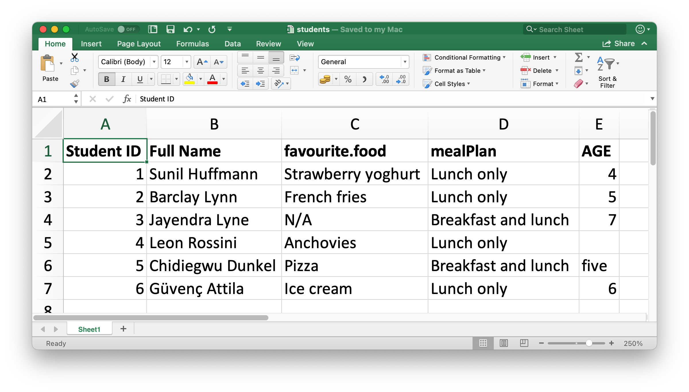
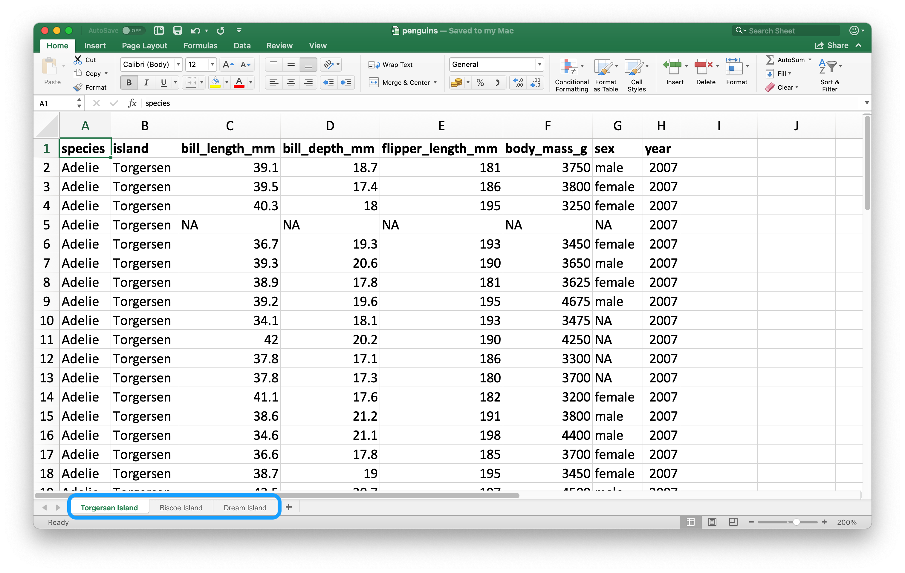
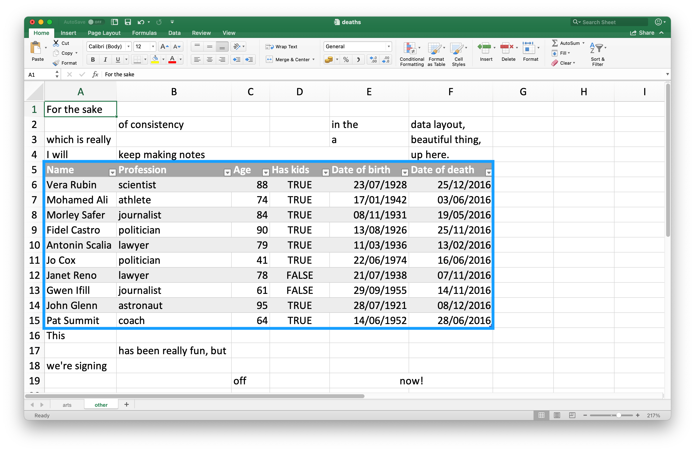
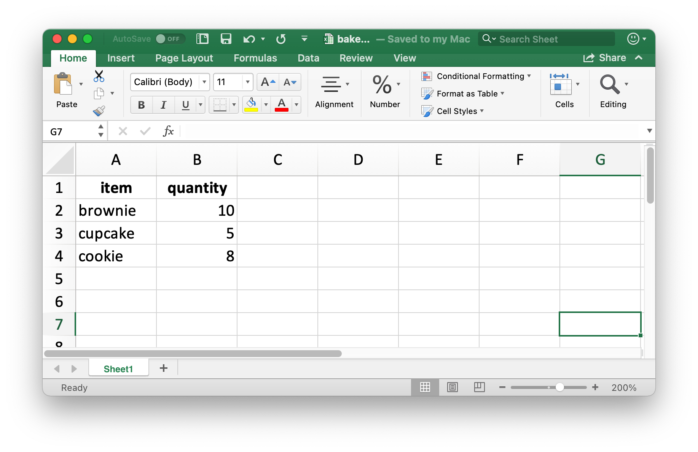
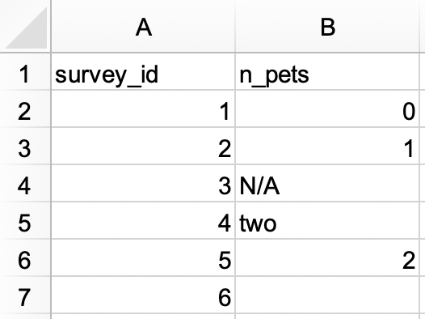
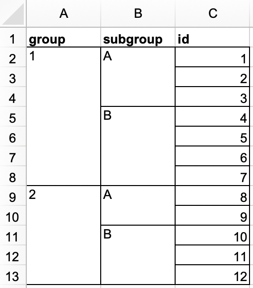
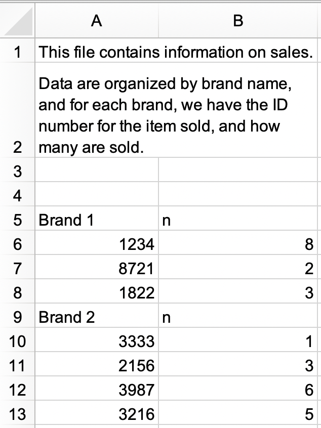
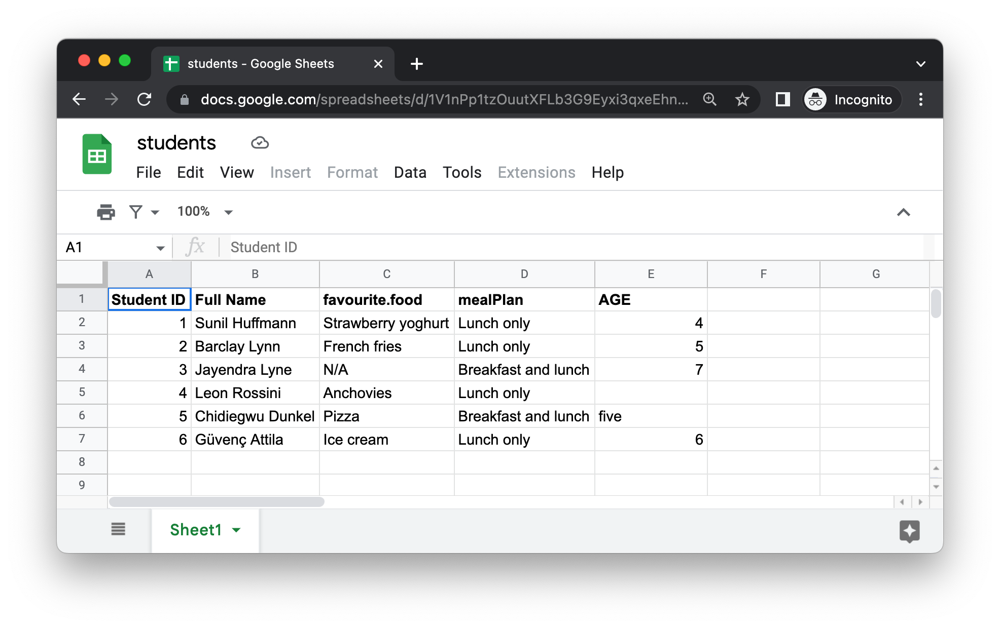

# 스프레드시트 {#sec-import-spreadsheets}

```{r}
#| echo: false
source("_common.R")
```

## 서론

@sec-data-import에서 `.csv`나 `.tsv` 같은 평문 텍스트 파일에서 데이터를 불러오는 방법을 배웠습니다.
이제 Excel 스프레드시트나 Google Sheets에서 데이터를 가져오는 방법을 배울 시간입니다.
이 챕터는 @sec-data-import에서 배운 내용을 바탕으로 하지만, 스프레드시트에서 데이터를 작업할 때 추가적으로 고려해야 할 사항들과 복잡성에 대해서도 논의할 것입니다.

여러분이 혹은 공동 작업자가 데이터를 정리하기 위해 스프레드시트를 사용한다면, Karl Broman과 Kara Woo가 쓴 "Data Organization in Spreadsheets" 논문을 읽어보시기를 강력히 권장합니다: <https://doi.org/10.1080/00031305.2017.1375989>.
이 논문에서 제시하는 모범 사례들은 스프레드시트 데이터를 R로 가져와 분석하고 시각화할 때 겪게 될 많은 골칫거리를 덜어줄 것입니다.

## Excel

Microsoft Excel은 데이터가 스프레드시트 파일 내의 워크시트(worksheets)에 구성되는 널리 사용되는 스프레드시트 소프트웨어 프로그램입니다.

### 사전 요구 사항

이 섹션에서는 **readxl** 패키지를 사용하여 R에서 Excel 스프레드시트 데이터를 로드하는 방법을 배웁니다.
이 패키지는 핵심 tidyverse에 속하지 않으므로 명시적으로 로드해야 하지만, tidyverse 패키지를 설치할 때 자동으로 설치됩니다.
나중에 Excel 스프레드시트를 생성할 수 있게 해주는 writexl 패키지도 사용할 것입니다.

```{r}
#| message: false
library(readxl)
library(tidyverse)
library(writexl)
```

### 시작하기

대부분의 readxl 함수를 사용하면 Excel 스프레드시트를 R로 로드할 수 있습니다:

-   `read_xls()`는 `xls` 형식의 Excel 파일을 읽습니다.
-   `read_xlsx()`는 `xlsx` 형식의 Excel 파일을 읽습니다.
-   `read_excel()`은 `xls`와 `xlsx` 형식을 모두 읽을 수 있습니다. 입력값을 바탕으로 파일 타입을 추측합니다.

이 함수들은 다른 유형의 파일을 읽기 위해 이전에 소개했던 `read_csv()`, `read_table()` 등의 함수들과 구문이 비슷합니다.
이 챕터의 나머지 부분에서는 `read_excel()`의 사용에 집중하겠습니다.

### Excel 스프레드시트 읽기 {#sec-reading-spreadsheets-excel}

@fig-students-excel은 우리가 R로 읽어 들일 스프레드시트가 Excel에서 어떻게 보이는지 보여줍니다.
이 스프레드시트는 <https://docs.google.com/spreadsheets/d/1V1nPp1tzOuutXFLb3G9Eyxi3qxeEhnOXUzL5_BcCQ0w/>에서 Excel 파일로 다운로드할 수 있습니다.

```{r}
#| label: fig-students-excel
#| echo: false
#| fig-width: 5
#| fig-cap: |
#|   Excel의 students.xlsx라는 스프레드시트.
#| fig-alt: |
#|   Excel의 students 스프레드시트의 모습. 스프레드시트에는 6명의 
#|   학생에 대한 정보(ID, 전체 이름, 좋아하는 음식, 식사 플랜, 나이)가 포함되어 있음.

```

`read_excel()`의 첫 번째 인자는 읽어올 파일의 경로입니다.

```{r}
students <- read_excel("data/students.xlsx")
```

`read_excel()`은 파일을 티블(tibble)로 읽어 들입니다.

```{r}
students
```

데이터에는 6명의 학생이 있고 각 학생당 5개의 변수가 있습니다.
하지만 이 데이터셋에서 해결하고 싶은 몇 가지 문제점들이 있습니다:

1.  열 이름이 중구난방입니다.
    `col_names` 인자를 사용하여 일관된 형식의 열 이름을 제공할 수 있습니다; 우리는 `snake_case`를 권장합니다.

    ```{r}
    #| include: false
    options(
      dplyr.print_min = 7,
      dplyr.print_max = 7
    )
    ```

    ```{r}
    read_excel(
      "data/students.xlsx",
      col_names = c("student_id", "full_name", "favourite_food", "meal_plan", "age")
    )
    ```

    ```{r}
    #| include: false
    options(
      dplyr.print_min = 6,
      dplyr.print_max = 6
    )
    ```

    안타깝게도 이것만으로는 부족합니다.
    원하는 변수 이름은 얻었지만, 이전에 헤더 행이었던 것이 이제 데이터의 첫 번째 관측값으로 나타납니다.
    `skip` 인자를 사용하여 그 행을 명시적으로 건너뛸 수 있습니다.

    ```{r}
    read_excel(
      "data/students.xlsx",
      col_names = c("student_id", "full_name", "favourite_food", "meal_plan", "age"),
      skip = 1
    )
    ```

2.  `favourite_food` 열을 보면 관측값 중 하나가 `N/A`로, 이는 "not available"을 의미하지만 현재 진짜 `NA`로 인식되지 않고 있습니다(이 `N/A`와 4번째 학생의 나이 `NA`의 차이에 주목하세요).
    `na` 인자를 사용하여 어떤 문자열이 `NA`로 인식되어야 할지 지정할 수 있습니다.
    기본적으로는 `""`(빈 문자열, 또는 스프레드시트에서 데이터를 읽을 때는 빈 셀이나 수식 `=NA()`가 있는 셀)만 `NA`로 인식됩니다.

    ```{r}
    read_excel(
      "data/students.xlsx",
      col_names = c("student_id", "full_name", "favourite_food", "meal_plan", "age"),
      skip = 1,
      na = c("", "N/A")
    )
    ```

3.  마지막으로 남은 문제 하나는 `age`가 문자형 변수로 읽혔는데, 실제로는 숫자여야 한다는 것입니다.
    평면 파일(flat files)에서 데이터를 읽을 때 `read_csv()`와 그 친구들을 사용하는 것처럼, `read_excel()`에 `col_types` 인자를 제공하여 읽어올 변수의 열 타입을 지정할 수 있습니다.
    하지만 구문은 약간 다릅니다.
    옵션으로는 `"skip"`, `"guess"`, `"logical"`, `"numeric"`, `"date"`, `"text"`, 또는 `"list"`가 있습니다.

    ```{r}
    read_excel(
      "data/students.xlsx",
      col_names = c("student_id", "full_name", "favourite_food", "meal_plan", "age"),
      skip = 1,
      na = c("", "N/A"),
      col_types = c("numeric", "text", "text", "text", "numeric")
    )
    ```

    하지만 이 역시 원하는 결과를 얻지 못했습니다.
    `age`가 숫자형이어야 한다고 지정함으로써, 우리는 숫자가 아닌 항목(값 `five`를 가진 셀)을 가진 셀을 `NA`로 바꿔버렸습니다.
    이 경우 우리는 age를 `"text"`로 읽은 다음, 데이터가 R에 로드된 후에 변경해야 합니다.

    ```{r}
    students <- read_excel(
      "data/students.xlsx",
      col_names = c("student_id", "full_name", "favourite_food", "meal_plan", "age"),
      skip = 1,
      na = c("", "N/A"),
      col_types = c("numeric", "text", "text", "text", "text")
    )

    students <- students |>
      mutate(
        age = if_else(age == "five", "5", age),
        age = parse_number(age)
      )

    students
    ```

데이터를 우리가 원하는 정확한 형식으로 로드하기까지 여러 단계를 거치고 시행착오를 겪었는데, 이는 예상치 못한 일이 아닙니다.
데이터 과학은 반복적인 프로세스이며, 스프레드시트에서 데이터를 읽어 들일 때 이 반복 과정은 다른 평문 직사각형 데이터 파일에 비해 더 지루할 수 있습니다. 사람들이 스프레드시트에 데이터를 입력할 때 데이터를 저장하는 용도뿐만 아니라 공유하고 소통하는 데에도 사용하는 경향이 있기 때문입니다.

데이터를 로드하고 살펴보기 전까지는 데이터가 어떻게 생겼을지 정확히 알 방법이 없습니다.
음, 사실 방법이 하나 있긴 합니다.
파일을 Excel에서 열어보고 살짝 엿보는 것입니다.
만약 그렇게 할 거라면, 대화식으로 열어서 찾아볼 복사본을 만들고 원본 데이터 파일은 그대로 둔 채 원본 파일에서 R로 읽어 들이는 것을 권장합니다.
이렇게 하면 파일을 검사하는 동안 실수로 스프레드시트의 내용을 덮어쓰는 일을 방지할 수 있습니다.
또한 우리가 여기서 했던 일을 두려워해서는 안 됩니다: 데이터를 로드하고, 살짝 살펴보고, 코드를 조정하고, 다시 로드하고, 결과에 만족할 때까지 이 과정을 반복하세요.

### 워크시트 읽기

평면 파일과 비교해 스프레드시트를 구별하는 중요한 특징은 워크시트(worksheets)라고 불리는 다중 시트의 개념입니다.
@fig-penguins-islands는 여러 워크시트가 있는 Excel 스프레드시트를 보여줍니다.
데이터는 **palmerpenguins** 패키지에서 가져온 것이며, 이 스프레드시트는 <https://docs.google.com/spreadsheets/d/1aFu8lnD_g0yjF5O-K6SFgSEWiHPpgvFCF0NY9D6LXnY/>에서 Excel 파일로 다운로드할 수 있습니다.
각 워크시트에는 데이터를 수집한 서로 다른 섬에 사는 펭귄들에 대한 정보가 들어있습니다.

```{r}
#| label: fig-penguins-islands
#| echo: false
#| fig-cap: |
#|   세 개의 워크시트가 포함된 Excel의 penguins.xlsx라는 스프레드시트.
#| fig-alt: |
#|   Excel의 penguins 스프레드시트의 모습. 스프레드시트에는 
#|   Torgersen Island, Biscoe Island, Dream Island의 세 가지 
#|   워크시트가 포함되어 있음.

```

`read_excel()`의 `sheet` 인자를 사용해 스프레드시트에서 단일 워크시트를 읽을 수 있습니다.
우리가 지금까지 의존했던 기본값은 첫 번째 시트입니다.

```{r}
read_excel("data/penguins.xlsx", sheet = "Torgersen Island")
```

숫자 데이터를 포함하는 것처럼 보이는 일부 변수들이, 문자열 `"NA"`가 실제 `NA`로 인식되지 않았기 때문에 문자로 읽혔습니다.

```{r}
penguins_torgersen <- read_excel("data/penguins.xlsx", sheet = "Torgersen Island", na = "NA")

penguins_torgersen
```

대안으로, `excel_sheets()`를 사용하여 Excel 스프레드시트 내의 모든 워크시트에 대한 정보를 얻은 다음, 관심 있는 워크시트를 선택하여 읽을 수도 있습니다.

```{r}
excel_sheets("data/penguins.xlsx")
```

워크시트의 이름을 알고 나면 `read_excel()`을 사용하여 각각을 읽어 들일 수 있습니다.

```{r}
penguins_biscoe <- read_excel("data/penguins.xlsx", sheet = "Biscoe Island", na = "NA")
penguins_dream  <- read_excel("data/penguins.xlsx", sheet = "Dream Island", na = "NA")
```

이 경우 전체 펭귄 데이터셋이 스프레드시트 내 세 개의 워크시트에 나뉘어 있습니다.
각 워크시트는 열의 개수는 같지만 행의 개수는 다릅니다.

```{r}
dim(penguins_torgersen)
dim(penguins_biscoe)
dim(penguins_dream)
```

`bind_rows()`를 사용하여 이들을 하나로 모을 수 있습니다.

```{r}
penguins <- bind_rows(penguins_torgersen, penguins_biscoe, penguins_dream)
penguins
```

@sec-iteration에서 이러한 유형의 작업을 반복적인 코드 없이 수행하는 방법에 대해 다룰 것입니다.

### 시트의 일부 읽기

많은 사람들이 Excel 스프레드시트를 데이터 저장뿐만 아니라 프레젠테이션용으로도 사용하기 때문에, R로 읽어 들이고 싶지 않은 데이터 외의 셀 항목을 스프레드시트에서 발견하는 것은 아주 흔한 일입니다.
@fig-deaths-excel은 그러한 스프레드시트를 보여줍니다. 시트 가운데에는 데이터 프레임처럼 보이는 것이 있지만, 데이터 위아래의 셀에는 쓸데없는 텍스트가 있습니다.

```{r}
#| label: fig-deaths-excel
#| echo: false
#| fig-cap: |
#|   Excel의 deaths.xlsx라는 스프레드시트.
#| fig-alt: |
#|   Excel의 deaths 스프레드시트의 모습. 스프레드시트 상단에는 
#|   데이터가 아닌 정보를 포함하는 네 개의 행이 있음; 
#|   'For the sake of consistency in the data layout, which is really a 
#|   beautiful thing, I will keep making notes up here.'라는 텍스트가 
#|   이 상위 네 행의 셀들에 걸쳐 있음. 그 다음에는 유명인 10명의 
#|   이름, 직업, 나이, 자녀 유무, 출생 및 사망 날짜를 포함하는 사망 정보 
#|   데이터 프레임이 있음. 하단에는 데이터가 아닌 정보를 포함하는 
#|   네 개의 행이 더 있음; 'This has been really fun, but we're signing 
#|   off now!'라는 텍스트가 이 하위 네 행의 셀들에 걸쳐 있음.

```

이 스프레드시트는 readxl 패키지에 제공되는 예제 스프레드시트 중 하나입니다.
`readxl_example()` 함수를 사용하여 패키지가 설치된 디렉토리 내에 있는 이 스프레드시트의 위치를 찾을 수 있습니다.
이 함수는 평소처럼 `read_excel()`에서 사용할 수 있는 스프레드시트의 경로를 반환합니다.

```{r}
deaths_path <- readxl_example("deaths.xlsx")
deaths <- read_excel(deaths_path)
deaths
```

맨 위 세 행과 맨 아래 네 행은 데이터 프레임의 일부가 아닙니다.
`skip`과 `n_max` 인자를 사용하여 이러한 불필요한 행들을 제거하는 것도 가능하지만, 셀 범위를 사용하는 것을 추천합니다.
Excel에서 맨 왼쪽 위 셀은 `A1`입니다.
열을 가로질러 오른쪽으로 이동하면 셀 레이블이 알파벳순으로 이동합니다(즉, `B1`, `C1` 등).
그리고 열을 따라 아래로 내려가면 셀 레이블의 숫자가 증가합니다(즉, `A2`, `A3` 등).

여기서 우리가 읽어 들일 데이터는 셀 `A5`에서 시작하여 셀 `F15`에서 끝납니다.
스프레드시트 표기법으로는 `A5:F15`이며, 이를 `range` 인자에 제공합니다:

```{r}
read_excel(deaths_path, range = "A5:F15")
```

### 데이터 타입

CSV 파일에서는 모든 값이 문자열입니다.
이것이 데이터에 있어서 특별히 맞는 말은 아니지만, 모든 것이 문자열이라는 점에서 단순합니다.

Excel 스프레드시트의 근본적인 데이터는 더 복잡합니다.
셀은 다음 네 가지 중 하나일 수 있습니다:

-   `TRUE`, `FALSE`, `NA`와 같은 불리언(boolean).

-   "10"이나 "10.5"와 같은 숫자.

-   "11/1/21"이나 "11/1/21 3:00 PM"처럼 시간을 포함할 수 있는 날짜-시간(datetime).

-   "ten"과 같은 텍스트 문자열.

스프레드시트 데이터를 다룰 때, 근본적인 데이터가 셀에 보이는 것과 매우 다를 수 있다는 점을 명심하는 것이 중요합니다.
예를 들어 Excel에는 정수(integer) 개념이 없습니다.
모든 숫자는 부동 소수점(floating points)으로 저장되지만, 사용자가 지정할 수 있는 소수점 자릿수로 데이터를 표시하도록 선택할 수 있습니다.
유사하게 날짜는 실제로 숫자로 저장되는데, 구체적으로 1900년 1월 1일 이후의 일수로 저장됩니다.
Excel에서 서식을 적용하여 날짜가 표시되는 방식을 사용자 정의할 수 있습니다.
혼란스럽게도 숫자처럼 보이지만 실제로는 문자열인 것을 가질 수도 있습니다(예: Excel 셀에 `'10`을 입력하는 경우).

기저 데이터가 어떻게 저장되는지와 어떻게 표시되는지 간의 이러한 차이점들은 데이터가 R로 로드될 때 놀라움을 유발할 수 있습니다.
기본적으로 readxl은 주어진 열의 데이터 타입을 추측합니다.
권장하는 워크플로는 readxl이 열 타입을 추측하게 하고, 추측된 열 타입이 마음에 드는지 확인한 다음, 그렇지 않다면 돌아가서 @sec-reading-spreadsheets-excel에서 보여준 대로 `col_types`를 명시하여 다시 가져오는 것입니다.

또 다른 과제는 Excel 스프레드시트의 한 열에 이러한 타입들이 섞여 있는 경우입니다(예: 일부 셀은 숫자, 다른 셀은 텍스트, 다른 셀은 날짜 등).
데이터를 R로 가져올 때 readxl은 결정을 내려야 합니다.
이러한 경우 이 열의 타입을 `"list"`로 설정할 수 있는데, 이는 해당 열을 길이가 1인 벡터들의 리스트로 로드하며 벡터 각 요소의 타입은 추측됩니다.

::: callout-note
때로는 셀 배경의 색상이나 텍스트가 굵은지 여부와 같이 데이터가 더 기이한 방식으로 저장되기도 합니다.
그런 경우 [tidyxl 패키지](https://nacnudus.github.io/tidyxl/)가 유용할 수 있습니다.
Excel에서 표 형식이 아닌(non-tabular) 데이터로 작업하는 전략에 대해 더 알아보려면 <https://nacnudus.github.io/spreadsheet-munging-strategies/>를 참조하세요.
:::

### Excel에 쓰기 {#sec-writing-to-excel}

나중에 파일로 쓸 수 있는 작은 데이터 프레임을 하나 만들어 봅시다.
`item`이 팩터형(factor)이고 `quantity`가 정수형(integer)이라는 점에 유의하세요.

```{r}
bake_sale <- tibble(
  item     = factor(c("brownie", "cupcake", "cookie")),
  quantity = c(10, 5, 8)
)

bake_sale
```

[writexl 패키지](https://docs.ropensci.org/writexl/)의 `write_xlsx()` 함수를 사용하여 디스크에 데이터를 Excel 파일로 다시 쓸 수 있습니다:

```{r}
#| eval: false

write_xlsx(bake_sale, path = "data/bake-sale.xlsx")
```

@fig-bake-sale-excel은 Excel에서 데이터가 어떻게 보이는지 보여줍니다.
열 이름이 포함되고 굵게 표시된 점에 주목하세요.
`col_names`와 `format_headers` 인자를 `FALSE`로 설정하여 이들을 끌 수 있습니다.

```{r}
#| label: fig-bake-sale-excel
#| echo: false
#| fig-width: 5
#| fig-cap: |
#|   Excel의 bake-sale.xlsx라는 스프레드시트.
#| fig-alt: |
#|   앞서 생성한 Bake sale 데이터 프레임의 Excel 모습.

```

CSV에서 읽어 들일 때와 마찬가지로 데이터를 다시 읽어올 때 데이터 타입에 대한 정보는 손실됩니다.
이로 인해 Excel 파일은 중간 결과를 캐시하는 용도로도 신뢰하기 어렵습니다.
대안은 @sec-writing-to-a-file을 참조하세요.

```{r}
read_excel("data/bake-sale.xlsx")
```

### 서식이 지정된 출력

writexl 패키지는 단순한 Excel 스프레드시트를 작성하기 위한 경량 솔루션이지만, 스프레드시트 내의 특정 시트에 쓰거나 스타일을 지정하는 등 추가적인 기능에 관심이 있다면 [openxlsx 패키지](https://ycphs.github.io/openxlsx)를 사용하고 싶을 것입니다.
여기서 이 패키지 사용의 세부 사항까지 다루지는 않겠지만, openxlsx를 사용하여 R에서 Excel로 쓴 데이터에 대한 추가 서식 지정 기능에 대한 광범위한 논의를 보려면 <https://ycphs.github.io/openxlsx/articles/Formatting.html>를 읽어보시길 권장합니다.

이 패키지는 tidyverse의 일부가 아니기 때문에 함수와 워크플로가 낯설게 느껴질 수 있다는 점에 유의하세요.
예를 들어, 함수 이름은 camelCase를 사용하고, 여러 함수를 파이프라인으로 합성할 수 없으며, 인자의 순서가 tidyverse에서의 순서와 다릅니다.
하지만 괜찮습니다.
R 학습 및 사용 범위가 이 책을 넘어서 확장됨에 따라, 여러분은 R에서 특정 목표를 달성하기 위해 사용할 다양한 R 패키지들에서 쓰이는 많은 다른 스타일들을 접하게 될 것입니다.
새로운 패키지에서 사용되는 코딩 스타일에 익숙해지는 좋은 방법은 함수 설명서에 제공된 예제들을 실행해 보면서 구문과 출력 형식에 대한 감을 잡고 패키지와 함께 제공되는 비넷(vignettes)을 읽는 것입니다.

### 연습문제

1.  Excel 파일에서 다음 데이터셋을 만들고 `survey.xlsx`로 저장하세요.
    또는 [여기](https://docs.google.com/spreadsheets/d/1yc5gL-a2OOBr8M7B3IsDNX5uR17vBHOyWZq6xSTG2G8)에서 Excel 파일로 다운로드할 수 있습니다.

    ```{r}
    #| echo: false
    #| fig-width: 4
    #| fig-alt: |
    #|   3개의 열(group, subgroup, id)과 12개의 행이 있는 스프레드시트. 
    #|   group 열에는 두 가지 값이 있음: 1(병합된 7개 행에 걸쳐 있음)과 2 
    #|   (병합된 5개 행에 걸쳐 있음). subgroup 열에는 네 가지 값이 있음: A 
    #|   (병합된 3개 행에 걸쳐 있음), B (병합된 4개 행에 걸쳐 있음), A (병합된 2개 
    #|   행에 걸쳐 있음), B (병합된 3개 행에 걸쳐 있음). id 열에는 1부터 
    #|   12까지의 열두 가지 값이 있음.
    
    ```

    그런 다음 이를 R로 읽어 들이되, `survey_id`는 문자형 변수로, `n_pets`는 숫자형 변수로 읽으세요.

    ```{r}
    #| echo: false
    read_excel("data/survey.xlsx", na = c("", "N/A"), col_types = c("text", "text")) |>
      mutate(
        n_pets = case_when(
          n_pets == "none" ~ "0",
          n_pets == "two"  ~ "2",
          TRUE             ~ n_pets
        ),
        n_pets = as.numeric(n_pets)
      )
    ```

2.  다른 Excel 파일에서 다음 데이터셋을 만들고 `roster.xlsx`로 저장하세요.
    또는 [여기](https://docs.google.com/spreadsheets/d/1LgZ0Bkg9d_NK8uTdP2uHXm07kAlwx8-Ictf8NocebIE)에서 Excel 파일로 다운로드할 수 있습니다.

    ```{r}
    #| echo: false
    #| fig-width: 4
    #| fig-alt: |
    #|   3개의 열(group, subgroup, id)과 12개의 행이 있는 스프레드시트. 
    #|   group 열에는 두 가지 값이 있음: 1(병합된 7개 행에 걸쳐 있음)과 2 
    #|   (병합된 5개 행에 걸쳐 있음). subgroup 열에는 네 가지 값이 있음: A (병합된 3개 
    #|   행에 걸쳐 있음), B (병합된 4개 행에 걸쳐 있음), A (병합된 2개 행에 
    #|   걸쳐 있음), B (병합된 3개 행에 걸쳐 있음). id 열에는 1부터 
    #|   12까지의 열두 가지 값이 있음.
    
    ```

    그런 다음 이를 R로 읽어 들이세요.
    생성된 데이터 프레임은 `roster`라고 불려야 하며 다음과 같이 보여야 합니다.

    ```{r}
    #| echo: false
    #| message: false
    read_excel("data/roster.xlsx") |>
      fill(group, subgroup) |>
      print(n = 12)
    ```

3.  새 Excel 파일에서 다음 데이터셋을 만들고 `sales.xlsx`로 저장하세요.
    또는 [여기](https://docs.google.com/spreadsheets/d/1oCqdXUNO8JR3Pca8fHfiz_WXWxMuZAp3YiYFaKze5V0)에서 Excel 파일로 다운로드할 수 있습니다.

    ```{r}
    #| echo: false
    #| fig-alt: |
    #|   2개의 열과 13개의 행이 있는 스프레드시트. 처음 두 행에는 시트에 
    #|   대한 정보가 포함된 텍스트가 있음. 행 1에는 "This file contains 
    #|   information on sales"라고 쓰여 있음. 행 2에는 "Data are organized by 
    #|   brand name, and for each brand, we have the ID number for the item 
    #|   sold, and how many are sold."라고 쓰여 있음. 그 다음 두 개의 빈 행이 
    #|   있고, 이어서 9행의 데이터가 있음.
    
    ```

    a\.
    `sales.xlsx`를 읽고 `sales`로 저장하세요.
    데이터 프레임은 열 이름이 `id`와 `n`이고 9개의 행을 가져야 하며, 다음과 같이 보여야 합니다.

    ```{r}
    #| echo: false
    #| message: false
    read_excel("data/sales.xlsx", skip = 3, col_names = c("id", "n")) |>
      print(n = 9)
    ```

    b\.
    `sales`를 추가로 수정하여 세 개의 열(`brand`, `id`, `n`)과 7행의 데이터로 구성된 다음과 같은 tidy 형식으로 만드세요.
    `id`와 `n`은 숫자형이고, `brand`는 문자형 변수임에 유의하세요.

    ```{r}
    #| echo: false
    #| message: false
    read_excel("data/sales.xlsx", skip = 3, col_names = c("id", "n")) |>
      mutate(brand = if_else(str_detect(id, "Brand"), id, NA)) |>
      fill(brand) |>
      filter(n != "n") |>
      relocate(brand) |>
      mutate(
        id = as.numeric(id),
        n = as.numeric(n)
      ) |>
      print(n = 7)
    ```

4.  `bake_sale` 데이터 프레임을 다시 만들고, openxlsx 패키지의 `write.xlsx()` 함수를 사용하여 Excel 파일에 쓰세요.

5.  @sec-data-import에서 열 이름을 snake case로 바꾸기 위해 `janitor::clean_names()` 함수에 대해 배웠습니다.
    이 섹션 앞부분에서 소개한 `students.xlsx` 파일을 읽고 이 함수를 사용하여 열 이름을 "정리"하세요.

6.  `.xlsx` 확장자를 가진 파일을 `read_xls()`로 읽으려고 하면 어떻게 되나요?

## Google Sheets

Google Sheets는 또 다른 널리 사용되는 스프레드시트 프로그램입니다.
무료이며 웹 기반입니다.
Excel과 마찬가지로 Google Sheets의 데이터도 스프레드시트 파일 내부의 워크시트(시트라고도 함)에 정리됩니다.

### 사전 요구 사항

이 섹션에서도 스프레드시트에 초점을 맞추지만, 이번에는 **googlesheets4** 패키지를 사용하여 Google Sheet에서 데이터를 로드할 것입니다.
이 패키지도 핵심 tidyverse에 속하지 않으므로 명시적으로 로드해야 합니다.

```{r}
library(googlesheets4)
library(tidyverse)
```

패키지 이름에 관한 짧은 메모: googlesheets4는 [Sheets API v4](https://developers.google.com/sheets/api/)의 v4를 사용하여 Google Sheets에 대한 R 인터페이스를 제공하기 때문에 이러한 이름이 붙었습니다.

### 시작하기

googlesheets4 패키지의 주요 함수는 `read_sheet()`로, URL이나 파일 ID로부터 Google Sheet를 읽어 들입니다.
이 함수는 `range_read()`라는 이름으로도 불립니다.

`gs4_create()`를 사용해 새로운 시트를 만들거나 `sheet_write()`와 그 친구들을 사용해 기존 시트에 쓸 수도 있습니다.

이 섹션에서는 Excel과 Google Sheets에서 데이터를 읽는 작업 흐름 사이의 유사점과 차이점을 강조하기 위해 Excel 섹션과 동일한 데이터셋으로 작업할 것입니다.
readxl과 googlesheets4 패키지 모두 @sec-data-import에서 본 `read_csv()` 함수를 제공하는 readr 패키지의 기능을 모방하도록 설계되었습니다.
따라서 `read_excel()`을 단순히 `read_sheet()`로 바꾸는 것만으로도 많은 작업을 수행할 수 있습니다.
하지만 Excel과 Google Sheets가 정확히 같은 방식으로 동작하지는 않기 때문에 다른 작업의 경우 함수 호출을 추가로 업데이트해야 할 수도 있습니다.

### Google Sheets 읽기

@fig-students-googlesheets는 우리가 R로 읽어 들일 스프레드시트가 브라우저 창에서 어떻게 보이는지 보여줍니다.
이것은 @fig-students-excel과 동일한 데이터셋이지만, Excel 대신 Google Sheet에 저장되어 있습니다.

```{r}
#| label: fig-students-googlesheets
#| echo: false
#| fig-cap: |
#|   브라우저 창에 있는 students라는 Google Sheet.
#| fig-alt: |
#|   Google Sheets의 students 스프레드시트 모습. 스프레드시트에는 
#|   6명의 학생에 대한 정보(ID, 전체 이름, 좋아하는 음식, 식사 플랜, 나이)가 
#|   포함되어 있음.

```

`read_sheet()`의 첫 번째 인자는 읽을 파일의 URL이며, 티블(tibble)을 반환합니다:\
<https://docs.google.com/spreadsheets/d/1V1nPp1tzOuutXFLb3G9Eyxi3qxeEhnOXUzL5_BcCQ0w>.
이런 URL은 다루기 불편하므로 주로 ID를 사용하여 시트를 식별하고자 할 것입니다.

```{r}
gs4_deauth()
```

```{r}
students_sheet_id <- "1V1nPp1tzOuutXFLb3G9Eyxi3qxeEhnOXUzL5_BcCQ0w"
students <- read_sheet(students_sheet_id)
students
```

`read_excel()`에서 했던 것과 마찬가지로 열 이름, NA 문자열, 그리고 열 타입을 `read_sheet()`에 제공할 수 있습니다.

```{r}
students <- read_sheet(
  students_sheet_id,
  col_names = c("student_id", "full_name", "favourite_food", "meal_plan", "age"),
  skip = 1,
  na = c("", "N/A"),
  col_types = "dcccc"
)

students
```

여기서는 짧은 코드를 사용하여 열 타입을 약간 다르게 정의했다는 점에 유의하세요.
예를 들어 "dcccc"는 "double, character, character, character, character"를 의미합니다.

Google Sheets에서 개별 시트를 읽는 것도 가능합니다.
[penguins Google Sheet](https://pos.it/r4ds-penguins)에서 "Torgersen Island" 시트를 읽어봅시다:

```{r}
penguins_sheet_id <- "1aFu8lnD_g0yjF5O-K6SFgSEWiHPpgvFCF0NY9D6LXnY"
read_sheet(penguins_sheet_id, sheet = "Torgersen Island")
```

`sheet_names()`를 사용하여 Google Sheet 내의 모든 시트 목록을 얻을 수 있습니다:

```{r}
sheet_names(penguins_sheet_id)
```

마지막으로 `read_excel()`을 다룰 때와 마찬가지로 `read_sheet()`에서 `range`를 정의하여 Google Sheet의 일부분만 읽을 수 있습니다.
아래 코드에서 googlesheets4 패키지와 함께 제공되는 예제 Google Sheet를 찾기 위해 `gs4_example()` 함수를 사용하고 있다는 점에 유의하세요.

```{r}
deaths_url <- gs4_example("deaths")
deaths <- read_sheet(deaths_url, range = "A5:F15")
deaths
```

### Google Sheets에 쓰기

`write_sheet()`를 사용하여 R에서 Google Sheets로 쓸 수 있습니다.
첫 번째 인자는 쓸 데이터 프레임이고, 두 번째 인자는 쓸 Google Sheet의 이름(또는 다른 식별자)입니다:

```{r}
#| eval: false
write_sheet(bake_sale, ss = "bake-sale")
```

Google Sheet 안의 특정 (워크)시트에 데이터를 쓰고 싶다면 `sheet` 인자를 사용하여 지정할 수 있습니다.

```{r}
#| eval: false
write_sheet(bake_sale, ss = "bake-sale", sheet = "Sales")
```

### 인증(Authentication)

Google 계정으로 인증하지 않고 `gs4_deauth()`를 사용하여 공개된 Google Sheet를 읽을 수는 있지만, 비공개 시트를 읽거나 시트에 쓰려면 googlesheets4가 *여러분의* Google Sheets를 보고 관리할 수 있도록 인증이 필요합니다.

인증이 필요한 시트를 읽으려고 할 때 googlesheets4는 웹 브라우저로 리디렉션하여 Google 계정에 로그인하고 Google Sheets로 여러분을 대신하여 작업할 권한을 부여하도록 요청합니다.
하지만 특정 Google 계정, 인증 범위 등을 지정하고 싶다면 `gs4_auth()`를 통해 할 수 있습니다. 예: `gs4_auth(email = "mine@example.com")`는 특정 이메일과 연결된 토큰을 사용하도록 강제합니다.
자세한 인증 세부 사항은 googlesheets4 인증 비넷을 읽어보실 것을 권장합니다: <https://googlesheets4.tidyverse.org/articles/auth.html>.

### 연습문제

1.  이 챕터의 앞부분에 있던 `students` 데이터셋을 `read_excel()`과 `read_sheet()` 함수에 추가 인자를 제공하지 않고 Excel과 Google Sheets에서 각각 읽어 들이세요.
    결과로 나온 데이터 프레임이 R에서 정확히 같나요?
    그렇지 않다면, 어떻게 다른가요?

2.  <https://pos.it/r4ds-survey>에서 survey라는 제목의 Google Sheet를 읽어 들이되, `survey_id`는 문자형 변수로 `n_pets`는 숫자형 변수로 지정하세요.

3.  <https://pos.it/r4ds-roster>에서 roster라는 제목의 Google Sheet를 읽어 들이세요.
    결과 데이터 프레임은 `roster`라고 불려야 하며 다음과 같이 생겨야 합니다.

    ```{r}
    #| echo: false
    #| message: false
    read_sheet("https://docs.google.com/spreadsheets/d/1LgZ0Bkg9d_NK8uTdP2uHXm07kAlwx8-Ictf8NocebIE/") |>
      fill(group, subgroup) |>
      print(n = 12)
    ```

## 요약

Microsoft Excel과 Google Sheets는 가장 인기 있는 스프레드시트 시스템 중 두 가지입니다.
R에서 직접 Excel 및 Google Sheets 파일에 저장된 데이터와 상호 작용할 수 있다는 것은 초능력과 같습니다!
이 챕터에서는 readxl 패키지의 `read_excel()`을 사용하여 Excel에서, googlesheets4 패키지의 `read_sheet()`를 사용하여 Google Sheets에서 R로 데이터를 읽어 들이는 방법을 배웠습니다.
이 함수들은 서로 매우 유사하게 작동하며 열 이름, NA 문자열, 읽어 들일 파일 상단에서 건너뛸 행 등을 지정하기 위한 유사한 인자들을 가지고 있습니다.
또한 두 함수 모두 스프레드시트에서 단일 시트를 읽을 수 있게 해줍니다.

한편, Excel 파일에 쓰는 데는 다른 패키지와 함수(`writexl::write_xlsx()`)가 필요하지만, Google Sheet에 쓸 때는 googlesheets4 패키지의 `write_sheet()`를 사용할 수 있습니다.

다음 챕터에서는 다른 종류의 데이터 소스와 해당 소스에서 데이터를 R로 읽어 들이는 방법에 대해 배우게 될 것입니다: 바로 데이터베이스입니다.
