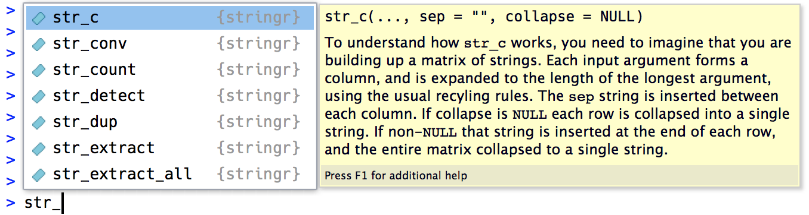

# 문자열 {#sec-strings}

```{r}
#| echo: false
source("_common.R")
```

## 서론

지금까지 여러분은 세부 사항을 자세히 배우지 않고도 많은 문자열을 사용해 왔습니다.
이제 문자열 내부로 깊숙이 들어가 문자열이 어떻게 작동하는지 배우고, 사용 가능한 강력한 문자열 조작 도구들을 마스터할 시간입니다.

먼저 문자열과 문자형 벡터를 만드는 세부 사항부터 시작하겠습니다.
그다음 데이터로부터 문자열을 만드는 법을 배우고, 반대로 문자열에서 데이터를 추출하는 법을 배울 것입니다.
그 후에는 개별 글자를 다루는 도구들에 대해 논의하겠습니다.
이 챕터는 개별 글자를 다루는 함수들과 다른 언어를 다룰 때 영어에서의 기대치가 어떻게 어긋날 수 있는지에 대한 짧은 논의로 마무리됩니다.

정규 표현식의 강력함에 대해 더 배우게 될 다음 챕터에서도 문자열 작업을 계속 이어 나갈 것입니다.

### 사전 요구 사항

이 챕터에서는 핵심 tidyverse의 일부인 stringr 패키지의 함수들을 사용합니다.
또한 조작하기에 재미있는 문자열들을 제공하는 babynames 데이터를 사용할 것입니다.

```{r}
#| label: setup
#| message: false
library(tidyverse)
library(babynames)
```

모든 stringr 함수는 `str_`로 시작하기 때문에 stringr 함수를 사용하고 있다는 것을 금방 알 수 있습니다.
이는 특히 RStudio를 사용할 때 유용합니다. `str_`를 입력하면 자동 완성 기능이 활성화되어 사용 가능한 함수들을 기억해 내는 데 도움을 주기 때문입니다.

```{r}
#| echo: false
#| fig-alt: |
#|   RStudio 콘솔에 str_c를 입력했을 때 상단에 표시되는 자동 완성 툴팁. 
#|   str_c로 시작하는 함수 목록을 보여줍니다. 자동 완성 목록에서 강조된 
#|   함수의 시그니처와 매뉴얼 페이지 시작 부분이 우측 패널에 표시됩니다.

```

## 문자열 만들기

이 책의 앞부분에서 문자열을 간간이 만들었지만 세부적인 내용은 다루지 않았습니다.
우선, 작은따옴표(`'`)나 큰따옴표(`"`) 중 하나를 사용하여 문자열을 만들 수 있습니다.
둘 사이에 동작 방식의 차이는 없으므로, 일관성을 위해 [tidyverse 스타일 가이드](https://style.tidyverse.org/syntax.html#character-vectors)에서는 문자열 내부에 여러 개의 `"`가 포함된 경우가 아니라면 `"`를 사용할 것을 권장합니다.

```{r}
string1 <- "This is a string"
string2 <- 'If I want to include a "quote" inside a string, I use single quotes'
```

따옴표 닫는 것을 잊어버리면 계속 입력하라는 프롬프트인 `+`가 나타납니다:

```         
> "This is a string without a closing quote
+ 
+ 
+ HELP I'M STUCK IN A STRING
```

이런 일이 발생하고 어떤 따옴표를 닫아야 할지 모르겠다면 Escape 키를 눌러 취소하고 다시 시도하세요.

### 이스케이프

문자열 내부에 리터럴 작은따옴표나 큰따옴표를 포함하려면 `\`를 사용하여 "이스케이프(escape)"할 수 있습니다:

```{r}
double_quote <- "\"" # 또는 '"'
single_quote <- '\'' # 또는 "'"
```

따라서 문자열 내부에 리터럴 백슬래시를 포함하고 싶다면 `"\\"`와 같이 이스케이프 해야 합니다:

```{r}
backslash <- "\\"
```

문자열의 출력 표현(printed representation)은 문자열 그 자체와 같지 않다는 점에 유의하세요. 출력 표현은 이스케이프를 보여주기 때문입니다(다시 말해, 문자열을 출력할 때 출력된 결과를 복사하여 붙여넣으면 해당 문자열을 다시 만들 수 있습니다).
문자열의 실제 내용을 보려면 `str_view()`를 사용하세요[^strings-1]:

[^strings-1]: 또는 base R 함수인 `writeLines()`를 사용하세요.

```{r}
x <- c(single_quote, double_quote, backslash)
x
str_view(x)
```

### 원시 문자열 {#sec-raw-strings}

여러 개의 따옴표나 백슬래시가 포함된 문자열을 만드는 것은 금방 혼란스러워질 수 있습니다.
문제를 보여주기 위해, `double_quote`와 `single_quote` 변수를 정의했던 코드 블록의 내용을 포함하는 문자열을 만들어 보겠습니다:

```{r}
tricky <- "double_quote <- \"\\\"\" # or '\"'
single_quote <- '\\'' # or \"'\""
tricky
str_view(tricky)
```

백슬래시가 정말 많네요!
(이를 가끔 [기울어진 이쑤시개 증후군](https://en.wikipedia.org/wiki/Leaning_toothpick_syndrome)이라고 부릅니다.) 이스케이프를 없애기 위해 대신 **원시 문자열(raw string)** 을 사용할 수 있습니다[^strings-2]:

[^strings-2]: R 4.0.0 버전 이상에서 사용할 수 있습니다.

```{r}
tricky <- r"(double_quote <- "\"" # or '"'
single_quote <- '\'' # or "'")"
str_view(tricky)
```

원시 문자열은 보통 `r"(`로 시작하고 `)"`로 끝납니다.
하지만 문자열에 `)"`가 포함되어 있다면 대신 `r"[]"`나 `r"{}"`를 사용할 수 있고, 그래도 충분하지 않다면 시작과 끝 쌍을 고유하게 만들기 위해 대시를 원하는 만큼 삽입할 수 있습니다(예: `r"--()--"`, `r"---()---"` 등). 원시 문자열은 어떤 텍스트도 처리할 수 있을 만큼 유연합니다.

### 기타 특수 문자

`"`, `'`, `\` 뿐만 아니라 유용하게 쓰일 수 있는 몇 가지 다른 특수 문자들도 있습니다.
가장 흔한 것은 줄바꿈 문자인 `\n`과 탭 문자인 `\t`입니다. 또한 가끔 `\u` 또는 `\U`로 시작하는 유니코드 이스케이프를 포함한 문자열을 볼 수도 있습니다.
이는 모든 시스템에서 작동하는 비영어권 문자를 작성하는 방법입니다. `?Quotes`에서 다른 특수 문자들의 전체 목록을 확인할 수 있습니다.

```{r}
x <- c("one\ntwo", "one\ttwo", "\u00b5", "\U0001f604")
x
str_view(x)
```

`str_view()`는 탭 문자를 더 쉽게 알아볼 수 있도록 중괄호를 사용한다는 점에 유의하세요[^strings-3].
텍스트 작업을 할 때 어려운 점 중 하나는 공백(white space)이 텍스트에 포함되는 방식이 다양하다는 것인데, 이러한 배경 지식은 무언가 이상한 일이 일어나고 있음을 인식하는 데 도움이 됩니다.

[^strings-3]: `str_view()`는 또한 색상을 사용하여 탭, 공백, 일치 항목 등에 주의를 집중시킵니다. 현재 이 책에서는 색상이 나타나지 않지만, 코드를 대화식으로 실행할 때는 색상을 확인할 수 있을 것입니다.

### 연습문제

1.  다음 값들을 포함하는 문자열을 만드세요:

    1.  `He said "That's amazing!"`

    2.  `\a\b\c\d`

    3.  `\\\\\\`

2.  R 세션에서 문자열을 만들고 출력해 보세요. 특수 문자 "\\u00a0"은 어떻게 됩니까? `str_view()`는 이를 어떻게 표시합니까? 구글링을 조금 해서 이 특수 문자가 무엇인지 알아낼 수 있나요?

    ```{r}
    x <- "This\u00a0is\u00a0tricky"
    ```

## 데이터로부터 여러 문자열 만들기

이제 "수동으로" 한두 개의 문자열을 만드는 기본 사항을 배웠으므로, 다른 문자열로부터 새로운 문자열을 만드는 세부 사항을 살펴보겠습니다.
이는 여러분이 작성한 텍스트를 데이터 프레임의 문자열과 결합하고 싶은 흔한 문제를 해결하는 데 도움이 될 것입니다.
예를 들어, "Hello"와 `name` 변수를 결합하여 인사말을 만들 수 있습니다.
`str_c()`와 `str_glue()`를 사용하여 이 작업을 수행하는 방법과 이들을 `mutate()`와 함께 사용하는 방법을 보여드리겠습니다.
자연스럽게 `summarize()`와 함께 어떤 stringr 함수를 사용할 수 있을지 의문이 생길 텐데, 문자열을 위한 요약 함수인 `str_flatten()`에 대한 논의로 이 섹션을 마무리하겠습니다.

### `str_c()`

`str_c()`는 임의의 개수만큼 벡터를 인자로 받아 문자형 벡터를 반환합니다:

```{r}
str_c("x", "y")
str_c("x", "y", "z")
str_c("Hello ", c("John", "Susan"))
```

`str_c()`는 base R의 `paste0()`와 매우 유사하지만, 재사용 규칙과 결측값 전파에 대한 일반적인 tidyverse 규칙을 따름으로써 `mutate()`와 함께 사용되도록 설계되었습니다:

```{r}
df <- tibble(name = c("Flora", "David", "Terra", NA))
df |> mutate(greeting = str_c("Hi ", name, "!"))
```

결측값을 다른 방식으로 표시하고 싶다면 `coalesce()`를 사용하여 대체하세요.
원하는 바에 따라 `str_c()` 내부 또는 외부에서 사용할 수 있습니다:

```{r}
df |> 
  mutate(
    greeting1 = str_c("Hi ", coalesce(name, "you"), "!"),
    greeting2 = coalesce(str_c("Hi ", name, "!"), "Hi!")
  )
```

### `str_glue()` {#sec-glue}

`str_c()`를 사용하여 많은 고정된 문자열과 가변적인 문자열을 섞다 보면 `"`를 정말 많이 입력하게 되고, 코드의 전체적인 목표를 파악하기 어려워진다는 것을 알게 될 것입니다. 대안적인 접근 방식은 [glue 패키지](https://glue.tidyverse.org)에서 `str_glue()`를 통해 제공됩니다[^strings-4]. `str_glue()`에는 특수한 기능을 가진 단일 문자열을 입력합니다. `{}` 내부의 모든 것은 따옴표 외부에 있는 것처럼 평가됩니다:

[^strings-4]: stringr을 사용하지 않는 경우 `glue::glue()`를 통해 직접 접근할 수도 있습니다.

```{r}
df |> mutate(greeting = str_glue("Hi {name}!"))
```

보시다시피, 안타깝게도 `str_glue()`는 현재 결측값을 문자열 `"NA"`로 변환하여 `str_c()`와 일관되지 않게 작동합니다.

또한 문자열에 일반적인 `{`나 `}`를 포함해야 하는 경우 어떻게 되는지 궁금할 수도 있습니다.
무언가 이스케이프 처리를 해야 할 것 같다고 추측했다면 맞습니다.
비결은 glue가 약간 다른 이스케이프 기법을 사용한다는 것입니다. `\`와 같은 특수 문자를 접두사로 붙이는 대신, 특수 문자를 중복해서 사용합니다:

```{r}
df |> mutate(greeting = str_glue("{{Hi {name}!}}"))
```

### `str_flatten()`

`str_c()`와 `str_glue()`는 출력이 입력과 동일한 길이를 가지므로 `mutate()`와 잘 작동합니다.
항상 단일 문자열을 반환하는 등 `summarize()`와 잘 작동하는 함수를 원한다면 어떨까요?
그것이 바로 `str_flatten()`의 역할입니다[^strings-5]. 이 함수는 문자형 벡터를 받아 벡터의 각 요소를 하나의 문자열로 결합합니다:

[^strings-5]: Base R의 대등한 함수는 `collapse` 인자와 함께 사용하는 `paste()`입니다.

```{r}
str_flatten(c("x", "y", "z"))
str_flatten(c("x", "y", "z"), ", ")
str_flatten(c("x", "y", "z"), ", ", last = ", and ")
```

이 덕분에 `summarize()`와 잘 작동합니다:

```{r}
df <- tribble(
  ~ name, ~ fruit,
  "Carmen", "banana",
  "Carmen", "apple",
  "Marvin", "nectarine",
  "Terence", "cantaloupe",
  "Terence", "papaya",
  "Terence", "mandarin"
)
df |>
  group_by(name) |> 
  summarize(fruits = str_flatten(fruit, ", "))
```

### 연습문제

1.  다음 입력들에 대해 `paste0()`와 `str_c()`의 결과를 비교하고 대조해 보세요:

    ```{r}
    #| eval: false
    str_c("hi ", NA)
    str_c(letters[1:2], letters[1:3])
    ```

2.  `paste()`와 `paste0()`의 차이점은 무엇입니까? `str_c()`를 사용하여 `paste()`와 동등한 결과를 어떻게 재현할 수 있습니까?

3.  다음 표현식들을 `str_c()`에서 `str_glue()`로 또는 그 반대로 변환해 보세요:

    a.  `str_c("The price of ", food, " is ", price)`

    b.  `str_glue("I'm {age} years old and live in {country}")`

    c.  `str_c("\\section{", title, "}")`

## 문자열에서 데이터 추출하기

여러 변수가 하나의 문자열에 빽빽하게 들어 있는 경우는 흔합니다.
이 섹션에서는 이를 추출하기 위해 다음 네 가지 tidyr 함수를 사용하는 방법을 배울 것입니다:

-   `df |> separate_longer_delim(col, delim)`
-   `df |> separate_longer_position(col, width)`
-   `df |> separate_wider_delim(col, delim, names)`
-   `df |> separate_wider_position(col, widths)`

자세히 살펴보면 공통된 패턴이 있음을 알 수 있습니다: `separate_` 다음에 `longer` 또는 `wider`가 오고, 그 다음에 `_`, 마지막으로 `delim` 또는 `position`이 옵니다.
이는 이 네 함수가 두 개의 더 단순한 기본 요소들로 구성되어 있기 때문입니다:

-   `pivot_longer()` 및 `pivot_wider()`와 마찬가지로, `_longer` 함수는 새로운 행을 만들어 입력 데이터 프레임을 길게 만들고, `_wider` 함수는 새로운 열을 생성하여 입력 데이터 프레임을 넓게 만듭니다.
-   `delim`은 `", "`나 `" "`와 같은 구분자(delimiter)를 기준으로 문자열을 나눕니다. `position`은 `c(3, 5, 2)`와 같이 지정된 너비에서 문자열을 나눕니다.

이 가족의 마지막 구성원인 `separate_wider_regex()`에 대해서는 @sec-regular-expressions 에서 다루겠습니다.
이는 `wider` 함수들 중 가장 유연하지만, 이를 사용하려면 정규 표현식에 대해 알아야 합니다.

이어지는 두 섹션에서는 이러한 분리 함수들 뒤에 숨겨진 기본적인 아이디어를 제공할 것입니다. 먼저 조금 더 단순한 행으로 분리하기를 다루고, 그다음 열로 분리하기를 다루겠습니다. 마지막으로 `wider` 함수들이 문제 진단을 위해 제공하는 도구들에 대해 논의하며 마무리하겠습니다.

### 행으로 분리하기

문자열을 행으로 분리하는 것은 행마다 구성 요소의 개수가 다를 때 가장 유용합니다.
가장 흔한 경우는 구분자를 기준으로 나누기 위해 `separate_longer_delim()`을 사용하는 것입니다:

```{r}
df1 <- tibble(x = c("a,b,c", "d,e", "f"))
df1 |> 
  separate_longer_delim(x, delim = ",")
```

실제로 `separate_longer_position()`을 보는 경우는 드물지만, 일부 오래된 데이터셋은 각 문자가 값을 기록하는 데 사용되는 매우 조밀한 형식을 사용하기도 합니다:

```{r}
df2 <- tibble(x = c("1211", "131", "21"))
df2 |> 
  separate_longer_position(x, width = 1)
```

### 열로 분리하기 {#sec-string-columns}

문자열을 열로 분리하는 것은 각 문자열에 고정된 수의 구성 요소가 있고 이를 여러 열로 펼치고 싶을 때 가장 유용합니다.
열의 이름을 지정해야 하므로 `longer`에 상응하는 함수들보다 약간 더 복잡합니다.
예를 들어 다음 데이터셋에서 `x`는 코드, 판 번호, 연도로 구성되며 `"."`로 구분되어 있습니다.
`separate_wider_delim()`을 사용하기 위해 구분자와 이름을 두 인자로 제공합니다:

```{r}
df3 <- tibble(x = c("a10.1.2022", "b10.2.2011", "e15.1.2015"))
df3 |> 
  separate_wider_delim(
    x,
    delim = ".",
    names = c("code", "edition", "year")
  )
```

특정 부분이 유용하지 않다면 `NA` 이름을 사용하여 결과에서 제외할 수 있습니다:

```{r}
df3 |> 
  separate_wider_delim(
    x,
    delim = ".",
    names = c("code", NA, "year")
  )
```

`separate_wider_position()`은 각 열의 너비를 지정해야 하므로 약간 다르게 작동합니다.
따라서 이름이 새로운 열의 이름을 나타내고 값이 차지하는 문자 수를 나타내는 정수 벡터를 제공합니다.
이름을 지정하지 않음으로써 출력에서 특정 값을 제외할 수 있습니다:

```{r}
df4 <- tibble(x = c("202215TX", "202122LA", "202325CA")) 
df4 |> 
  separate_wider_position(
    x,
    widths = c(year = 4, age = 2, state = 2)
  )
```

### 열 분리 문제 진단하기

`separate_wider_delim()`[^strings-6]은 고정되고 알려진 열 세트를 필요로 합니다.
일부 행에 예상한 개수의 조각이 없다면 어떻게 될까요?
조각이 너무 적거나 너무 많은 두 가지 상황이 발생할 수 있으므로, `separate_wider_delim()`은 이를 돕기 위해 `too_few`와 `too_many`라는 두 인자를 제공합니다. 먼저 다음 샘플 데이터셋으로 `too_few`의 경우를 살펴보겠습니다:

[^strings-6]: 동일한 원칙이 `separate_wider_position()` 및 `separate_wider_regex()`에도 적용됩니다.

```{r}
#| error: true
df <- tibble(a = c("1-1-1", "1-1-2", "1-3", "1-3-2", "1"))

df |> 
  separate_wider_delim(
    a,
    delim = "-",
    names = c("x", "y", "z")
  )
```

에러가 발생하지만, 에러 메시지에서 어떻게 진행하면 좋을지 몇 가지 제안을 해줍니다.
먼저 문제를 디버깅하는 것부터 시작하겠습니다:

```{r}
debug <- df |> 
  separate_wider_delim(
    a,
    delim = "-",
    names = c("x", "y", "z"),
    too_few = "debug"
  )
debug
```

디버그 모드를 사용하면 `a_ok`, `a_pieces`, `a_remainder`라는 세 개의 추가 열이 출력에 추가됩니다(다른 이름의 변수를 분리하면 접두사가 달라집니다).
여기서 `a_ok`를 통해 실패한 입력값을 빠르게 찾을 수 있습니다:

```{r}
debug |> filter(!a_ok)
```

`a_pieces`는 `names`의 길이인 기대값 3과 비교하여 몇 개의 조각이 발견되었는지 알려줍니다.
조각이 너무 적을 때는 `a_remainder`가 유용하지 않지만, 곧 다시 보게 될 것입니다.

때때로 이 디버깅 정보를 살펴보면 구분자 전략의 문제를 발견하거나 분리하기 전에 전처리가 더 필요하다는 점을 깨닫게 될 수 있습니다.
그런 경우에는 근본적인 문제를 수정하고, 새로운 문제가 에러로 나타날 수 있도록 `too_few = "debug"`를 반드시 제거해야 합니다.

다른 경우에는 누락된 조각을 `NA`로 채우고 계속 진행하고 싶을 수 있습니다.
이것이 `too_few = "align_start"`와 `too_few = "align_end"`의 역할이며, `NA`를 어디에 넣을지 제어할 수 있게 해줍니다:

```{r}
df |> 
  separate_wider_delim(
    a,
    delim = "-",
    names = c("x", "y", "z"),
    too_few = "align_start"
  )
```

조각이 너무 많은 경우에도 동일한 원칙이 적용됩니다:

```{r}
#| error: true
df <- tibble(a = c("1-1-1", "1-1-2", "1-3-5-6", "1-3-2", "1-3-5-7-9"))

df |> 
  separate_wider_delim(
    a,
    delim = "-",
    names = c("x", "y", "z")
  )
```

이제 결과를 디버깅해 보면 `a_remainder`의 목적을 알 수 있습니다:

```{r}
debug <- df |> 
  separate_wider_delim(
    a,
    delim = "-",
    names = c("x", "y", "z"),
    too_many = "debug"
  )
debug |> filter(!a_ok)
```

조각이 너무 많은 경우를 처리하기 위한 몇 가지 다른 옵션이 있습니다. 추가 조각을 조용히 "삭제(drop)"하거나, 마지막 열에 모두 "병합(merge)"할 수 있습니다:

```{r}
df |> 
  separate_wider_delim(
    a,
    delim = "-",
    names = c("x", "y", "z"),
    too_many = "drop"
  )


df |> 
  separate_wider_delim(
    a,
    delim = "-",
    names = c("x", "y", "z"),
    too_many = "merge"
  )
```

## 글자

이 섹션에서는 문자열 내의 개별 글자(letters)를 다루는 함수들을 소개합니다.
문자열의 길이를 구하는 법, 부분 문자열(substrings)을 추출하는 법, 플롯이나 표에서 긴 문자열을 처리하는 법을 배우게 될 것입니다.

### 길이

`str_length()`는 문자열의 글자 수를 알려줍니다:

```{r}
str_length(c("a", "R for data science", NA))
```

이를 `count()`와 함께 사용하여 미국 아기 이름 길이의 분포를 찾고, `filter()`를 사용하여 가장 긴 이름들을 찾을 수 있습니다. 가장 긴 이름들은 15글자입니다[^strings-7]:

[^strings-7]: 이 항목들을 보면 아기 이름 데이터에서 공백이나 하이픈은 제거되고 15자 이후에는 잘린 것으로 추측됩니다.

```{r}
babynames |>
  count(length = str_length(name), wt = n)

babynames |> 
  filter(str_length(name) == 15) |> 
  count(name, wt = n, sort = TRUE)
```

### 부분 문자열 추출

`str_sub(string, start, end)`를 사용하여 문자열의 일부를 추출할 수 있습니다. 여기서 `start`와 `end`는 부분 문자열의 시작과 끝 위치입니다.
`start`와 `end` 인자는 모두 포함되므로 반환되는 문자열의 길이는 `end - start + 1`이 됩니다:

```{r}
x <- c("Apple", "Banana", "Pear")
str_sub(x, 1, 3)
```

음수 값을 사용하여 문자열의 끝에서부터 거꾸로 셀 수도 있습니다. -1은 마지막 글자, -2는 끝에서 두 번째 글자 등을 나타냅니다.

```{r}
str_sub(x, -3, -1)
```

`str_sub()`는 문자열이 너무 짧아도 실패하지 않고 가능한 만큼만 반환합니다:

```{r}
str_sub("a", 1, 5)
```

`mutate()` 안에서 `str_sub()`를 사용하여 각 이름의 첫 글자와 마지막 글자를 찾을 수 있습니다:

```{r}
babynames |> 
  mutate(
    first = str_sub(name, 1, 1),
    last = str_sub(name, -1, -1)
  )
```

### 연습문제

1.  아기 이름 길이의 분포를 계산할 때 왜 `wt = n`을 사용했나요?
2.  `str_length()`와 `str_sub()`를 사용하여 각 아기 이름의 중간 글자를 추출해 보세요. 문자열의 글자 수가 짝수라면 어떻게 하겠습니까?
3.  시간이 지남에 따라 아기 이름 길이에 큰 변화 추세가 있나요? 첫 글자와 마지막 글자의 인기에 대해서는 어떻습니까?

## 비영어권 텍스트 {#sec-other-languages}

지금까지 우리는 두 가지 이유로 다루기 특히 쉬운 영어 텍스트에 집중해 왔습니다.
첫째로, 영어 알파벳은 단 26개의 글자로 구성되어 상대적으로 단순합니다.
둘째로(어쩌면 더 중요하게도), 우리가 오늘날 사용하는 컴퓨팅 인프라는 주로 영어 사용자에 의해 설계되었습니다.
안타깝게도 비영어권 언어를 모두 다룰 공간은 부족합니다.
그럼에도 불구하고 여러분이 마주할 수 있는 가장 큰 과제들인 인코딩, 글자 변형, 로케일 의존적 함수들에 대해 주의를 환기하고 싶습니다.

### 인코딩

비영어권 텍스트를 다룰 때 첫 번째 과제는 대개 **인코딩(encoding)** 입니다.
무슨 일이 일어나고 있는지 이해하려면 컴퓨터가 문자열을 어떻게 표현하는지 깊이 있게 살펴봐야 합니다.
R에서는 `charToRaw()`를 사용하여 문자열의 기저 표현을 확인할 수 있습니다:

```{r}
charToRaw("Hadley")
```

이 여섯 개의 16진수 각각은 하나의 글자를 나타냅니다. `48`은 H, `61`은 a와 같은 식입니다.
16진수에서 문자로의 매핑을 인코딩이라고 부르며, 이 경우 인코딩은 ASCII라고 불립니다.
ASCII는 **American** Standard Code for Information Interchange(미국 정보 교환 표준 부호)이므로 영어 문자를 아주 잘 표현합니다.

영어가 아닌 다른 언어의 경우에는 상황이 그리 쉽지 않습니다.
컴퓨팅의 초창기에는 비영어권 문자를 인코딩하기 위한 다양한 표준들이 경쟁했습니다.
예를 들어 유럽을 위한 두 개의 서로 다른 인코딩이 있었습니다. 서유럽 언어에는 Latin1(일명 ISO-8859-1)이 사용되었고, 중유럽 언어에는 Latin2(일명 ISO-8859-2)가 사용되었습니다.
Latin1에서 바이트 `b1`은 "±"이지만, Latin2에서는 "ą"입니다!
다행히 오늘날에는 거의 모든 곳에서 지원되는 하나의 표준인 UTF-8이 있습니다.
UTF-8은 오늘날 사람들이 사용하는 거의 모든 문자와 이모지와 같은 많은 추가 기호들을 인코딩할 수 있습니다.

readr은 모든 곳에서 UTF-8을 사용합니다.
이는 좋은 기본값이지만 UTF-8을 사용하지 않는 오래된 시스템에서 생성된 데이터에 대해서는 실패할 것입니다.
이런 일이 발생하면 문자열을 출력할 때 이상하게 보일 것입니다.
어떨 때는 한두 글자만 깨져 보일 수 있고, 어떨 때는 완전히 해독 불가능한 글자들로 보일 수도 있습니다.
예를 들어 여기 일반적이지 않은 인코딩으로 된 두 개의 인라인 CSV가 있습니다[^strings-8]:

[^strings-8]: 여기서는 기호 `\x`를 사용하여 이진 데이터를 문자열에 직접 인코딩합니다.

```{r}
#| eval: false

x1 <- "text\nEl Ni\xf1o was particularly bad this year"
read_csv(x1)$text
#> [1] "El Ni\xf1o was particularly bad this year"

x2 <- "text\n\x82\xb1\x82\xf1\x82\xc9\x82\xbf\x82\xcd"
read_csv(x2)$text
#> [1] "\x82\xb1\x82\xf1\x82ɂ\xbf\x82\xcd"
```

이들을 올바르게 읽으려면 `locale` 인자를 통해 인코딩을 지정해야 합니다:

```{r}
#| eval: false
read_csv(x1, locale = locale(encoding = "Latin1"))$text
#> [1] "El Niño was particularly bad this year"

read_csv(x2, locale = locale(encoding = "Shift-JIS"))$text
#> [1] "こんにちは"
```

올바른 인코딩은 어떻게 찾을까요?
운이 좋다면 데이터 설명서 어딘가에 포함되어 있을 것입니다.
안타깝게도 그런 경우는 드물기에, readr은 인코딩을 알아내는 데 도움을 주는 `guess_encoding()`을 제공합니다.
이것이 완벽하지는 않으며 (여기서처럼 짧은 텍스트가 아닌) 긴 텍스트가 있을 때 더 잘 작동하지만, 시작하기에 합리적인 도구입니다. 올바른 인코딩을 찾기 전까지 몇 가지 다른 인코딩을 시도해 볼 필요가 있습니다.

인코딩은 풍부하고 복잡한 주제입니다. 여기서는 겉핥기만 했을 뿐입니다.
더 자세히 배우고 싶다면 <http://kunststube.net/encoding/>의 상세한 설명을 읽어보실 것을 권장합니다.

### 글자 변형

악센트가 있는 언어로 작업할 때 글자의 위치를 결정하는 것(예를 들어 `str_length()`와 `str_sub()`)은 큰 도전 과제입니다. 악센트가 있는 글자는 단일 개별 문자(예: ü)로 인코딩될 수도 있고, 악센트가 없는 글자(예: u)와 발음 구별 기호(예: ¨)가 결합된 두 개의 문자로 인코딩될 수도 있기 때문입니다.
예를 들어 이 코드는 동일하게 보이는 ü를 표현하는 두 가지 방법을 보여줍니다:

```{r}
u <- c("\u00fc", "u\u0308")
str_view(u)
```

하지만 두 문자열의 길이는 다르며 첫 번째 글자도 서로 다릅니다:

```{r}
str_length(u)
str_sub(u, 1, 1)
```

마지막으로, 이 문자열들을 `==`으로 비교하면 서로 다른 것으로 해석하는 반면, stringr의 편리한 `str_equal()` 함수는 두 문자열이 동일한 외형을 가지고 있음을 인식한다는 점에 주목하세요:

```{r}
u[[1]] == u[[2]]

str_equal(u[[1]], u[[2]])
```

### 로케일 의존적 함수

마지막으로, 작동 방식이 여러분의 **로케일(locale)** 에 따라 달라지는 몇 가지 stringr 함수들이 있습니다.
로케일은 언어와 유사하지만, 언어 내의 지역적 차이를 처리하기 위한 선택적인 지역 지정자를 포함합니다.
로케일은 소문자 언어 약어로 지정되며, 선택적으로 `_`와 대문자 지역 식별자가 뒤따릅니다.
예를 들어 "en"은 영어, "en_GB"는 영국 영어, "en_US"는 미국 영어입니다.
자신의 언어 코드를 아직 모른다면 [위키백과](https://en.wikipedia.org/wiki/List_of_ISO_639-1_codes)에 좋은 목록이 있으며, `stringi::stri_locale_list()`를 살펴보면 stringr에서 지원되는 로케일을 확인할 수 있습니다.

Base R 문자열 함수들은 운영체제에서 설정된 로케일을 자동으로 사용합니다.
이것은 base R 문자열 함수가 여러분의 언어에 대해 예상대로 작동함을 의미하지만, 다른 국가에 사는 사람과 코드를 공유하면 다르게 작동할 수 있다는 뜻이기도 합니다.
이 문제를 피하기 위해 stringr은 기본적으로 "en" 로케일을 사용하는 영어 규칙으로 설정되어 있으며, 이를 덮어쓰려면 `locale` 인자를 지정해야 합니다.
다행히 로케일이 정말 중요한 함수는 대소문자 변경과 정렬, 두 가지 세트뿐입니다.

대소문자를 변경하는 규칙은 언어마다 다릅니다.
예를 들어 터키어에는 점이 있는 것과 없는 것, 두 종류의 i가 있습니다.
이들은 서로 다른 글자이므로 대문자 변환 방식도 다릅니다:

```{r}
str_to_upper(c("i", "ı"))
str_to_upper(c("i", "ı"), locale = "tr")
```

문자열 정렬은 알파벳 순서에 따라 달라지며, 알파벳 순서는 모든 언어에서 동일하지 않습니다[^strings-9]!
예제 하나를 보겠습니다. 체코어에서 "ch"는 알파벳에서 `h` 다음에 나타나는 복합 문자입니다.

[^strings-9]: 중국어처럼 알파벳이 없는 언어의 정렬은 훨씬 더 복잡합니다.

```{r}
str_sort(c("a", "c", "ch", "h", "z"))
str_sort(c("a", "c", "ch", "h", "z"), locale = "cs")
```

이는 `dplyr::arrange()`로 문자열을 정렬할 때도 발생하며, 이것이 `arrange()`에도 `locale` 인자가 있는 이유입니다.

## 요약

이 챕터에서 여러분은 문자열을 생성, 결합, 추출하는 방법과 비영어권 문자열에서 겪을 수 있는 몇 가지 도전 과제 등 stringr 패키지의 강력한 기능 몇 가지를 배웠습니다.
이제 문자열 작업을 위한 가장 중요하고 강력한 도구 중 하나인 정규 표현식을 배울 시간입니다.
정규 표현식은 문자열 내의 패턴을 설명하기 위한 매우 간결하면서도 표현력이 풍부한 언어이며 다음 챕터의 주제입니다.
