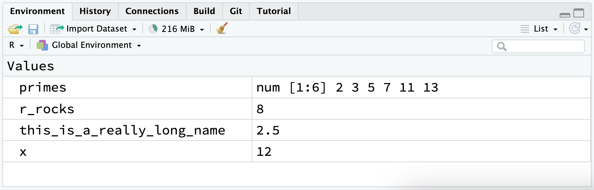

# 워크플로: 기초 {#sec-workflow-basics}

```{r}
#| echo: false
source("_common.R")
```

이제 R 코드를 실행한 경험이 어느 정도 있을 것입니다.
많은 세부 사항을 알려드리지는 않았지만, 여러분은 분명 기초적인 내용을 파악하셨을 것입니다. 그렇지 않았다면 이 책을 던져버렸을 것입니다!
프로그래밍을 처음 시작할 때 좌절감을 느끼는 것은 자연스러운 일입니다. R은 구문에 매우 엄격해서 한 글자만 잘못 입력해도 에러가 발생하기 때문입니다.
어느 정도의 좌절은 예상할 수 있지만, 이는 누구나 겪는 일이며 일시적이라는 점을 기억하세요. 이는 모든 사람이 겪는 일이며, 이를 극복하는 방법은 계속 시도하는 것입니다.

더 나아가기 전에, R 코드를 실행하는 데 필요한 견고한 기초를 갖추고 있는지, 그리고 가장 유용한 RStudio 기능들을 알고 있는지 확인해 봅시다.

## 코딩 기초

최대한 빨리 시각화(plotting)를 시작하기 위해 지금까지 생략했던 몇 가지 기초 사항을 검토해 보겠습니다.
R을 사용하여 기본적인 수학 계산을 할 수 있습니다:

```{r}
1 / 200 * 30
(59 + 73 + 2) / 3
sin(pi / 2)
```

할당 연산자 `<-`를 사용하여 새로운 객체를 만들 수 있습니다:

```{r}
x <- 3 * 4
```

`x`의 값은 출력되지 않고 저장만 된다는 점에 유의하세요.
값을 확인하고 싶다면 콘솔에 `x`를 입력하세요.

`c()`를 사용하여 여러 요소를 하나의 벡터로 **결합(combine)** 할 수 있습니다:

```{r}
primes <- c(2, 3, 5, 7, 11, 13)
```

벡터에 대한 기본적인 산술 연산은 벡터의 모든 요소에 적용됩니다:

```{r}
primes * 2
primes - 1
```

객체를 생성하는 모든 R 문장, 즉 **할당(assignment)** 문은 동일한 형식을 가집니다:

```{r}
#| eval: false
object_name <- value
```

이 코드를 읽을 때 머릿속으로 "객체 이름(object_name)은 값(value)을 받는다(gets)"라고 읽으세요.

여러분은 수많은 할당을 하게 될 텐데, `<-`를 입력하는 것은 귀찮은 일입니다.
RStudio의 키보드 단축키인 Alt + -(마이너스 기호)를 사용하여 시간을 절약할 수 있습니다.
RStudio가 자동으로 `<-` 주위에 공백을 추가하는 것을 보셨나요? 이는 코드 포맷팅에서 좋은 습관입니다.
코드는 평소에도 읽기 힘들 수 있으니, 공백을 사용해서 눈의 피로를 덜어주세요(giveyoureyesabreak).

## 주석

R은 해당 줄에서 `#` 뒤에 오는 모든 텍스트를 무시합니다.
이를 통해 R은 무시하지만 사람은 읽을 수 있는 텍스트인 **주석(comments)** 을 작성할 수 있습니다.
때로는 예제 코드에서 어떤 일이 일어나고 있는지 설명하기 위해 주석을 포함하기도 할 것입니다.

주석은 뒤따르는 코드가 무엇을 하는지 간략하게 설명하는 데 도움이 될 수 있습니다.

```{r}
# 소수 벡터 생성
primes <- c(2, 3, 5, 7, 11, 13)

# 소수에 2를 곱함
primes * 2
```

이와 같이 짧은 코드에서는 모든 코드 줄마다 주석을 남길 필요는 없을 수도 있습니다.
하지만 작성하는 코드가 복잡해질수록 주석은 여러분(그리고 동료들)이 코드에서 무엇을 했는지 파악하는 데 많은 시간을 아껴줄 것입니다.

주석은 코드의 *방법(how)* 이나 *무엇(what)* 이 아니라 *이유(why)* 를 설명하는 데 사용하세요.
*무엇*과 *방법*은 아무리 지루하더라도 코드를 주의 깊게 읽으면 언제든지 파악할 수 있습니다.
만약 주석에 모든 단계를 설명한 다음 코드를 변경한다면, 주석도 함께 업데이트해야 한다는 것을 기억해야 합니다. 그렇지 않으면 나중에 코드를 다시 볼 때 매우 혼란스러울 것입니다.

반면에 무언가를 *왜* 했는지 알아내는 것은 훨씬 어렵거나 불가능할 수도 있습니다.
예를 들어, `geom_smooth()`에는 곡선의 매끄러움을 조절하는 `span`이라는 인자가 있으며, 큰 값일수록 더 매끄러운 곡선이 생성됩니다.
여러분이 `span` 값을 기본값인 0.75에서 0.9로 변경하기로 했다고 가정해 봅시다. 미래의 독자가 *무엇*이 일어나고 있는지 이해하기는 쉽지만, 주석에 여러분의 생각을 기록해 두지 않는다면 왜 기본값을 변경했는지 아무도 이해하지 못할 것입니다.

데이터 분석 코드의 경우, 주석을 사용하여 전체적인 공략 계획을 설명하고 분석 과정에서 마주치는 중요한 통찰들을 기록하세요.
코드 자체만으로는 이러한 지식을 다시 얻을 수 있는 방법이 없습니다.

## 이름에 담긴 의미 {#sec-whats-in-a-name}

객체 이름은 반드시 문자로 시작해야 하며 문자, 숫자, `_`, `.`만 포함할 수 있습니다.
객체 이름이 설명적(descriptive)이기를 원할 것이므로, 여러 단어를 사용하는 경우 관례(convention)를 따라야 합니다.
단어 사이에 `_`를 넣어 소문자로 작성하는 **스네이크 케이스(snake_case)** 를 권장합니다.

```{r}
#| eval: false
i_use_snake_case
otherPeopleUseCamelCase
some.people.use.periods
And_aFew.People_RENOUNCEconvention
```

@sec-workflow-style에서 코드 스타일에 대해 논의할 때 이름에 대해 다시 다루겠습니다.

이름을 입력하여 객체를 검사할 수 있습니다:

```{r}
x
```

다른 할당을 하나 더 해봅시다:

```{r}
this_is_a_really_long_name <- 2.5
```

이 객체를 검사하려면 RStudio의 자동 완성 기능을 사용해 보세요: "this"를 입력하고 TAB 키를 누른 다음, 접두사가 유일해질 때까지 문자를 추가하고 Enter 키를 누르세요.

실수를 해서 `this_is_a_really_long_name`의 값이 2.5가 아니라 3.5여야 한다고 가정해 봅시다.
이를 수정하는 데 도움이 되는 다른 키보드 단축키를 사용할 수 있습니다.
예를 들어, ↑ 키를 누르면 마지막으로 입력한 명령어를 가져와서 수정할 수 있습니다.
또는 "this"를 입력한 다음 Cmd/Ctrl + ↑를 누르면 해당 글자로 시작하는 이전에 입력한 모든 명령어가 나열됩니다.
화살표 키로 탐색한 다음 Enter를 눌러 명령어를 다시 입력하세요. 2.5를 3.5로 바꾸고 다시 실행하세요.

또 하나 할당을 해봅시다:

```{r}
r_rocks <- 2^3
```

이를 검사해 봅시다:

```{r}
#| eval: false
r_rock
#> Error: object 'r_rock' not found
R_rocks
#> Error: object 'R_rocks' not found
```

이는 여러분과 R 사이의 암묵적인 계약을 보여줍니다. R은 지루한 계산을 대신 해주지만, 그 대가로 여러분은 지시 사항을 완벽하게 정확하게 전달해야 합니다.
그렇지 않으면 찾고 있는 객체를 찾을 수 없다는 에러가 발생하기 쉽습니다.
오타는 중요합니다. R은 여러분의 마음을 읽고 "아, `r_rock`이라고 쳤지만 아마 `r_rocks`를 뜻했겠지"라고 말해줄 수 없습니다.
대소문자도 중요합니다. 마찬가지로 R은 여러분의 마음을 읽고 "`R_rocks`라고 쳤지만 아마 `r_rocks`를 뜻했겠지"라고 말해줄 수 없습니다.

## 함수 호출하기

R에는 다음과 같이 호출되는 수많은 내장 함수들이 있습니다:

```{r}
#| eval: false
function_name(argument1 = value1, argument2 = value2, ...)
```

숫자들의 일정한 **수열(sequences)** 을 만드는 `seq()`를 사용해 보고, 그 과정에서 RStudio의 더 유용한 기능들을 배워봅시다.
`se`를 입력하고 TAB 키를 누르세요.
팝업 창에 가능한 자동 완성 목록이 표시됩니다.
더 입력(예: `q`)하여 중복을 제거하거나 ↑/↓ 화살표 키를 사용하여 `seq()`를 지정하세요.
함수의 인자와 목적을 상기시켜 주는 부유식 툴팁(floating tooltip)이 나타나는 것을 확인하세요.
더 많은 도움이 필요하면 F1 키를 눌러 오른쪽 하단 창의 도움말 탭에서 모든 상세 내용을 확인하세요.

원하는 함수를 선택했다면 다시 TAB 키를 누르세요.
RStudio가 짝이 맞는 여는 괄호(`(`)와 닫는 괄호(`)`)를 자동으로 추가해 줍니다.
첫 번째 인자의 이름인 `from`을 입력하고 `1`로 설정하세요.
그다음 두 번째 인자 이름인 `to`를 입력하고 `10`으로 설정하세요.
마지막으로 Enter를 누르세요.

```{r}
seq(from = 1, to = 10)
```

우리는 종종 함수 호출에서 처음 몇 개의 인자 이름을 생략하기도 하므로, 다음과 같이 다시 작성할 수 있습니다:

```{r}
seq(1, 10)
```

다음 코드를 입력할 때 RStudio가 따옴표 쌍에 대해서도 유사한 도움을 제공하는 것을 확인하세요:

```{r}
x <- "hello world"
```

따옴표와 괄호는 항상 짝을 맞춰서 와야 합니다.
RStudio는 최선을 다해 도와주지만, 여전히 실수를 해서 짝이 맞지 않게 될 수 있습니다.
이런 일이 발생하면 R은 계속되는 문자 "+"를 표시합니다:

```         
> x <- "hello
+
```

`+`는 R이 더 많은 입력을 기다리고 있음을 알려줍니다. R은 여러분이 아직 끝내지 않았다고 생각합니다.
보통 이는 `"` 또는 `)`를 잊어버렸음을 의미합니다. 누락된 짝을 추가하거나, ESCAPE 키를 눌러 표현식을 취소하고 다시 시도하세요.

오른쪽 상단 창의 Environment(환경) 탭에는 여러분이 생성한 모든 객체가 표시됩니다:

```{r}
#| echo: false
#| fig-alt: |
#|   Global Environment에 r_rocks, this_is_a_really_long_name, 
#|   x, y가 표시된 RStudio의 Environment 탭.

```

## 연습문제

1.  왜 이 코드는 작동하지 않나요?

    ```{r}
    #| error: true
    my_variable <- 10
    my_varıable
    ```

    자세히 살펴보세요!
    (이것이 무의미한 연습처럼 보일 수 있지만, 아주 작은 차이점도 알아차릴 수 있도록 뇌를 훈련하는 것은 프로그래밍을 할 때 큰 도움이 됩니다.)

2.  다음 R 명령어들이 올바르게 실행되도록 각각 수정해 보세요:

    ```{r}
    #| eval: false
    libary(todyverse)

    ggplot(dTA = mpg) + 
      geom_point(maping = aes(x = displ y = hwy)) +
      geom_smooth(method = "lm)
    ```

3.  Option + Shift + K / Alt + Shift + K를 눌러보세요.
    어떤 일이 일어나나요?
    메뉴를 사용하여 같은 곳으로 가려면 어떻게 해야 하나요?

4.  @sec-ggsave의 연습문제를 다시 살펴봅시다.
    다음 코드 줄들을 실행해 보세요.
    두 플롯 중 어느 것이 `mpg-plot.png`로 저장되나요?
    왜 그런가요?

    ```{r}
    #| eval: false
    my_bar_plot <- ggplot(mpg, aes(x = class)) +
      geom_bar()
    my_scatter_plot <- ggplot(mpg, aes(x = cty, y = hwy)) +
      geom_point()
    ggsave(filename = "mpg-plot.png", plot = my_bar_plot)
    ```

## 요약

R 코드가 어떻게 작동하는지 조금 더 배웠으며, 나중에 코드를 다시 볼 때 코드를 이해하는 데 도움이 되는 몇 가지 팁도 배웠습니다.
다음 챕터에서는 중요한 변수를 선택하거나, 관심 있는 행으로 필터링하거나, 요약 통계량을 계산하는 등 데이터 변형을 도와주는 tidyverse 패키지인 dplyr에 대해 배우면서 데이터 과학 여정을 계속하겠습니다.