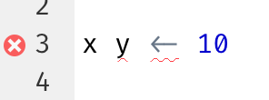
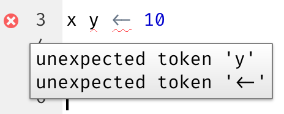
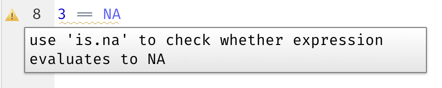
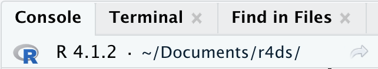

# 워크플로: 스크립트와 프로젝트 {#sec-workflow-scripts-projects}

```{r}
#| echo: false
source("_common.R")
```

이 챕터에서는 코드를 체계적으로 구성하기 위한 두 가지 필수 도구인 스크립트(scripts)와 프로젝트(projects)를 소개합니다.

## 스크립트

지금까지 여러분은 코드를 실행하기 위해 콘솔을 사용해 왔습니다.
콘솔은 시작하기에 아주 좋은 곳이지만, 더 복잡한 ggplot2 그래픽과 더 긴 dplyr 파이프라인을 만들게 되면 금방 비좁게 느껴질 것입니다.
작업할 공간을 더 확보하려면 스크립트 에디터를 사용하세요.
File 메뉴를 클릭하고 New File을 선택한 다음 R script를 선택하거나, 키보드 단축키인 Cmd/Ctrl + Shift + N을 눌러 에디터를 여세요.
이제 @fig-rstudio-script에서 보이는 것처럼 네 개의 창이 나타날 것입니다.
스크립트 에디터는 코드를 실험하기에 아주 좋은 장소입니다.
무언가를 변경하고 싶을 때 모든 내용을 다시 입력할 필요 없이 스크립트를 수정하고 다시 실행하면 됩니다.
또한 원하는 대로 작동하는 코드를 작성했다면, 나중에 쉽게 다시 볼 수 있도록 스크립트 파일로 저장할 수 있습니다.

```{r}
#| label: fig-rstudio-script
#| echo: false
#| out-width: ~
#| fig-cap: |
#|   스크립트 에디터를 열면 IDE의 왼쪽 상단에 새로운 창이 추가됩니다.
#| fig-alt: |
#|   에디터, 콘솔, 출력이 강조된 RStudio IDE.
knitr::include_graphics("diagrams/rstudio/script.png", dpi = 270)
```

### 코드 실행하기

스크립트 에디터는 복잡한 ggplot2 플롯을 구축하거나 긴 dplyr 조작 과정들을 작성하기에 매우 훌륭한 곳입니다.
스크립트 에디터를 효과적으로 사용하는 열쇠는 가장 중요한 키보드 단축키 중 하나인 Cmd/Ctrl + Enter를 외우는 것입니다.
이는 콘솔에서 현재 R 표현식을 실행합니다.
예를 들어 아래 코드를 봅시다.

```{r}
#| eval: false
library(dplyr)
library(nycflights13)

not_cancelled <- flights |> 
  filter(!is.na(dep_delay)█, !is.na(arr_delay))

not_cancelled |> 
  group_by(year, month, day) |> 
  summarize(mean = mean(dep_delay))
```

커서가 █에 있다면, Cmd/Ctrl + Enter를 누르면 `not_cancelled`를 생성하는 전체 명령어가 실행됩니다.
또한 커서가 다음 문장(`not_cancelled |>`로 시작하는 줄)으로 이동합니다.
덕분에 Cmd/Ctrl + Enter를 반복해서 누름으로써 전체 스크립트를 단계별로 쉽게 진행할 수 있습니다.

코드를 표현식별로 실행하는 대신, Cmd/Ctrl + Shift + S를 눌러 전체 스크립트를 한 번에 실행할 수도 있습니다.
정기적으로 이렇게 하는 것은 스크립트에 코드의 모든 중요한 부분을 빠짐없이 담았는지 확인하는 좋은 방법입니다.

항상 스크립트 시작 부분에 필요한 패키지들을 넣어두기를 권장합니다.
그렇게 하면 다른 사람과 코드를 공유할 때, 그들이 어떤 패키지를 설치해야 하는지 쉽게 알 수 있습니다.
하지만 공유하는 스크립트에 `install.packages()`를 절대 포함해서는 안 된다는 점에 유의하세요.
상대방이 주의 깊게 살피지 않았을 때 그들의 컴퓨터 설정을 바꿔버리는 스크립트를 건네는 것은 품위 없는 행동입니다!

이후 챕터들을 공부할 때는 스크립트 에디터에서 시작하고 키보드 단축키를 연습해 보시기를 강력히 추천합니다.
시간이 지나면 이런 방식으로 코드를 콘솔에 보내는 것이 너무 자연스러워져서 생각조차 하지 않게 될 것입니다.

### RStudio 진단 도구

스크립트 에디터에서 RStudio는 빨간 물결선과 사이드바의 십자 표시로 구문 에러(syntax error)를 강조해 줍니다.

```{r}
#| echo: false
#| out-width: ~
#| fig-alt: |
#|   x y <- 10이라는 스크립트가 있는 스크립트 에디터. 빨간색 X는 구문 에러가 
#|   있음을 나타냄. 구문 에러는 빨간 물결선으로도 강조됨.

```

십자 표시 위에 마우스를 올리면 문제가 무엇인지 확인할 수 있습니다.

```{r}
#| echo: false
#| out-width: ~
#| fig-alt: |
#|   x y <- 10이라는 스크립트가 있는 스크립트 에디터. 빨간색 X는 구문 에러가 
#|   있음을 나타냄. 구문 에러는 빨간 물결선으로도 강조됨. 
#|   X 위에 마우스를 올리면 예기치 않은 토큰 y와 예기치 않은 토큰 <-라는 
#|   텍스트가 담긴 텍스트 박스가 나타남.

```

RStudio는 또한 잠재적인 문제에 대해서도 알려줍니다.

```{r}
#| echo: false
#| out-width: ~
#| fig-alt: |
#|   3 == NA라는 스크립트가 있는 스크립트 에디터. 노란색 느낌표는 
#|   잠재적인 문제가 있을 수 있음을 나타냄. 느낌표 위에 마우스를 올리면 
#|   표현식이 NA인지 확인하기 위해 is.na를 사용하라는 텍스트 박스가 나타남.

```

### 저장 및 이름 짓기

RStudio는 종료 시 스크립트 에디터의 내용을 자동으로 저장하며, 다시 열 때 자동으로 로드합니다.
그럼에도 불구하고 Untitled1, Untitled2, Untitled3 등으로 두지 말고, 스크립트를 저장하고 정보가 담긴 이름을 부여하는 것이 좋습니다.

파일 이름을 `code.R`이나 `myscript.R`이라고 짓고 싶은 유혹이 들 수 있겠지만, 파일 이름을 선택하기 전에 조금 더 고민해 보아야 합니다.
파일 이름 짓기의 세 가지 중요한 원칙은 다음과 같습니다:

1.  파일 이름은 **컴퓨터(machine)** 가 읽기 좋아야 합니다: 공백, 기호, 특수 문자를 피하세요. 대소문자 구분에만 의존하여 파일을 구별하지 마세요.
2.  파일 이름은 **사람(human)** 이 읽기 좋아야 합니다: 파일 이름을 사용하여 파일에 담긴 내용을 설명하세요.
3.  파일 이름은 기본 정렬(sorting) 방식과 잘 어울려야 합니다: 알파벳순 정렬만으로도 파일이 사용되는 순서대로 나열되도록 파일 이름 앞에 숫자를 붙이세요.

예를 들어 프로젝트 폴더에 다음과 같은 파일들이 있다고 가정해 봅시다.

```         
alternative model.R
code for exploratory analysis.r
finalreport.qmd
FinalReport.qmd
fig 1.png
Figure_02.png
model_first_try.R
run-first.r
temp.txt
```

여기에는 여러 가지 문제가 있습니다. 어느 파일을 먼저 실행해야 할지 알기 어렵고, 이름에 공백이 포함되어 있으며, 대소문자만 다른 동일한 이름의 파일(`finalreport`와 `FinalReport`[^workflow-scripts-1])이 두 개나 있고, 어떤 이름은 내용을 설명하지 못합니다(`run-first`와 `temp`).

[^workflow-scripts-1]: 파일 이름에 "final"을 사용하는 것 자체가 운을 시험하는 행위라는 것은 말할 것도 없습니다 😆 코믹 만화 Piled Higher and Deeper에 이와 관련된 [재미있는 에피소드](https://phdcomics.com/comics/archive.php?comicid=1531)가 있습니다.

다음은 동일한 파일들을 이름 짓고 정리하는 더 나은 방법입니다:

```         
01-load-data.R
02-exploratory-analysis.R
03-model-approach-1.R
04-model-approach-2.R
fig-01.png
fig-02.png
report-2022-03-20.qmd
report-2022-04-02.qmd
report-draft-notes.txt
```

주요 스크립트에 번호를 매기면 실행 순서가 명확해지며, 일관된 이름 짓기 방식 덕분에 무엇이 다른지 더 쉽게 알 수 있습니다.
또한 그림들도 유사하게 레이블이 붙어 있고, 보고서들은 파일 이름에 포함된 날짜로 구별되며, `temp`는 내용을 더 잘 설명하는 `report-draft-notes`로 이름이 바뀌었습니다.
한 디렉토리에 파일이 많다면 한 단계 더 나아가 스크립트, 그림 등 파일 유형별로 다른 디렉토리에 정리하는 것을 권장합니다.

## 프로젝트

언젠가 여러분은 R을 종료하고 다른 일을 하다가 나중에 다시 분석으로 돌아와야 할 것입니다.
언젠가 여러분은 여러 분석을 동시에 진행하게 될 것이고 이들을 분리해서 유지하고 싶을 것입니다.
언젠가 여러분은 외부 세계에서 R로 데이터를 가져오고, R에서 계산한 숫자 결과와 그림을 다시 외부 세계로 내보내야 할 것입니다.

이러한 현실적인 상황을 처리하기 위해 두 가지 결정을 내려야 합니다:

1.  **진실의 원천(source of truth)** 은 무엇인가?
    지속적인 기록으로 남길 것은 무엇인가?

2.  여러분의 분석 작업물은 어디에 거주하는가?

### 진실의 원천은 무엇인가?

초보자일 때는 분석 과정에서 생성한 모든 객체가 담겨 있는 현재의 Environment(환경)에 의존해도 괜찮습니다.
하지만 더 큰 프로젝트를 수행하거나 다른 사람과 협업하는 것을 더 쉽게 하려면, 여러분의 진실의 원천은 R 스크립트여야 합니다.
R 스크립트(그리고 데이터 파일)가 있다면 환경을 다시 구축할 수 있습니다.
반면 환경만 있다면 R 스크립트를 다시 만드는 것은 훨씬 더 어렵습니다. 기억을 더듬어 코드를 대량으로 다시 입력하거나(그 과정에서 필연적으로 실수가 발생합니다) R History를 주의 깊게 채굴해야 합니다.

R 스크립트를 분석의 진실의 원천으로 유지하는 데 도움이 되도록, 세션 간에 워크스페이스(workspace)를 보존하지 않도록 RStudio에 지시할 것을 강력히 권장합니다.
`usethis::use_blank_slate()`를 실행하거나[^workflow-scripts-2], @fig-blank-slate에 표시된 옵션들을 따라 해서 이 설정을 할 수 있습니다. 이로 인해 RStudio를 재시작할 때 지난번에 실행했던 코드를 기억하지 못하고, 생성했던 객체나 읽어온 데이터셋들을 더 이상 사용할 수 없게 되어 단기적으로는 고통스러울 수도 있습니다.
하지만 이 단기적인 고통은 코드에 모든 중요한 절차를 빠짐없이 담도록 강제하기 때문에 장기적인 고통을 면하게 해줍니다.
어떤 중요한 계산의 결과를 코드에 담지 않고 환경에만 저장했다는 사실을 석 달 뒤에 깨닫는 것보다 더 나쁜 일은 없습니다.

[^workflow-scripts-2]: usethis가 설치되어 있지 않다면 `install.packages("usethis")`로 설치할 수 있습니다.

```{r}
#| label: fig-blank-slate
#| echo: false
#| fig-cap: |
#|   항상 깨끗한 상태(clean slate)로 RStudio 세션을 시작하려면 RStudio 옵션에서 
#|   이 옵션들을 따라 하세요.
#| fig-alt: |
#|   'Restore .RData into workspace at startup' 옵션이 체크 해제된 
#|   RStudio Global Options 창. 또한 'Save workspace to .RData on exit' 옵션이 
#|   Never로 설정되어 있음.
#| out-width: ~
knitr::include_graphics("diagrams/rstudio/clean-slate.png", dpi = 270)
```

에디터에 코드의 중요한 부분들을 모두 빠짐없이 담았는지 확인하는 데 도움이 되는 훌륭한 키보드 단축키 한 쌍이 있습니다:

1.  Cmd/Ctrl + Shift + 0/F10을 눌러 R을 재시작합니다.
2.  Cmd/Ctrl + Shift + S를 눌러 현재 스크립트를 다시 실행합니다.

저희는 공동으로 이 패턴을 일주일에 수백 번씩 사용합니다.

키보드 단축키를 사용하지 않는다면 Session \> Restart R 메뉴로 가서 현재 스크립트를 강조 표시하고 다시 실행할 수도 있습니다.

::: callout-note
## RStudio 서버

RStudio 서버를 사용 중이라면 기본적으로 R 세션이 재시작되지 않습니다.
RStudio 서버 탭을 닫을 때 R을 종료하는 것처럼 느껴질 수 있지만, 서버는 실제로는 백그라운드에서 세션을 계속 실행합니다.
다음에 다시 돌아왔을 때 여러분은 떠났던 시점과 정확히 같은 곳에 있게 됩니다.
따라서 깨끗한 상태(clean slate)에서 시작할 수 있도록 정기적으로 R을 재시작해 주는 것이 더욱 중요합니다.
:::

### 여러분의 분석 작업물은 어디에 거주하는가?

R에는 **작업 디렉토리(working directory)** 라는 강력한 개념이 있습니다.
이곳은 R이 파일을 로드할 때 찾는 곳이며, 파일을 저장할 때 두는 곳입니다.
RStudio는 콘솔 상단에 현재 작업 디렉토리를 보여줍니다:

```{r}
#| echo: false
#| fig-alt: |
#|   콘솔 탭은 현재 작업 디렉토리를 ~/Documents/r4ds로 보여줌.
#| out-width: ~

```

또한 R 코드에서 `getwd()`를 실행하여 이를 출력해 볼 수 있습니다:

```{r}
#| eval: false
getwd()
#> [1] "/Users/hadley/Documents/r4ds"
```

이 R 세션의 현재 작업 디렉토리(이를 "집(home)"이라고 생각하세요)는 Hadley의 Documents 폴더 내의 r4ds라는 하위 폴더에 있습니다.
여러분의 컴퓨터는 Hadley의 컴퓨터와 다른 디렉토리 구조를 가지고 있기 때문에, 이 코드를 실행하면 다른 결과가 반환될 것입니다!

R 입문자일 때는 작업 디렉토리를 홈 디렉토리나 문서 디렉토리, 그 외 컴퓨터의 아무 디렉토리로 두어도 괜찮습니다.
하지만 여러분은 이미 이 책의 여러 챕터를 넘겼고, 더 이상 입문자가 아닙니다.
이제 곧 여러분은 프로젝트를 디렉토리별로 정리하고, 프로젝트 작업을 할 때 R의 작업 디렉토리를 해당 디렉토리로 설정하는 수준으로 발전해야 합니다.

R 내부에서 작업 디렉토리를 설정할 수도 있지만, **저희는 이를 추천하지 않습니다**:

```{r}
#| eval: false
setwd("/path/to/my/CoolProject")
```

더 나은 방법이 있습니다. 여러분이 전문가처럼 R 작업을 관리할 수 있게 해주는 방법입니다.
그 방법이 바로 **RStudio 프로젝트(project)** 입니다.

### RStudio 프로젝트

특정 프로젝트와 관련된 모든 파일(입력 데이터, R 스크립트, 분석 결과, 그림)을 한 디렉토리에 모아두는 것은 매우 현명하고 일반적인 관행이어서, RStudio에는 **프로젝트**를 통해 이를 지원하는 기능이 내장되어 있습니다.
이 책의 나머지 부분을 공부하는 동안 사용할 프로젝트를 하나 만들어 봅시다.
File \> New Project를 클릭한 다음, @fig-new-project에 표시된 단계를 따르세요.

```{r}
#| label: fig-new-project
#| echo: false
#| fig-cap: | 
#|   새 프로젝트 생성 방법: (위) 먼저 New Directory를 클릭하고, (중간) 
#|   New Project를 클릭한 다음, (아래) 디렉토리(프로젝트) 이름을 입력하고 
#|   적절한 하위 디렉토리를 위치로 선택하고 Create Project를 클릭합니다.
#| fig-alt: |
#|   New Project 메뉴의 세 가지 스크린샷. 첫 번째 스크린샷에서는 
#|   Create Project 창이 보이고 New Directory가 선택됨. 
#|   두 번째 스크린샷에서는 Project Type 창이 보이고 Empty Project가 선택됨. 
#|   세 번째 스크린샷에서는 Create New Project 창이 보이고 디렉토리 이름이 
#|   r4ds로 주어졌으며 바탕 화면의 하위 디렉토리로 프로젝트가 생성되고 있음.
#| out-width: ~
knitr::include_graphics("diagrams/new-project.png")
```

프로젝트 이름을 `r4ds`라고 짓고 프로젝트를 어느 하위 디렉토리에 둘지 신중하게 생각하세요.
적절한 곳에 저장하지 않으면 나중에 찾기 어려울 것입니다!

이 과정이 완료되면 이 책만을 위한 새로운 RStudio 프로젝트가 생깁니다.
프로젝트의 "집"이 현재 작업 디렉토리인지 확인하세요:

```{r}
#| eval: false
getwd()
#> [1] /Users/hadley/Documents/r4ds
```

이제 다음 명령어들을 스케치 에디터에 입력하고 "diamonds.R"이라는 이름으로 파일을 저장하세요.
그다음 "data"라는 이름의 폴더를 하나 만드세요.
RStudio의 Files 창에서 "New Folder" 버튼을 클릭하여 만들 수 있습니다.
마지막으로 전체 스크립트를 실행하면 PNG 파일과 CSV 파일이 프로젝트 디렉토리에 저장될 것입니다.
세부 내용은 걱정하지 마세요. 나중에 책에서 배우게 될 것입니다.

```{r}
#| label: toy-line
#| eval: false
library(tidyverse)

ggplot(diamonds, aes(x = carat, y = price)) + 
  geom_hex()
ggsave("diamonds.png")

write_csv(diamonds, "data/diamonds.csv")
```

RStudio를 종료하세요.
프로젝트와 관련된 폴더를 살펴보세요. `.Rproj` 파일에 주목하세요.
그 파일을 더블 클릭하여 프로젝트를 다시 여세요.
여러분이 중단했던 곳으로 돌아온 것을 보게 될 것입니다. 작업 디렉토리와 명령어 History가 동일하며 작업 중이던 모든 파일이 여전히 열려 있습니다.
하지만 위 지시 사항을 따랐기 때문에 환경은 완전히 깨끗할 것이며, 이는 여러분이 깨끗한 상태(clean slate)에서 시작함을 보장합니다.

사용 중인 OS에서 `diamonds.png`를 검색해 보면 PNG 파일뿐만 아니라 *그 파일을 생성한 스크립트*(`diamonds.R`)도 찾을 수 있을 것입니다.
이것은 엄청난 이점입니다!
언젠가 여러분은 그림을 다시 만들고 싶거나 그것이 어디서 왔는지 알고 싶어질 것입니다.
그림을 마우스나 클립보드가 아니라 **R 코드를 사용하여** 엄격하게 파일로 저장한다면, 과거의 작업을 쉽게 재현할 수 있을 것입니다!

### 상대 경로와 절대 경로

일단 프로젝트 내부에 있다면 절대 경로(absolute path)가 아닌 상대 경로(relative path)만을 사용해야 합니다.
차이점이 무엇일까요?
상대 경로는 작업 디렉토리, 즉 프로젝트의 집을 기준으로 한 경로입니다.
앞서 Hadley가 `data/diamonds.csv`라고 썼을 때 이는 `/Users/hadley/Documents/r4ds/data/diamonds.csv`의 단축 방식이었습니다.
중요한 점은 Mine이 자기 컴퓨터에서 이 코드를 실행하면 `/Users/Mine/Documents/r4ds/data/diamonds.csv`를 가리키게 된다는 것입니다.
이것이 바로 상대 경로가 중요한 이유입니다. R 프로젝트 폴더가 어디에 있든 상관없이 작동하기 때문입니다.

절대 경로는 작업 디렉토리와 관계없이 항상 같은 곳을 가리킵니다.
운영 체제에 따라 조금씩 다르게 보입니다.
Windows에서는 드라이브 문자(`C:`)나 두 개의 백슬래시(`\\servername`)로 시작하고, Mac/Linux에서는 슬래시 `/`(`/users/hadley`)로 시작합니다.
스크립트에서 절대 경로를 **절대로** 사용해서는 안 됩니다. 공유를 방해하기 때문입니다. 다른 누구도 여러분과 정확히 똑같은 디렉토리 구성을 가지고 있지 않을 것입니다.

운영 체제 간의 또 다른 중요한 차이점은 경로의 구성 요소를 구분하는 방법입니다.
Mac과 Linux는 슬래시(`data/diamonds.csv`)를 사용하고 Windows는 백슬래시(`data\diamonds.csv`)를 사용합니다.
(현재 플랫폼에 관계없이) R은 두 유형 모두에서 작동할 수 있지만, 불행하게도 백슬래시는 R에게 특별한 의미가 있어서 경로에 백슬래시 하나를 넣으려면 백슬래시를 두 번 입력해야 합니다!
이는 생활을 고통스럽게 만들므로, 저희는 항상 슬래시("/")를 사용하는 Linux/Mac 스타일을 사용할 것을 권장합니다.

## 연습문제

1.  RStudio Tips 트위터 계정 <https://twitter.com/rstudiotips>에 가서 흥미로워 보이는 팁 하나를 찾아보세요. 그리고 이를 사용하는 연습을 해보세요!

2.  RStudio 진단 도구는 어떤 다른 흔한 실수들을 보고해 줄까요? <https://support.posit.co/hc/en-us/articles/205753617-Code-Diagnostics>에서 확인해 보세요.

## 요약

이 챕터에서는 R 코드를 스크립트(파일)와 프로젝트(디렉토리)로 구성하는 방법을 배웠습니다.
코드 스타일과 마찬가지로, 이것이 처음에는 번거로운 일처럼 느껴질 수 있습니다.
하지만 여러 프로젝트에 걸쳐 코드가 쌓이게 되면, 초기의 약간의 정리가 나중에 얼마나 많은 시간을 아껴주는지 깨닫게 될 것입니다.

요약하자면, 스크립트와 프로젝트는 미래에 도움이 될 견고한 워크플로를 제공합니다:

-   각 데이터 분석 프로젝트를 위해 하나의 RStudio 프로젝트를 만드세요.
-   정보가 담긴 이름으로 스크립트를 프로젝트에 저장하고, 수정하고, 부분별로 또는 전체를 실행하세요. 스크립트에 모든 것을 담았는지 확인하기 위해 R을 자주 재시작하세요.
-   절대 경로가 아닌 전적으로 상대 경로만을 사용하세요.

그러면 필요한 모든 것이 한곳에 있게 되며, 여러분이 진행 중인 다른 모든 프로젝트와 깔끔하게 분리됩니다.

지금까지 우리는 R 패키지에 포함된 데이터셋들로 작업해 왔습니다.
이는 미리 준비된 데이터로 연습하기에 좋지만, 분명 여러분의 데이터는 이런 식으로 제공되지 않을 것입니다.
따라서 다음 챕터에서는 readr 패키지를 사용하여 디스크에서 R 세션으로 데이터를 로드하는 방법을 배우게 될 것입니다.
