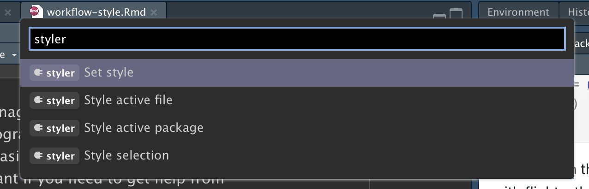
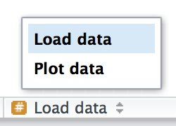

# 워크플로: 코드 스타일 {#sec-workflow-style}

```{r}
#| echo: false
source("_common.R")
```

좋은 코드 스타일은 올바른 문장 부호와 같습니다. 그것 없이도 어떻게든 지낼 수는 있겠지만, 그것이있으면정말로읽기가훨씬쉬워집니다(butitsuremakesthingseasiertoread).
아주 초보 프로그래머일지라도 코드 스타일에 신경을 쓰는 것이 좋습니다.
일관된 스타일을 사용하면 다른 사람들(미래의 여러분을 포함해서!)이 여러분의 작업물을 읽기 쉬워지며, 특히 다른 사람의 도움을 받아야 할 때 매우 중요합니다.
이 챕터에서는 이 책 전체에서 사용되는 [tidyverse 스타일 가이드](https://style.tidyverse.org)의 가장 중요한 점들을 소개합니다.

코드를 스타일링하는 것이 처음에는 다소 지루하게 느껴질 수 있지만, 연습하다 보면 곧 제2의 천성(second nature)이 될 것입니다.
또한 로렌츠 발터트(Lorenz Walthert)가 만든 [**styler**](https://styler.r-lib.org) 패키지와 같이 기존 코드를 빠르게 다시 스타일링할 수 있는 훌륭한 도구들이 있습니다.
`install.packages("styler")`로 설치한 후, 이를 사용하는 쉬운 방법은 RStudio의 **커맨드 팔레트(command palette)** 를 이용하는 것입니다.
커맨드 팔레트를 사용하면 모든 내장 RStudio 명령어와 패키지에서 제공하는 많은 애드인(addin)을 사용할 수 있습니다.
Cmd/Ctrl + Shift + P를 눌러 팔레트를 열고 "styler"를 입력하여 styler 패키지가 제공하는 모든 단축 명령어를 확인하세요.
@fig-styler는 그 결과를 보여줍니다.

```{r}
#| label: fig-styler
#| echo: false
#| out-width: null
#| fig-cap: | 
#|   RStudio의 커맨드 팔레트를 사용하면 키보드만으로 모든 RStudio 명령어에 
#|   쉽게 접근할 수 있습니다.
#| fig-alt: |
#|   "styler"를 입력한 후의 커맨드 팔레트 스크린샷. 패키지에서 제공하는 
#|   네 가지 스타일링 도구를 보여줌.

```

이 챕터의 코드 예제에서는 tidyverse와 nycflights13 패키지를 사용하겠습니다.

```{r}
#| label: setup
#| message: false
library(tidyverse)
library(nycflights13)
```

## 이름

@sec-whats-in-a-name에서 이름에 대해 잠시 이야기했습니다.
변수 이름(`<-`와 `mutate()`로 생성된 이름들)은 소문자, 숫자, `_`만 사용해야 함을 기억하세요.
이름 안에서 단어를 구분할 때는 `_`를 사용하세요.

```{r}
#| eval: false
# 권장:
short_flights <- flights |> filter(air_time < 60)

# 지양:
SHORTFLIGHTS <- flights |> filter(air_time < 60)
```

일반적인 원칙으로, 타이핑하기 빠른 간결한 이름보다는 이해하기 쉬운 길고 설명적인 이름을 선호하는 것이 좋습니다.
짧은 이름은 코드를 작성할 때 시간을 아주 조금만 아껴줄 뿐이지만(특히 자동 완성이 입력을 도와주기 때문입니다), 나중에 오래된 코드로 돌아왔을 때 수수께끼 같은 약어를 해독하는 데는 많은 시간이 걸릴 수 있습니다.

관련된 여러 이름이 있다면 일관성을 유지하기 위해 최선을 다하세요.
이전의 관례를 잊어버려 불일치가 발생하는 것은 쉬운 일이니, 나중에 돌아가서 이름을 바꿔야 하더라도 너무 자책하지 마세요.
일반적으로 하나의 테마를 변주하는 여러 변수가 있다면, 자동 완성은 변수의 시작 부분에서 가장 잘 작동하므로 공통된 접미사보다는 공통된 접두사를 주는 것이 더 좋습니다.

## 공백

`^`를 제외한 수학 연산자(`+`, `-`, `==`, `<`, ...)의 양쪽과 할당 연산자(`<-`) 주위에는 공백을 두세요.

```{r}
#| eval: false
# 권장
z <- (a + b)^2 / d

# 지양
z<-( a + b ) ^ 2/d
```

일반 함수 호출 시 괄호의 안쪽이나 바깥쪽에는 공백을 두지 마세요.
표준 영어 문장과 마찬가지로 쉼표 뒤에는 항상 공백을 두세요.

```{r}
#| eval: false
# 권장
mean(x, na.rm = TRUE)

# 지양
mean (x ,na.rm=TRUE)
```

정렬(alignment)을 개선하기 위해 추가 공백을 넣는 것은 괜찮습니다.
예를 들어, `mutate()`에서 여러 변수를 만드는 경우 모든 `=`가 일직선이 되도록 공백을 추가하고 싶을 수 있습니다.[^workflow-style-1]
이렇게 하면 코드를 훑어보기가 더 쉬워집니다.

[^workflow-style-1]: `dep_time`은 `HMM` 또는 `HHMM` 형식이므로, 정수 나눗셈(`%/%`)을 사용하여 시간을 구하고 나머지(모듈로라고도 하는 `%%`)를 사용하여 분을 구합니다.

```{r}
#| eval: false
flights |> 
  mutate(
    speed      = distance / air_time,
    dep_hour   = dep_time %/% 100,
    dep_minute = dep_time %%  100
  )
```

## 파이프 {#sec-pipes}

`|>` 앞에는 항상 공백이 있어야 하며, 일반적으로 줄의 마지막에 위치해야 합니다.
이렇게 하면 새로운 단계를 추가하거나, 기존 단계를 재정렬하거나, 단계 내부의 요소를 수정하기 쉬워지며, 왼쪽의 동사들만 훑어봄으로써 전체적인 흐름(10,000 ft view)을 파악하기 좋아집니다.

```{r}
#| eval: false
# 권장 
flights |>  
  filter(!is.na(arr_delay), !is.na(tailnum)) |> 
  count(dest)

# 지양
flights|>filter(!is.na(arr_delay), !is.na(tailnum))|>count(dest)
```

파이프를 통해 전달받는 함수에 이름이 있는 인자(`mutate()`나 `summarize()`와 같은)가 있다면, 각 인자를 새로운 줄에 배치하세요.
함수에 이름이 있는 인자가 없다면(`select()`나 `filter()`와 같은), 한 줄에 다 들어가지 않는 경우를 제외하고는 모두 한 줄에 유지하세요. 한 줄에 들어가지 않는 경우에는 각 인자를 고유한 줄에 배치해야 합니다.

```{r}
#| eval: false
# 권장
flights |>  
  group_by(tailnum) |> 
  summarize(
    delay = mean(arr_delay, na.rm = TRUE),
    n = n()
  )

# 지양
flights |>
  group_by(
    tailnum
  ) |> 
  summarize(delay = mean(arr_delay, na.rm = TRUE), n = n())
```

파이프라인의 첫 번째 단계 이후에는 각 줄을 두 개의 공백으로 들여쓰기(indent) 하세요.
RStudio는 `|>` 뒤에서 줄 바꿈을 하면 자동으로 공백을 넣어줍니다.
각 인자를 고유한 줄에 배치하는 경우 두 개의 공백을 추가로 들여쓰세요.
닫는 괄호 `)`는 고유한 줄에 있어야 하며, 함수 이름의 수평 위치와 일치하도록 들여쓰기를 해제하세요.

```{r}
#| eval: false
# 권장 
flights |>  
  group_by(tailnum) |> 
  summarize(
    delay = mean(arr_delay, na.rm = TRUE),
    n = n()
  )

# 지양
flights|>
  group_by(tailnum) |> 
  summarize(
             delay = mean(arr_delay, na.rm = TRUE), 
             n = n()
           )

# 지양
flights|>
  group_by(tailnum) |> 
  summarize(
  delay = mean(arr_delay, na.rm = TRUE), 
  n = n()
  )
```

파이프라인이 한 줄에 쉽게 들어간다면 이러한 규칙 중 일부를 무시해도 괜찮습니다.
하지만 저희의 공동 경험에 따르면, 짧은 코드 조각은 길어지기 쉽기 때문에 처음부터 필요한 모든 수직 공간을 확보함으로써 장기적으로 시간을 절약할 수 있습니다.

```{r}
#| eval: false
# 한 줄에 콤팩트하게 들어감
df |> mutate(y = x + 1)

# 네 배 더 많은 줄을 차지하지만, 미래에 더 많은 변수와 단계로 
# 쉽게 확장할 수 있음
df |> 
  mutate(
    y = x + 1
  )
```

마지막으로, 10~15줄 이상의 매우 긴 파이프를 작성하는 것은 주의하세요.
이를 더 작은 하위 작업으로 나누고, 각 작업에 정보가 담긴 이름을 부여해 보세요.
이름은 독자가 무슨 일이 일어나고 있는지 파악하는 데 도움을 주며, 중간 결과가 예상대로인지 확인하기 쉽게 해줍니다.
데이터의 구조를 근본적으로 바꿀 때(예를 들어, 피벗팅이나 요약 후)와 같이 무언가에 정보가 담긴 이름을 붙일 수 있다면 항상 이름을 붙여야 합니다.
한 번에 완벽하게 작성하려 하지 마세요! 이는 좋은 이름을 붙일 수 있는 중간 상태가 있다면 긴 파이프라인을 나누는 것을 의미합니다.

## ggplot2

파이프에 적용되는 동일한 기본 규칙이 ggplot2에도 적용됩니다. `+`를 `|>`와 동일하게 취급하세요.

```{r}
#| eval: false
flights |> 
  group_by(month) |> 
  summarize(
    delay = mean(arr_delay, na.rm = TRUE)
  )|> 
  ggplot(aes(x = month, y = delay)) +
  geom_point() + 
  geom_line()
```

여기서도 함수의 모든 인자를 한 줄에 담을 수 없다면 각 인자를 고유한 줄에 배치하세요:

```{r}
#| eval: false
flights |> 
  group_by(dest) |> 
  summarize(
    distance = mean(distance),
    speed = mean(distance / air_time, na.rm = TRUE)
  ) |> 
  ggplot(aes(x = distance, y = speed)) +
  geom_smooth(
    method = "loess",
    span = 0.5,
    se = FALSE, 
    color = "white", 
    linewidth = 4
  ) +
  geom_point()
```

`|>`에서 `+`로 전환되는 부분을 주의하세요.
이러한 전환이 필요하지 않았으면 좋았겠지만, 불행하게도 ggplot2는 파이프가 발견되기 전에 작성되었습니다.

## 섹션 구분 주석

스크립트가 길어짐에 따라, 관리하기 쉬운 조각으로 파일을 나누기 위해 **섹션 구분(sectioning)** 주석을 사용할 수 있습니다.

```{r}
#| eval: false
# 데이터 로드 --------------------------------------

# 데이터 시각화 --------------------------------------
```

RStudio는 이러한 헤더를 생성하는 키보드 단축키(Cmd/Ctrl + Shift + R)를 제공하며, @fig-rstudio-sections에서 보이는 것처럼 에디터 왼쪽 하단의 코드 탐색 드롭다운에 이들을 표시해 줍니다.

```{r}
#| label: fig-rstudio-sections
#| echo: false
#| out-width: null
#| fig-cap: | 
#|   스크립트에 섹션 구분 주석을 추가한 후에는 스크립트 에디터 왼쪽 하단의 
#|   코드 탐색 도구를 사용하여 쉽게 이동할 수 있습니다.
#| fig-alt: |
#|   코드 탐색 도구를 사용하여 섹션으로 이동하는 RStudio 모습의 스크린샷.

```

## 연습문제

1.  위의 가이드라인에 따라 다음 파이프라인의 스타일을 다시 조정하세요.

    ```{r}
    #| eval: false
    flights|>filter(dest=="IAH")|>group_by(year,month,day)|>summarize(n=n(),
    delay=mean(arr_delay,na.rm=TRUE))|>filter(n>10)

    flights|>filter(carrier=="UA",dest%in%c("IAH","HOU"),sched_dep_time>
    0900,sched_arr_time<2000)|>group_by(flight)|>summarize(delay=mean(
    arr_delay,na.rm=TRUE),cancelled=sum(is.na(arr_delay)),n=n())|>filter(n>10)
    ```

## 요약

이 챕터에서는 코드 스타일의 가장 중요한 원칙들을 배웠습니다.
처음에는 이것들이 임의적인 규칙 모음처럼 느껴질 수 있지만(실제로 그렇기도 합니다!), 시간이 지남에 따라 더 많은 코드를 작성하고 더 많은 사람과 공유하게 되면 일관된 스타일이 얼마나 중요한지 알게 될 것입니다.
그리고 styler 패키지를 잊지 마세요. 스타일이 엉망인 코드의 품질을 빠르게 향상시킬 수 있는 훌륭한 방법입니다.

다음 챕터에서는 데이터 과학 도구로 다시 돌아가 타이디 데이터(tidy data)에 대해 배웁니다.
타이디 데이터는 tidyverse 전체에서 사용되는 데이터 프레임 구성의 일관된 방식입니다.
이러한 일관성은 여러분의 삶을 훨씬 편하게 만들어 줍니다. 일단 타이디 데이터를 갖추고 나면 대부분의 tidyverse 함수와 잘 작동하기 때문입니다.
물론 인생은 결코 쉽지 않으며, 실제로 마주하는 대부분의 데이터셋은 이미 타이디한 상태가 아닐 것입니다.
따라서 tidyr 패키지를 사용하여 정돈되지 않은 데이터를 정돈하는 방법도 가르쳐 드릴 것입니다.
